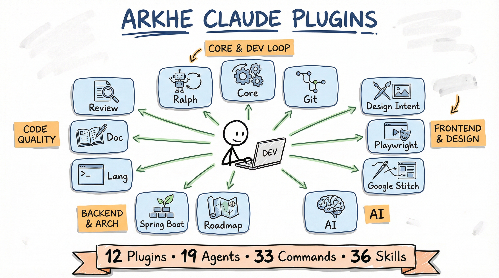

<div align="center">
  <h1>Arkhe Claude Plugins</h1>

  


  <p>
    <b>A collection of 9 Claude Code plugins</b> for documentation, AI engineering, code review, <br />
    UI/UX design, git workflows, Google Stitch prompting, Design Intent, and Domain-Driven Design.
  </p>

  <p>
    <a href="LICENSE">
      
    </a>
    
    
    <a href="https://github.com/joaquimscosta/arkhe-claude-plugins/stargazers">
      
    </a>
  </p>

  <h4>
    <a href="#rocket-quick-start">Quick Start</a>
    <span> · </span>
    <a href="#electric_plug-available-plugins">Browse Plugins</a>
    <span> · </span>
    <a href="#books-developer-documentation">Developer Docs</a>
    <span> · </span>
    <a href="https://github.com/joaquimscosta/arkhe-claude-plugins/issues">Report Bug</a>
  </h4>
</div>

<br />

---

## :electric_plug: Available Plugins

| Plugin | Description | Key Components | Docs |
| :--- | :--- | :--- | :---: |
| 🧠 **Core** | Quality control & workflow orchestration. | `deep-think-partner`, `deep-researcher`, `/research`, `/develop` | [View](./plugins/core/README.md) |
| 🤖 **AI** | Engineering toolkit for production LLM apps. | `ai-engineer`, `prompt-engineer`, `/improve-agent` | [View](./plugins/ai/README.md) |
| 📝 **Doc** | Multi-purpose documentation toolkit. | `doc-coauthoring`, `/diagram`, `/code-explain` | [View](./plugins/doc/README.md) |
| 🔍 **Review** | Code quality & security review tools. | `pragmatic-code-review`, `/code`, `/security` | [View](./plugins/review/README.md) |
| 🧵 **Stitch** | Google Stitch workflow toolkit with MCP integration. | `/prompt`, `/stitch-generate`, `generating-stitch-screens` | [View](./plugins/google-stitch/README.md) |
| 🔀 **Git** | Workflow automation (PRs, Commits, Changelogs). | `/commit`, `/create-pr`, Smart pre-commit | [View](./plugins/git/README.md) |
| 📐 **Design Intent** | Spec-Driven Development (SDD) & Figma Dialect. | `/feature`, `/plan`, `design-intent-specialist` | [View](./plugins/design-intent/README.md) |
| 💻 **Lang** | Language-specific skills (Bash/Shell). | `scripting-bash`, POSIX compliance | [View](./plugins/lang/README.md) |
| 🍃 **Spring Boot** | DDD with Spring Boot 4 implementation. | 7 skills: DDD, data, web-api, modulith, security, observability, testing | [View](./plugins/spring-boot/README.md) |

---

## :rocket: Quick Start

### 1. Add the Marketplace

**Option A: Install directly from GitHub (recommended)**

```bash
/plugin marketplace add joaquimscosta/arkhe-claude-plugins
```

**Option B: Clone and install locally**

```bash
git clone https://github.com/joaquimscosta/arkhe-claude-plugins.git
/plugin marketplace add ./arkhe-claude-plugins
```

### 2. Install Plugins

You can install all plugins at once:

```bash
/plugin install core@arkhe-claude-plugins
/plugin install ai@arkhe-claude-plugins
/plugin install doc@arkhe-claude-plugins
/plugin install review@arkhe-claude-plugins
/plugin install design-intent@arkhe-claude-plugins
/plugin install git@arkhe-claude-plugins
/plugin install google-stitch@arkhe-claude-plugins
/plugin install lang@arkhe-claude-plugins
/plugin install spring-boot@arkhe-claude-plugins
```

*Or install selectively based on your needs.*

### 3. Usage

After installation, restart Claude Code and use:

- **Agents:** Type `/agents` to see and select available agents.
- **Commands:** Type `/help` to see all available commands.
- **Skills:** Skills are automatically invoked when Claude detects relevant tasks.

---

## :compass: Recommendations & Namespacing

### Best Practices by Role

- **Documentation:** `core` + `doc`
- **AI/LLM Dev:** `ai`
- **Code Quality:** `review`
- **UI/Design:** `design-intent`
- **DevOps/Git:** `git` + `lang`

### Namespacing

If multiple plugins provide commands with similar names, use namespaced invocation:

```bash
# Direct invocation
/commit

# Namespaced invocation (to avoid conflicts)
/git:commit
/design-intent:feature
```

---

## :books: Developer Documentation

<details>
<summary><b>Click to expand Developer Resources</b></summary>

### Skills Development

- **[Skills Guide](./docs/SKILLS.md)** - Creating and managing Agent Skills.
- **[Agent Skills Overview](./docs/AGENT_SKILLS_OVERVIEW.md)** - Architecture and progressive disclosure.
- **[Skill Development Best Practices](./docs/SKILL_DEVELOPMENT_BEST_PRACTICES.md)** - Real-world lessons and token optimization.
- **[Anthropic Skills Repository](https://github.com/anthropics/skills)** - Reference implementations.

### Prompt Engineering

- **[Claude 4 Best Practices](./docs/CLAUDE_4_BEST_PRACTICES.md)** - Official techniques for Sonnet 4.5, Opus 4.1.

### Creating Plugins

1. Review the existing plugin structure.
2. Read the [Skills Development Best Practices](./docs/SKILL_DEVELOPMENT_BEST_PRACTICES.md).
3. Follow patterns in `plugins/core`, `plugins/doc`, and `plugins/git`.

</details>

<details>
<summary><b>Directory Structure</b></summary>

```
arkhe-claude-plugins/
├── .claude-plugin/
│   └── marketplace.json              # Marketplace catalog
├── plugins/                          # All 9 plugins
│   ├── core/                         # 1. Quality control & orchestration
│   ├── ai/                           # 2. AI engineering toolkit
│   ├── doc/                          # 3. Documentation toolkit
│   ├── review/                       # 4. Code review tools
│   ├── google-stitch/                # 5. Google Stitch prompting
│   ├── git/                          # 6. Git workflow automation
│   ├── design-intent/                # 7. Design Intent for SDD
│   ├── lang/                         # 8. Language-specific skills
│   └── spring-boot/                  # 9. Domain-Driven Design with Spring Boot 4
├── docs/                             # Developer documentation
├── templates/                        # Plugin templates
├── assets/                           # Project assets
├── README.md
├── INSTALLATION.md
└── CLAUDE.md
```

</details>

---

## :warning: License

This project is licensed under the MIT License - see the [LICENSE](LICENSE) file for details.
