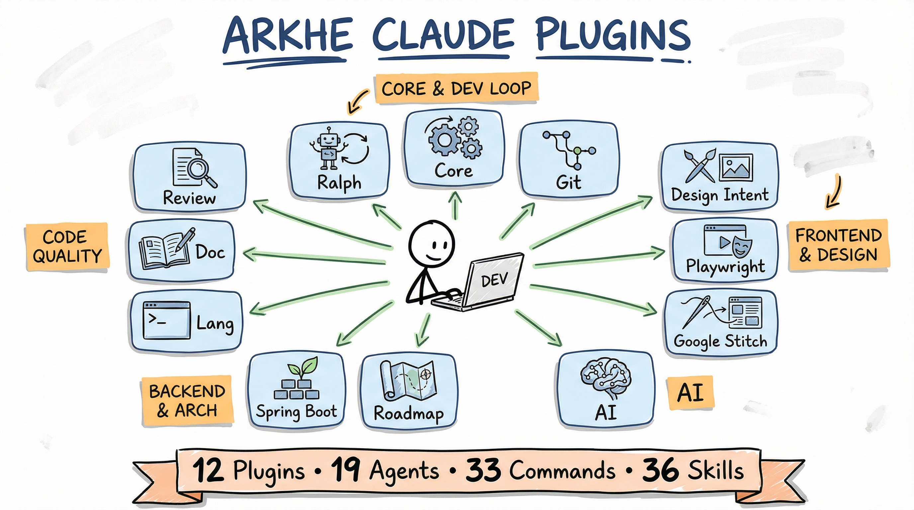

<div align="center">
  <h1>Arkhe Claude Plugins</h1>

  


  <p>
    <b>Supercharge Claude Code with 118 specialized components</b> — from deep reasoning and autonomous dev loops to<br />
    DDD architecture, design system enforcement, and git workflow automation. 20 agents, 35 commands, 63 skills across 12 modular plugins.
  </p>

  <p>
    <a href="LICENSE">
      
    </a>
    
    
    
    
    <a href="https://github.com/joaquimscosta/arkhe-claude-plugins/stargazers">
      
    </a>
  </p>

  <h4>
    <a href="#rocket-quick-start">Quick Start</a>
    <span> · </span>
    <a href="#electric_plug-available-plugins">Browse Plugins</a>
    <span> · </span>
    <a href="#books-developer-documentation">Developer Docs</a>
    <span> · </span>
    <a href="https://github.com/joaquimscosta/arkhe-claude-plugins/issues">Report Bug</a>
  </h4>
</div>

<br />

---

## Supported Platforms

Arkhe plugins now ship as a single repo with per-platform shims. The same skills payload runs on all three CLIs; commands and agents degrade gracefully where the platform lacks the primitive.

| Component | Claude Code | Antigravity CLI (`agy`) | Gemini CLI (Legacy) | Codex CLI |
| :--- | :---: | :---: | :---: | :---: |
| **Skills** (60 total) | ✅ Native | ✅ Auto-indexed & symlinked | ✅ Symlinked from canonical source | ✅ Symlinked + `--enable skills` |
| **Slash commands** (37 total) | ✅ Native `.md` | ✅ `plugin.json` / TOML | ✅ Transpiled to `.toml` | ✅ Surfaced as trigger phrases in `AGENTS.md` |
| **Subagents** (29 total) | ✅ Native dispatch | ✅ Native subagent dispatches | ⚠️ Inlined in command body (degraded) | ⚠️ Inlined in command body (degraded) |
| **Hooks** | n/a (none in arkhe today) | n/a | n/a | n/a |
| **MCP servers** | n/a (none in arkhe today) | n/a | n/a | n/a |

The `using-arkhe-skills` bootstrap skill (in the `core` plugin) maps Claude-only primitives — `AskUserQuestion`, `TaskCreate`/`TaskUpdate`, `EnterPlanMode`/`ExitPlanMode`, the `Skill` tool, the `Agent` tool — to Antigravity (`agy`), Gemini, and Codex equivalents at session start. Install `core` first on any platform.

See [INSTALLATION.md](./INSTALLATION.md) for per-platform install steps and each plugin's README for plugin-specific notes.

---

## :electric_plug: Available Plugins

| Plugin | Description | Key Components | Docs |
| :--- | :--- | :--- | :---: |
| 🧠 **Core** | 6-phase SDLC pipeline with multi-agent orchestration, deep research, and prompt optimization. | `deep-think-partner`, `deep-researcher`, `lyra`, `/develop`, `/research` | [View](./plugins/core/README.md) |
| 📝 **Doc** | Documentation generation with diagrams, ADRs, RFCs, and Johnny.Decimal management. | `rfc-critic`, `adr-critic`, `doc-coauthoring`, `/diagram`, `/rfc` | [View](./plugins/doc/README.md) |
| 🔍 **Review** | Code quality, security, and design reviews with pragmatic standards. | `pragmatic-code-review`, `design-review`, `false-positive-verifier` | [View](./plugins/review/README.md) |
| 🧵 **Stitch** | Atomic UI prompt authoring and MCP-powered Google Stitch screen generation. | `/prompt`, `/stitch-generate`, `generating-stitch-screens` | [View](./plugins/google-stitch/README.md) |
| 🔀 **Git** | Workflow automation with smart commits, PRs, changelogs, and Dependabot triage. | `/commit`, `/create-pr`, `/changelog`, `dependabot-review` | [View](./plugins/git/README.md) |
| 📐 **Design Intent** | Visual React prototyping from Figma/mockups with persistent pattern memory. | `design-intent-specialist`, `/design-intent`, `/save-patterns` | [View](./plugins/design-intent/README.md) |
| 💻 **Lang** | Production-grade language-specific skills (Bash/Shell). | `scripting-bash`, POSIX compliance, ShellCheck | [View](./plugins/lang/README.md) |
| 🎭 **Playwright** | Browser automation via Playwright CLI for testing and screenshots. | `playwright-cli`, `/playwright-setup` | [View](./plugins/playwright/README.md) |
| 🍃 **Spring Boot** | DDD with Spring Boot 4, Modulith 2.0, Security 7, and OpenTelemetry. | 10 skills: DDD, data, web-api, modulith, security, observability, testing, flyway | [View](./plugins/spring-boot/README.md) |
| 🔄 **Ralph** | Autonomous development loop with fresh context, task sets, and memory system. | `ralph-agent`, `/ralph`, `/create-prd`, Hat-lite system | [View](./plugins/ralph/README.md) |
| 🗺️ **Roadmap** | Product management, roadmap analysis, and solution architecture. | `product-manager`, `system-architect`, `roadmap-critic` | [View](./plugins/roadmap/README.md) |
| 🔧 **Devtools** | Developer tooling: SOPS encryption, Claude Code environment setup, quality stack. | `sops-setup`, `code-env-setup`, `quality-stack` | [View](./plugins/devtools/README.md) |

---

## :rocket: Quick Start

### Claude Code

1. **Add the Marketplace:**
   ```bash
   /plugin marketplace add joaquimscosta/arkhe-claude-plugins
   ```

2. **Install Plugins:**
   ```bash
   /plugin install core@arkhe-claude-plugins
   /plugin install doc@arkhe-claude-plugins
   /plugin install review@arkhe-claude-plugins
   /plugin install design-intent@arkhe-claude-plugins
   /plugin install git@arkhe-claude-plugins
   /plugin install google-stitch@arkhe-claude-plugins
   /plugin install lang@arkhe-claude-plugins
   /plugin install playwright@arkhe-claude-plugins
   /plugin install spring-boot@arkhe-claude-plugins
   /plugin install ralph@arkhe-claude-plugins
   /plugin install roadmap@arkhe-claude-plugins
   /plugin install devtools@arkhe-claude-plugins
   ```

3. **Reload Plugins:** Run `/reload-plugins` to apply.

---

### Antigravity CLI (`agy`)

1. **Clone the repository:**
   ```bash
   git clone https://github.com/joaquimscosta/arkhe-claude-plugins.git
   cd arkhe-claude-plugins
   ```

2. **Run the automated installer:**
   ```bash
   ./scripts/install-antigravity.sh
   ```
   *Or install specific plugins:* `./scripts/install-antigravity.sh core git review`

---

## :compass: Recommendations & Namespacing

### Recommended Plugin Stacks

Start with **`core`** + **`git`** — they provide the SDLC pipeline, deep reasoning, commit/PR automation, and changelog generation that benefit every workflow.

Then add plugins for your focus area:

| Focus | Add These | You Get |
| :--- | :--- | :--- |
| **Frontend/UI** | `design-intent`, `playwright` | Figma-to-React prototyping, pattern memory, browser testing |
| **Backend (Java)** | `spring-boot` | DDD, Spring Modulith, Security 7, observability, Flyway |
| **Code Quality** | `review` | Pragmatic code review, security audits, design review |
| **Documentation** | `doc` | Diagrams, ADRs, Johnny.Decimal, co-authored docs |
| **Product/Planning** | `roadmap` | User stories, scope assessment, architecture design |
| **Shell/DevOps** | `lang` | Production Bash scripting, POSIX compliance |
| **Google Stitch** | `google-stitch` | Atomic UI prompts, MCP-powered screen generation |

### Namespacing

If multiple plugins provide commands with similar names, use namespaced invocation:

```bash
# Direct invocation
/commit

# Namespaced invocation (to avoid conflicts)
/git:commit
/design-intent:design-intent
```

---

## :books: Developer Documentation

<details>
<summary><b>Click to expand Developer Resources</b></summary>

### Skills Development

- **[Skills Guide](./docs/reference/SKILLS.md)** — Creating and managing Agent Skills
- **[Skill Development Best Practices](./docs/SKILL_DEVELOPMENT_BEST_PRACTICES.md)** — Real-world lessons and token optimization
- **[Anthropic Skills Repository](https://github.com/anthropics/skills)** — Reference implementations

### Plugin & Agent Development

- **[Plugins Guide](./docs/reference/PLUGINS.md)** — Plugin system documentation
- **[Subagents Guide](./docs/reference/SUBAGENTS.md)** — Agent configuration and usage
- **[Best Practices](./docs/reference/BEST_PRACTICES.md)** — Official Claude Code best practices

### Reference

- **[Claude Code Guide](./docs/CLAUDE_CODE_GUIDE.md)** — Curated practitioner's guide

</details>

<details>
<summary><b>Directory Structure</b></summary>

```
arkhe-claude-plugins/
├── .claude-plugin/
│   └── marketplace.json              # Marketplace catalog
├── plugins/                          # All 12 plugins
│   ├── core/                         # 1. Quality control & orchestration
│   ├── doc/                          # 2. Documentation toolkit
│   ├── review/                       # 3. Code review tools
│   ├── google-stitch/                # 4. Google Stitch prompting
│   ├── git/                          # 5. Git workflow automation
│   ├── design-intent/                # 6. Design Intent for UI development
│   ├── lang/                         # 7. Language-specific skills
│   ├── playwright/                   # 8. Browser automation via Playwright CLI
│   ├── spring-boot/                  # 9. Domain-Driven Design with Spring Boot 4
│   ├── ralph/                        # 10. Autonomous development loop
│   ├── roadmap/                      # 11. Product management & architecture
│   └── devtools/                     # 12. Developer tooling & environment setup
├── docs/                             # Developer documentation
├── templates/                        # Plugin templates
├── assets/                           # Project assets
├── README.md
├── INSTALLATION.md
└── CLAUDE.md
```

</details>

---

## :warning: License

This project is licensed under the MIT License - see the [LICENSE](LICENSE) file for details.
