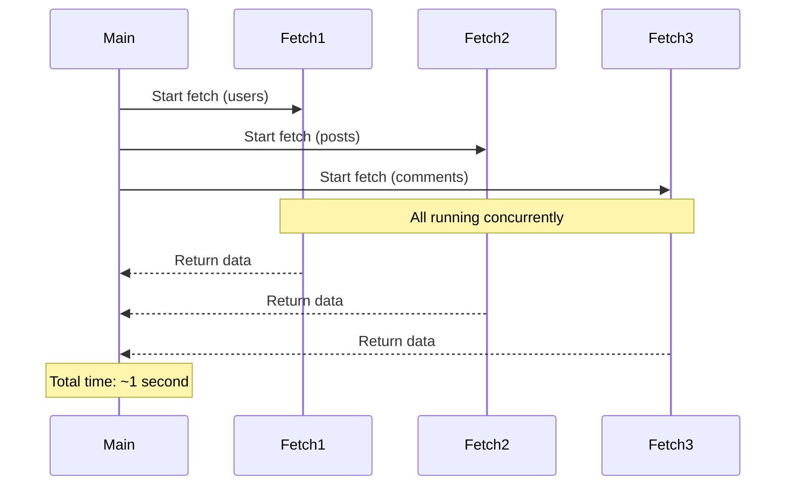
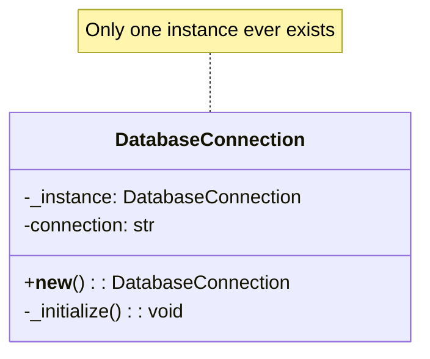
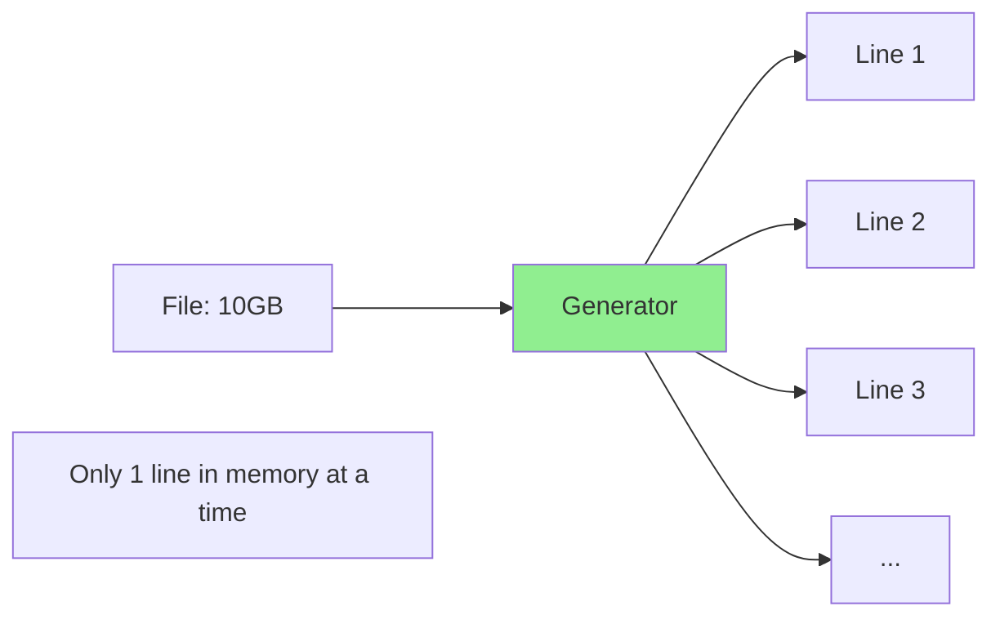
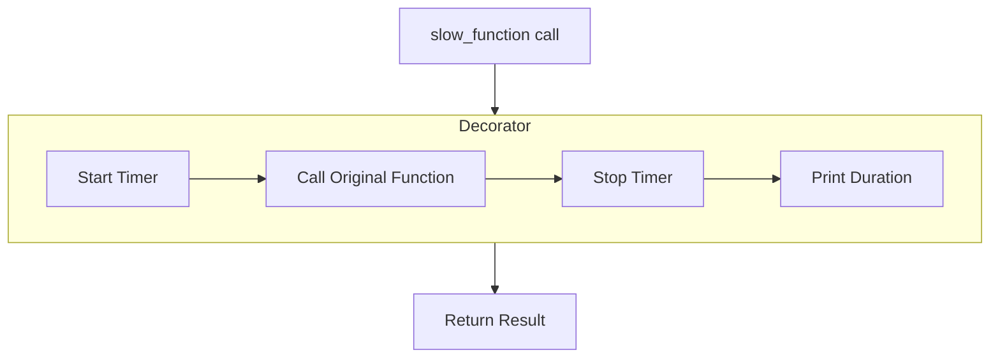

# Code Explanation Examples

Comprehensive examples of code explanations for various concepts and patterns.

## Example 1: Explaining Error Handling

### Code to Explain

```python
def safe_divide(a, b):
    try:
        result = a / b
        return result
    except ZeroDivisionError:
        print("Error: Cannot divide by zero!")
        return None
    except TypeError:
        print("Error: Please provide numbers only!")
        return None
    finally:
        print("Division attempt completed")
```

### Explanation Output

## What This Code Does

A defensive division function that handles errors gracefully instead of crashing.

## Key Concepts

- **Try/Except**: Catch specific exceptions to handle errors
- **Finally**: Code that always runs, regardless of success or failure

## Step-by-Step Breakdown

### Step 1: Attempt the Operation
**Lines 2-4**: The `try` block attempts the division. If successful, returns the result immediately.

### Step 2: Handle Division by Zero
**Lines 5-7**: If `b` is zero, Python raises `ZeroDivisionError`. We catch it, print a friendly message, and return `None` instead of crashing.

### Step 3: Handle Type Errors
**Lines 8-10**: If `a` or `b` isn't a number (e.g., a string), we catch `TypeError` and return `None`.

### Step 4: Cleanup
**Lines 11-12**: The `finally` block ALWAYS runs—whether the division succeeded, failed, or even if we return early. Useful for cleanup tasks.

## Try It Yourself

```python
safe_divide(10, 2)    # Success: returns 5.0
safe_divide(10, 0)    # ZeroDivisionError handled
safe_divide(10, "2")  # TypeError handled
```

---

## Example 2: Explaining Async/Await

### Code to Explain

```python
import asyncio

async def fetch_data(url):
    print(f"Fetching {url}...")
    await asyncio.sleep(1)  # Simulate network delay
    return f"Data from {url}"

async def main():
    results = await asyncio.gather(
        fetch_data("api.example.com/users"),
        fetch_data("api.example.com/posts"),
        fetch_data("api.example.com/comments")
    )
    return results

asyncio.run(main())
```

### Explanation Output

## What This Code Does

Fetches data from three URLs concurrently, completing in ~1 second instead of ~3 seconds.

## Key Concepts

- **async def**: Declares a coroutine (pausable function)
- **await**: Pauses execution until the result is ready
- **asyncio.gather**: Runs multiple coroutines concurrently

## Visual Overview



## Step-by-Step Breakdown

### Step 1: Define Async Function
**Lines 3-6**: `async def` creates a coroutine. The `await asyncio.sleep(1)` simulates a network delay without blocking other tasks.

### Step 2: Concurrent Execution
**Lines 8-13**: `asyncio.gather()` starts all three fetches simultaneously. Each `await` inside `fetch_data` allows other coroutines to run while waiting.

### Step 3: Run the Event Loop
**Line 15**: `asyncio.run()` creates an event loop and runs `main()` until complete.

## Why This Matters

**Without async** (sequential): 3 calls × 1 second = 3 seconds
**With async** (concurrent): All 3 calls overlap = ~1 second

---

## Example 3: Explaining a Design Pattern (Singleton)

### Code to Explain

```python
class DatabaseConnection:
    _instance = None

    def __new__(cls):
        if cls._instance is None:
            cls._instance = super().__new__(cls)
            cls._instance._initialize()
        return cls._instance

    def _initialize(self):
        self.connection = "Connected to DB"
        print("Database connection established")

# Usage
db1 = DatabaseConnection()
db2 = DatabaseConnection()
print(db1 is db2)  # True - same instance
```

### Explanation Output

## What This Code Does

Ensures only ONE database connection exists throughout the application, no matter how many times you create it.

## Key Concepts

- **Singleton Pattern**: Restricts a class to a single instance
- **`__new__`**: Controls object creation (before `__init__`)
- **Class variable**: `_instance` shared across all instances

## Visual Overview



## Step-by-Step Breakdown

### Step 1: Class Variable
**Line 2**: `_instance = None` stores the single instance. It's a class variable, shared by all.

### Step 2: Override Object Creation
**Lines 4-8**: `__new__` is called before `__init__`. We check if an instance exists:
- **First call**: `_instance` is `None`, so we create one
- **Subsequent calls**: Return the existing instance

### Step 3: One-Time Initialization
**Lines 10-12**: `_initialize()` only runs once (when instance is first created).

## Benefits and Trade-offs

**Benefits**:
- Controlled access to shared resource
- Prevents multiple database connections

**Trade-offs**:
- Harder to test (global state)
- Hides dependencies

---

## Example 4: Explaining a Generator

### Code to Explain

```python
def read_large_file(file_path):
    with open(file_path, 'r') as file:
        for line in file:
            yield line.strip()

# Usage
for line in read_large_file('huge_log.txt'):
    if 'ERROR' in line:
        print(line)
```

### Explanation Output

## What This Code Does

Reads a file line-by-line without loading the entire file into memory—critical for processing large files.

## Key Concepts

- **Generator**: Function that `yield`s values one at a time
- **Lazy Evaluation**: Values computed on-demand, not upfront
- **Memory Efficiency**: Only one line in memory at a time

## Visual Overview



## Step-by-Step Breakdown

### Step 1: Open File with Context Manager
**Line 2**: `with open()` ensures file is properly closed, even if an error occurs.

### Step 2: Yield Each Line
**Lines 3-4**: Instead of `return` (which would load all lines), `yield` produces ONE line, pauses, and waits for the next request.

### Step 3: On-Demand Processing
**Lines 7-9**: The `for` loop requests lines one at a time. Each iteration resumes the generator from where it paused.

## Memory Comparison

| Approach | Memory Usage (10GB file) |
|----------|-------------------------|
| `file.readlines()` | ~10GB |
| Generator | ~1 line (~100 bytes) |

---

## Example 5: Explaining Decorators

### Code to Explain

```python
import time
from functools import wraps

def timing_decorator(func):
    @wraps(func)
    def wrapper(*args, **kwargs):
        start = time.time()
        result = func(*args, **kwargs)
        end = time.time()
        print(f"{func.__name__} took {end - start:.2f} seconds")
        return result
    return wrapper

@timing_decorator
def slow_function():
    time.sleep(2)
    return "Done"

slow_function()  # Prints: "slow_function took 2.00 seconds"
```

### Explanation Output

## What This Code Does

Automatically measures and prints execution time for any function, without modifying the function itself.

## Key Concepts

- **Decorator**: Wraps a function to add behavior
- **Higher-Order Function**: Function that takes/returns functions
- **`@wraps`**: Preserves original function metadata

## Visual Overview



## Step-by-Step Breakdown

### Step 1: The Decorator Factory
**Lines 4-12**: `timing_decorator` takes a function and returns a new function (`wrapper`) that adds timing logic.

### Step 2: The Wrapper Function
**Lines 6-11**: `wrapper` does three things:
1. Records start time
2. Calls the original function
3. Records end time and prints duration

### Step 3: Preserve Metadata
**Line 5**: `@wraps(func)` copies the original function's name, docstring, etc. to the wrapper.

### Step 4: Apply the Decorator
**Line 14**: `@timing_decorator` is equivalent to:
```python
slow_function = timing_decorator(slow_function)
```

---

## Example 6: Explaining Recursion

### Code to Explain

```python
def fibonacci(n, memo={}):
    if n in memo:
        return memo[n]
    if n <= 1:
        return n
    memo[n] = fibonacci(n - 1, memo) + fibonacci(n - 2, memo)
    return memo[n]
```

### Explanation Output

## What This Code Does

Calculates Fibonacci numbers efficiently using memoization to avoid redundant calculations.

## Key Concepts

- **Recursion**: Function calls itself with smaller input
- **Memoization**: Cache results to avoid recalculation
- **Base Case**: Condition that stops recursion

## Visual Overview

```
fibonacci(5)
├── Check memo: not found
├── fibonacci(4) + fibonacci(3)
│   ├── fibonacci(4)
│   │   ├── fibonacci(3) + fibonacci(2)
│   │   └── Returns 3, caches memo[4]=3
│   └── fibonacci(3)
│       └── Found in memo! Returns 2
└── Returns 3 + 2 = 5
```

## Step-by-Step Breakdown

### Step 1: Check Cache
**Lines 2-3**: If we've already computed `fibonacci(n)`, return cached result immediately.

### Step 2: Base Case
**Lines 4-5**: `fibonacci(0) = 0` and `fibonacci(1) = 1`. These stop the recursion.

### Step 3: Recursive Case with Memoization
**Line 6**: Calculate `fib(n-1) + fib(n-2)` and store in `memo` before returning.

## Performance Impact

| Approach | Time for fibonacci(40) |
|----------|------------------------|
| Without memoization | ~1 minute |
| With memoization | < 1 millisecond |

---

## Quick Reference: Explanation Templates

### For Functions
```markdown
## [Function Name]
**Purpose**: [One sentence]
**Parameters**: [List with types]
**Returns**: [Type and meaning]
**Side Effects**: [If any]
```

### For Classes
```markdown
## [Class Name]
**Purpose**: [What it represents]
**Key Attributes**: [List]
**Key Methods**: [List]
**Relationships**: [Inheritance, composition]
```

### For Algorithms
```markdown
## [Algorithm Name]
**Problem**: [What it solves]
**Approach**: [High-level strategy]
**Complexity**: Time O(?), Space O(?)
**Visualization**: [Step-by-step example]
```
