# Mermaid Diagram Examples

Comprehensive examples for all diagram types with real-world use cases.

## Flowcharts / Graphs

### Basic Flowchart (Top to Bottom)

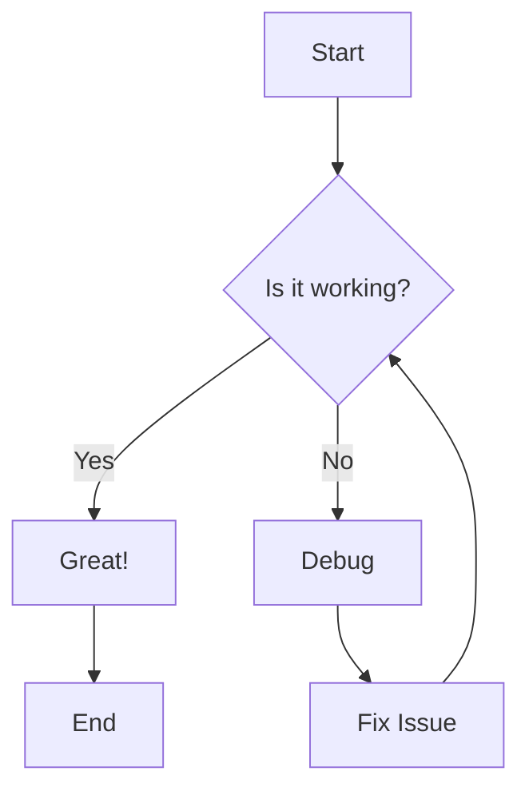
```mermaid
graph TD
    A[Start] --> B{Is it working?}
    B -->|Yes| C[Great!]
    B -->|No| D[Debug]
    D --> E[Fix Issue]
    E --> B
    C --> F[End]
```

### Horizontal Flowchart with Styling

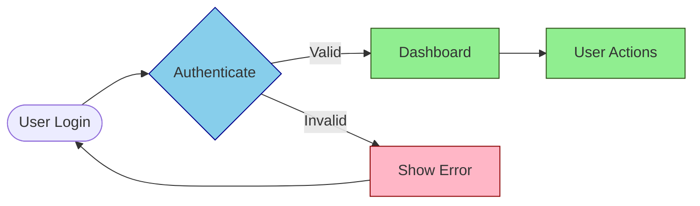
```mermaid
graph LR
    Start([User Login]) --> Auth{Authenticate}
    Auth -->|Valid| Dashboard[Dashboard]
    Auth -->|Invalid| Error[Show Error]
    Error --> Start
    Dashboard --> Actions[User Actions]

    classDef success fill:#90EE90,stroke:#2d5016
    classDef error fill:#FFB6C6,stroke:#8b0000
    classDef process fill:#87CEEB,stroke:#00008b

    class Dashboard,Actions success
    class Error error
    class Auth process
```

### Complex Flowchart with Subgraphs

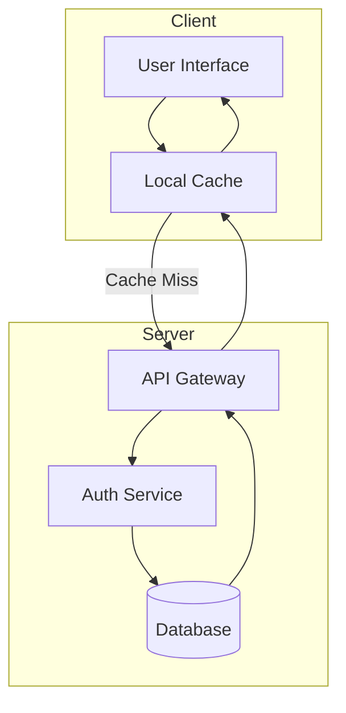
```mermaid
graph TB
    subgraph Client
        UI[User Interface]
        Cache[Local Cache]
    end

    subgraph Server
        API[API Gateway]
        Auth[Auth Service]
        DB[(Database)]
    end

    UI --> Cache
    Cache -->|Cache Miss| API
    API --> Auth
    Auth --> DB
    DB --> API
    API --> Cache
    Cache --> UI
```

## Sequence Diagrams

### API Request Flow

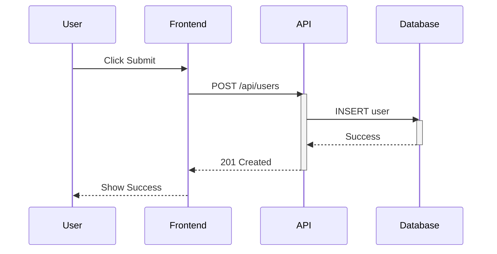
```mermaid
sequenceDiagram
    participant User
    participant Frontend
    participant API
    participant Database

    User->>Frontend: Click Submit
    Frontend->>API: POST /api/users
    activate API
    API->>Database: INSERT user
    activate Database
    Database-->>API: Success
    deactivate Database
    API-->>Frontend: 201 Created
    deactivate API
    Frontend-->>User: Show Success
```

### Authentication Flow with Alt/Opt

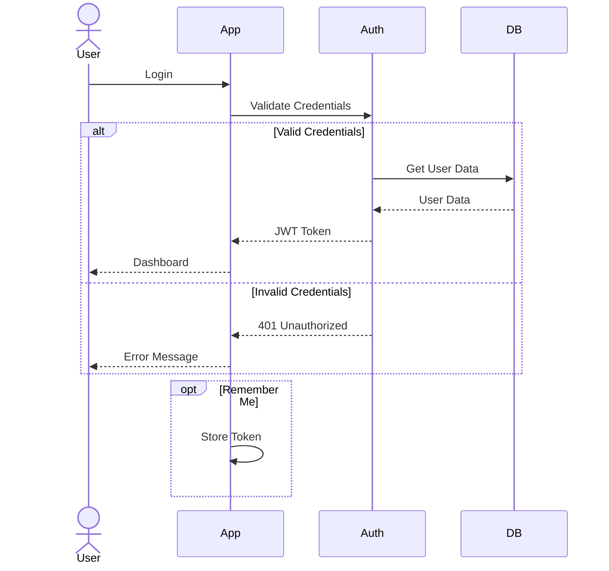
```mermaid
sequenceDiagram
    actor User
    participant App
    participant Auth
    participant DB

    User->>App: Login
    App->>Auth: Validate Credentials

    alt Valid Credentials
        Auth->>DB: Get User Data
        DB-->>Auth: User Data
        Auth-->>App: JWT Token
        App-->>User: Dashboard
    else Invalid Credentials
        Auth-->>App: 401 Unauthorized
        App-->>User: Error Message
    end

    opt Remember Me
        App->>App: Store Token
    end
```

### Microservices Communication

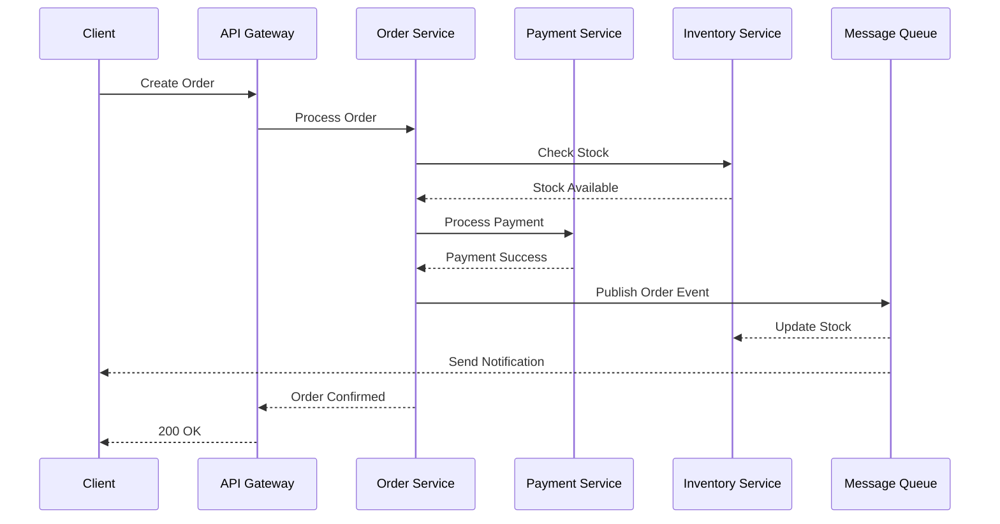
```mermaid
sequenceDiagram
    participant Client
    participant Gateway as API Gateway
    participant Order as Order Service
    participant Payment as Payment Service
    participant Inventory as Inventory Service
    participant Queue as Message Queue

    Client->>Gateway: Create Order
    Gateway->>Order: Process Order
    Order->>Inventory: Check Stock
    Inventory-->>Order: Stock Available
    Order->>Payment: Process Payment
    Payment-->>Order: Payment Success
    Order->>Queue: Publish Order Event
    Queue-->>Inventory: Update Stock
    Queue-->>Client: Send Notification
    Order-->>Gateway: Order Confirmed
    Gateway-->>Client: 200 OK
```

## Class Diagrams

### Object-Oriented Design

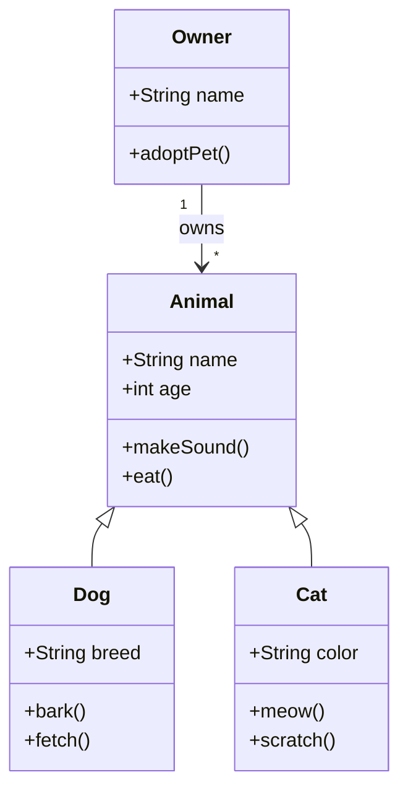
```mermaid
classDiagram
    class Animal {
        +String name
        +int age
        +makeSound()
        +eat()
    }

    class Dog {
        +String breed
        +bark()
        +fetch()
    }

    class Cat {
        +String color
        +meow()
        +scratch()
    }

    Animal <|-- Dog
    Animal <|-- Cat

    class Owner {
        +String name
        +adoptPet()
    }

    Owner "1" --> "*" Animal : owns
```

### Database Model

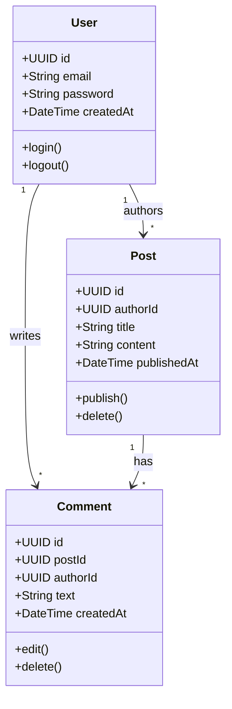
```mermaid
classDiagram
    class User {
        +UUID id
        +String email
        +String password
        +DateTime createdAt
        +login()
        +logout()
    }

    class Post {
        +UUID id
        +UUID authorId
        +String title
        +String content
        +DateTime publishedAt
        +publish()
        +delete()
    }

    class Comment {
        +UUID id
        +UUID postId
        +UUID authorId
        +String text
        +DateTime createdAt
        +edit()
        +delete()
    }

    User "1" --> "*" Post : authors
    User "1" --> "*" Comment : writes
    Post "1" --> "*" Comment : has
```

## State Diagrams

### User Authentication States

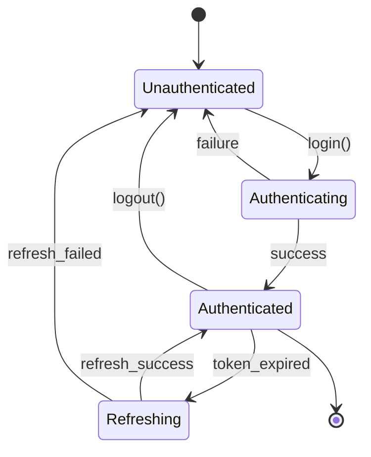
```mermaid
stateDiagram-v2
    [*] --> Unauthenticated

    Unauthenticated --> Authenticating : login()
    Authenticating --> Authenticated : success
    Authenticating --> Unauthenticated : failure

    Authenticated --> Refreshing : token_expired
    Refreshing --> Authenticated : refresh_success
    Refreshing --> Unauthenticated : refresh_failed

    Authenticated --> Unauthenticated : logout()

    Authenticated --> [*]
```

### Order Processing States

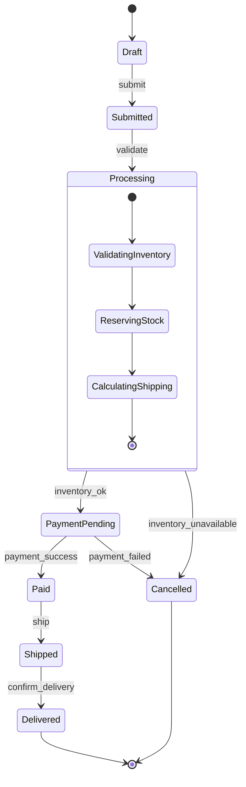
```mermaid
stateDiagram-v2
    [*] --> Draft

    Draft --> Submitted : submit
    Submitted --> Processing : validate
    Processing --> PaymentPending : inventory_ok
    PaymentPending --> Paid : payment_success
    PaymentPending --> Cancelled : payment_failed

    Paid --> Shipped : ship
    Shipped --> Delivered : confirm_delivery
    Delivered --> [*]

    Processing --> Cancelled : inventory_unavailable
    Cancelled --> [*]

    state Processing {
        [*] --> ValidatingInventory
        ValidatingInventory --> ReservingStock
        ReservingStock --> CalculatingShipping
        CalculatingShipping --> [*]
    }
```

## Entity Relationship Diagrams (ERD)

### E-commerce Database

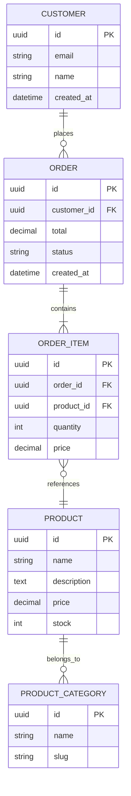
```mermaid
erDiagram
    CUSTOMER ||--o{ ORDER : places
    CUSTOMER {
        uuid id PK
        string email
        string name
        datetime created_at
    }

    ORDER ||--|{ ORDER_ITEM : contains
    ORDER {
        uuid id PK
        uuid customer_id FK
        decimal total
        string status
        datetime created_at
    }

    ORDER_ITEM }o--|| PRODUCT : references
    ORDER_ITEM {
        uuid id PK
        uuid order_id FK
        uuid product_id FK
        int quantity
        decimal price
    }

    PRODUCT ||--o{ PRODUCT_CATEGORY : belongs_to
    PRODUCT {
        uuid id PK
        string name
        text description
        decimal price
        int stock
    }

    PRODUCT_CATEGORY {
        uuid id PK
        string name
        string slug
    }
```

### Blog Platform Schema

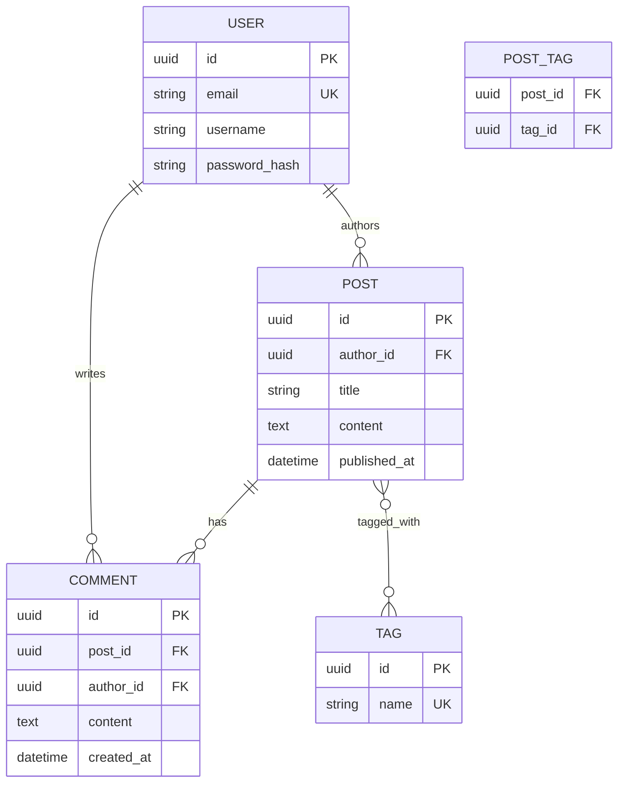
```mermaid
erDiagram
    USER ||--o{ POST : authors
    USER ||--o{ COMMENT : writes
    POST ||--o{ COMMENT : has
    POST }o--o{ TAG : tagged_with

    USER {
        uuid id PK
        string email UK
        string username
        string password_hash
    }

    POST {
        uuid id PK
        uuid author_id FK
        string title
        text content
        datetime published_at
    }

    COMMENT {
        uuid id PK
        uuid post_id FK
        uuid author_id FK
        text content
        datetime created_at
    }

    TAG {
        uuid id PK
        string name UK
    }

    POST_TAG {
        uuid post_id FK
        uuid tag_id FK
    }
```

## Gantt Charts

### Project Timeline

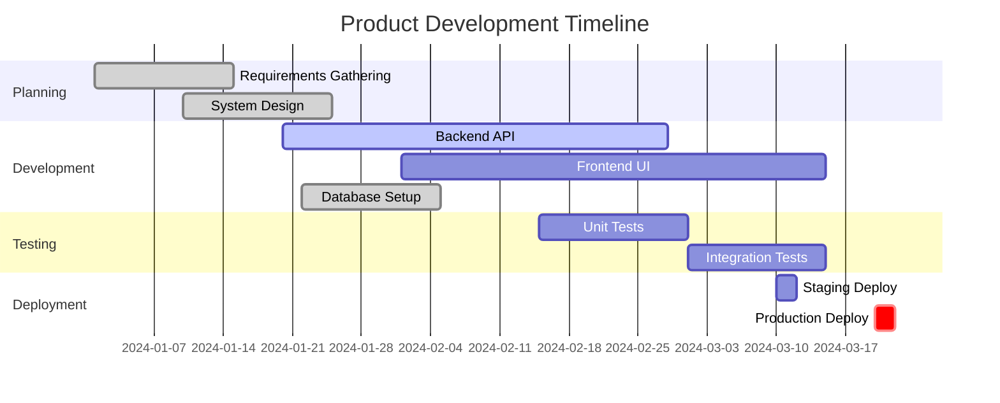
```mermaid
gantt
    title Product Development Timeline
    dateFormat YYYY-MM-DD

    section Planning
    Requirements Gathering    :done, req, 2024-01-01, 2024-01-15
    System Design             :done, design, 2024-01-10, 2024-01-25

    section Development
    Backend API               :active, backend, 2024-01-20, 2024-02-28
    Frontend UI               :frontend, 2024-02-01, 2024-03-15
    Database Setup            :done, db, 2024-01-22, 2024-02-05

    section Testing
    Unit Tests                :test1, 2024-02-15, 2024-03-01
    Integration Tests         :test2, 2024-03-01, 2024-03-15

    section Deployment
    Staging Deploy            :deploy1, 2024-03-10, 2024-03-12
    Production Deploy         :crit, deploy2, 2024-03-20, 2024-03-22
```

## Pie Charts

### Market Share Distribution

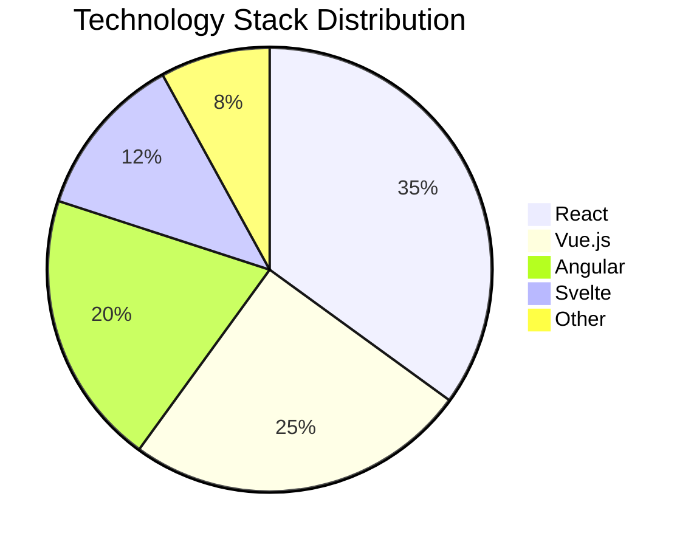
```mermaid
pie title Technology Stack Distribution
    "React" : 35
    "Vue.js" : 25
    "Angular" : 20
    "Svelte" : 12
    "Other" : 8
```

### Budget Allocation

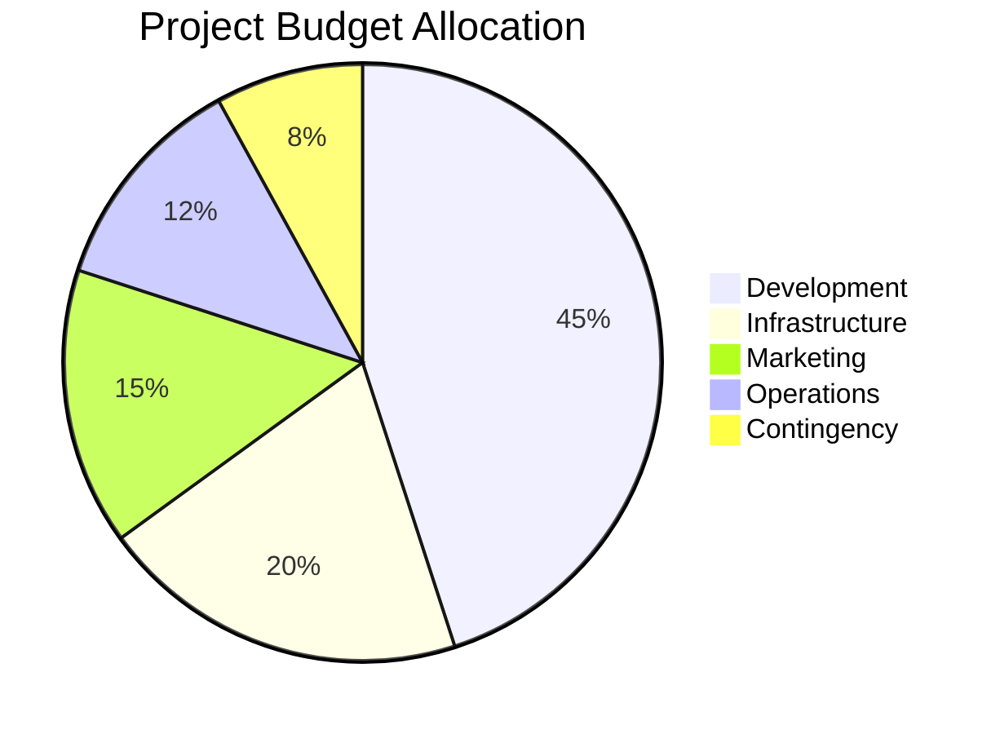
```mermaid
pie title Project Budget Allocation
    "Development" : 45
    "Infrastructure" : 20
    "Marketing" : 15
    "Operations" : 12
    "Contingency" : 8
```

## Git Graphs

### Feature Branch Workflow

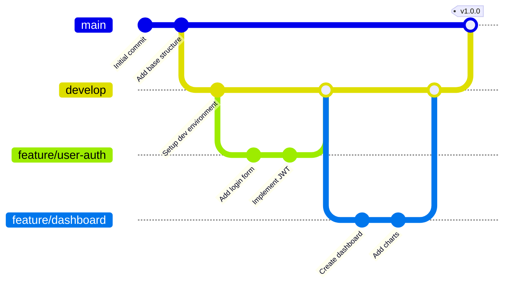
```mermaid
gitGraph
    commit id: "Initial commit"
    commit id: "Add base structure"

    branch develop
    checkout develop
    commit id: "Setup dev environment"

    branch feature/user-auth
    checkout feature/user-auth
    commit id: "Add login form"
    commit id: "Implement JWT"

    checkout develop
    merge feature/user-auth

    branch feature/dashboard
    checkout feature/dashboard
    commit id: "Create dashboard"
    commit id: "Add charts"

    checkout develop
    merge feature/dashboard

    checkout main
    merge develop tag: "v1.0.0"
```

## User Journey Maps

### E-commerce Purchase Flow

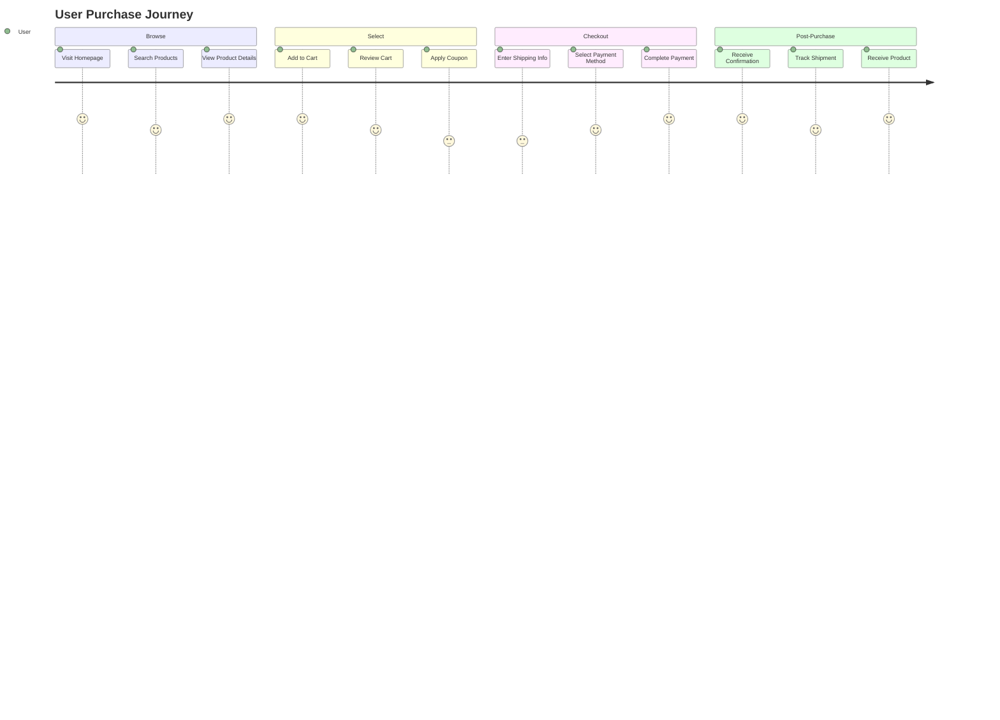
```mermaid
journey
    title User Purchase Journey
    section Browse
      Visit Homepage: 5: User
      Search Products: 4: User
      View Product Details: 5: User
    section Select
      Add to Cart: 5: User
      Review Cart: 4: User
      Apply Coupon: 3: User
    section Checkout
      Enter Shipping Info: 3: User
      Select Payment Method: 4: User
      Complete Payment: 5: User
    section Post-Purchase
      Receive Confirmation: 5: User
      Track Shipment: 4: User
      Receive Product: 5: User
```

## Quadrant Charts

### Feature Prioritization Matrix

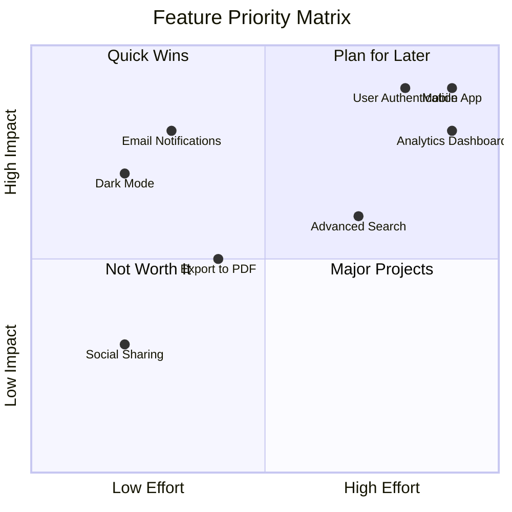
```mermaid
quadrantChart
    title Feature Priority Matrix
    x-axis Low Effort --> High Effort
    y-axis Low Impact --> High Impact
    quadrant-1 Plan for Later
    quadrant-2 Quick Wins
    quadrant-3 Not Worth It
    quadrant-4 Major Projects

    User Authentication: [0.8, 0.9]
    Dark Mode: [0.2, 0.7]
    Advanced Search: [0.7, 0.6]
    Email Notifications: [0.3, 0.8]
    Analytics Dashboard: [0.9, 0.8]
    Social Sharing: [0.2, 0.3]
    Export to PDF: [0.4, 0.5]
    Mobile App: [0.9, 0.9]
```

## Timeline Diagrams

### Product Evolution

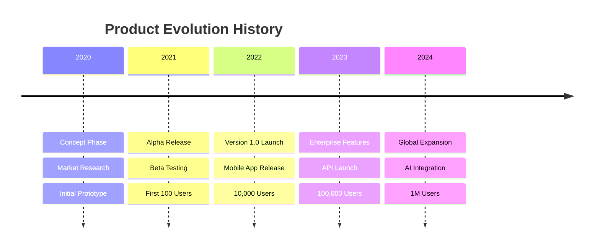
```mermaid
timeline
    title Product Evolution History
    2020 : Concept Phase
         : Market Research
         : Initial Prototype
    2021 : Alpha Release
         : Beta Testing
         : First 100 Users
    2022 : Version 1.0 Launch
         : Mobile App Release
         : 10,000 Users
    2023 : Enterprise Features
         : API Launch
         : 100,000 Users
    2024 : Global Expansion
         : AI Integration
         : 1M Users
```

### Company Milestones

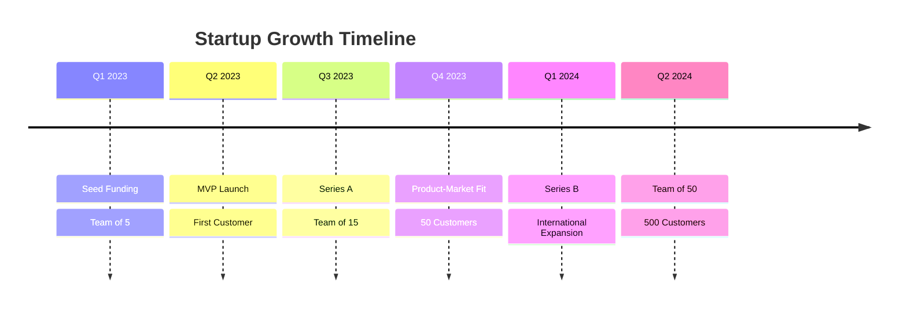
```mermaid
timeline
    title Startup Growth Timeline
    Q1 2023 : Seed Funding
            : Team of 5
    Q2 2023 : MVP Launch
            : First Customer
    Q3 2023 : Series A
            : Team of 15
    Q4 2023 : Product-Market Fit
            : 50 Customers
    Q1 2024 : Series B
            : International Expansion
    Q2 2024 : Team of 50
            : 500 Customers
```

## Advanced Styling Examples

### Custom Theme Flowchart

```mermaid
%%{init: {'theme':'base', 'themeVariables': { 'primaryColor':'#4a90e2','primaryTextColor':'#fff','primaryBorderColor':'#2c5aa0','lineColor':'#666','secondaryColor':'#50c878','tertiaryColor':'#ff6b6b'}}}%%
graph LR
    A[Start Process] --> B{Check Status}
    B -->|Active| C[Process Data]
    B -->|Inactive| D[Skip]
    C --> E[Generate Report]
    E --> F[End]
    D --> F

    style A fill:#4a90e2,stroke:#2c5aa0,color:#fff
    style E fill:#50c878,stroke:#2d5016,color:#fff
    style D fill:#ff6b6b,stroke:#8b0000,color:#fff
```

### Detailed Class Diagram with Relationships

```mermaid
classDiagram
    direction LR

    class PaymentProcessor {
        <<interface>>
        +processPayment(amount)
        +refund(transactionId)
    }

    class StripeProcessor {
        -String apiKey
        -String secretKey
        +processPayment(amount)
        +refund(transactionId)
        -validateCard()
    }

    class PayPalProcessor {
        -String clientId
        -String clientSecret
        +processPayment(amount)
        +refund(transactionId)
        -authenticateUser()
    }

    PaymentProcessor <|.. StripeProcessor : implements
    PaymentProcessor <|.. PayPalProcessor : implements

    class PaymentGateway {
        -PaymentProcessor processor
        +setProcessor(processor)
        +charge(amount)
    }

    PaymentGateway --> PaymentProcessor : uses

    note for PaymentProcessor "Strategy pattern for\nmultiple payment methods"
```

## Tips for Creating Effective Diagrams

1. **Choose the Right Type**: Match diagram type to your use case
   - Processes → Flowcharts
   - Interactions → Sequence diagrams
   - Structure → Class diagrams or ERDs
   - States → State diagrams
   - Timelines → Gantt charts or Timeline

2. **Keep It Simple**: Maximum 15-20 nodes per diagram
   - Use subgraphs to break down complexity
   - Create multiple diagrams for large systems

3. **Use Consistent Styling**:
   - Color-code by category (green=success, red=error, blue=process)
   - Use shape consistently (rectangle=process, diamond=decision)
   - Apply styling with `classDef` and `class` statements

4. **Add Context**:
   - Meaningful node labels
   - Descriptive edge labels
   - Comments for complex syntax

5. **Test Before Delivery**:
   - Verify rendering in target environment
   - Check for syntax errors
   - Ensure readability at different zoom levels
