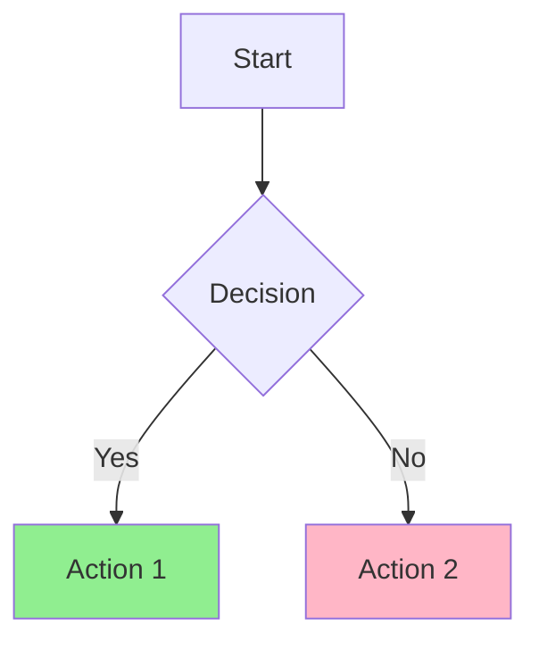

# Mermaid Diagram Generator

Expert skill for creating clear, professional Mermaid diagrams for documentation and visualization.

## Supported Diagram Types

```
graph/flowchart     - Flowcharts and decision trees
sequenceDiagram     - API interactions and workflows
classDiagram        - Object-oriented structures
stateDiagram-v2     - State machines and transitions
erDiagram           - Database relationships
gantt               - Project timelines
pie                 - Data distributions
gitGraph            - Git branching strategies
journey             - User experience flows
quadrantChart       - Priority matrices
timeline            - Historical events
```

## Quick Start

### Creating a New Diagram

1. **Identify the right diagram type** based on what you're visualizing
2. **Choose appropriate layout** (TB=top-to-bottom, LR=left-to-right, etc.)
3. **Keep it readable** - avoid overcrowding nodes
4. **Use consistent styling** - colors and shapes should have meaning
5. **Add meaningful labels** - clear, concise descriptions

### Editing Existing Diagrams

1. **Preserve the structure** - maintain existing node IDs and relationships
2. **Match the style** - use the same syntax patterns and formatting
3. **Test incrementally** - verify changes render correctly
4. **Document changes** - add comments for complex modifications

## Core Approach

**Readability First**
- Maximum 15-20 nodes per diagram
- Use subgraphs to organize complex flows
- Consistent spacing and indentation

**Meaningful Styling**
- Colors indicate categories (success=green, error=red, etc.)
- Shapes indicate types (rectangle=process, diamond=decision, etc.)
- Line styles indicate relationships (solid=strong, dashed=weak, etc.)

**Professional Output**
- Complete, working Mermaid code
- Both basic and styled versions
- Inline comments explaining complex syntax
- Rendering preview instructions

## Output Format

````markdown

````

## Common Use Cases

- **Documentation**: System architecture, API flows, data models
- **Planning**: Project timelines, user journeys, decision trees
- **Analysis**: State machines, entity relationships, git workflows
- **Communication**: Process flows, sequence diagrams, quadrant charts

## Workflow

See [WORKFLOW.md](WORKFLOW.md) for detailed step-by-step methodology including diagram type selection, creation process, styling guidelines, and quality validation.

## Examples

See [EXAMPLES.md](EXAMPLES.md) for comprehensive examples of all diagram types with real-world use cases.

## Troubleshooting

See [TROUBLESHOOTING.md](TROUBLESHOOTING.md) for common syntax errors, rendering issues, and optimization tips.

## Best Practices

1. **Start simple** - Get basic structure working first, then add styling
2. **Use subgraphs** - Group related nodes for clarity
3. **Limit connections** - Too many arrows create visual noise
4. **Test rendering** - Verify diagram displays correctly before delivery
5. **Provide alternatives** - Suggest different diagram types if needed
6. **Consider accessibility** - Use patterns in addition to colors
7. **Export recommendations** - SVG for scalability, PNG for compatibility

## Integration

This skill auto-invokes when triggered by keywords. For manual control, use the `/diagram` command.

When invoked by `/doc-generate`, this skill provides diagram generation capabilities for comprehensive documentation.
