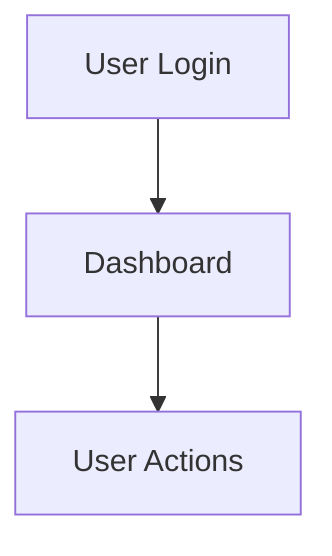
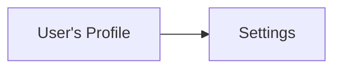
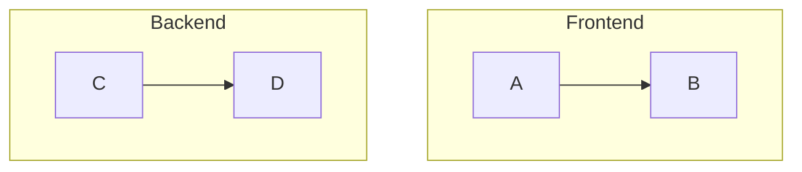
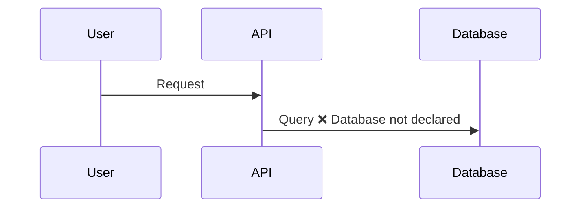
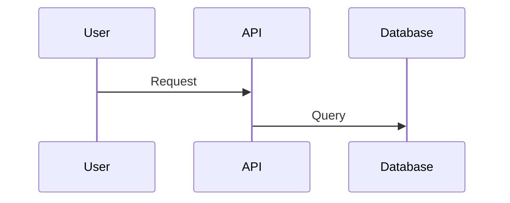
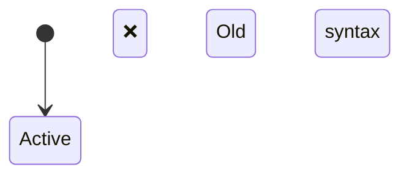
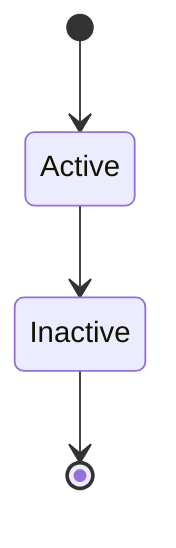
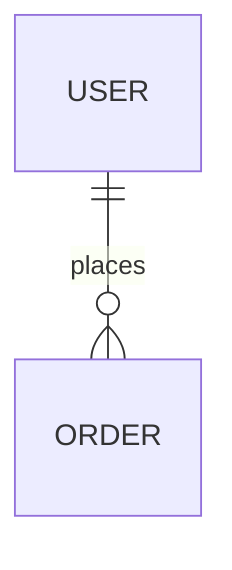
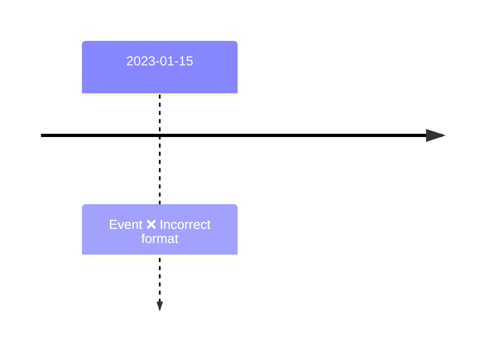
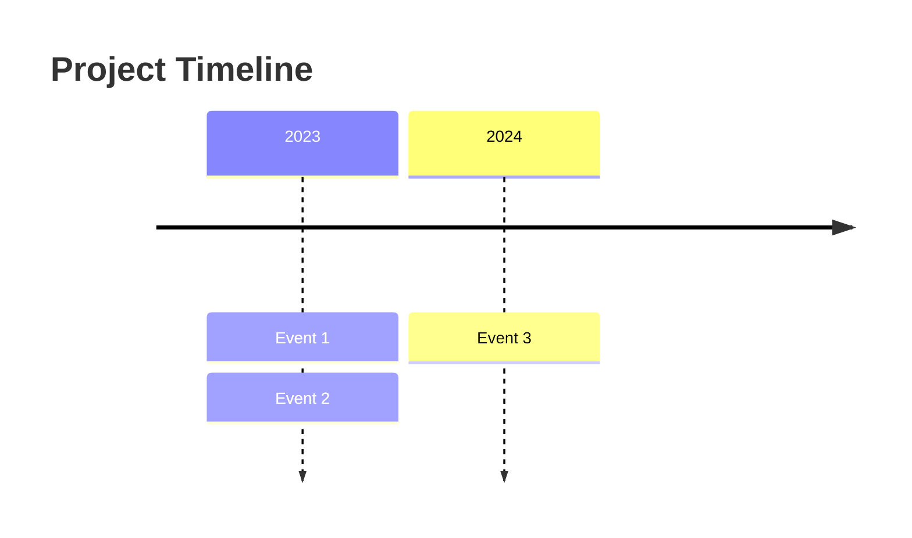

# Mermaid Diagram Troubleshooting

Common syntax errors, rendering issues, and optimization tips for Mermaid diagrams.

## Common Syntax Errors

### 1. Invalid Node IDs

**Error**: Diagram fails to render or shows unexpected connections

**Problem**:
```mermaid
graph TD
    User Login --> Dashboard
    Dashboard --> User Actions
```

**Solution**: Use valid node IDs (no spaces, start with letter)


**Rule**: Node IDs must be alphanumeric (can include underscores/hyphens). Use brackets `[]` for display text with spaces.

---

### 2. Missing Quotes in Labels

**Error**: Syntax error or label truncated

**Problem**:


**Solution**: Use quotes for labels with special characters


**Rule**: Use double quotes `"` when labels contain special characters: `'`, `"`, `:`, `|`, `{`, `}`, etc.

---

### 3. Incorrect Arrow Syntax

**Error**: Connection not rendering or syntax error

**Common mistakes**:
```mermaid
graph TD
    A -> B        ❌ Single dash (wrong)
    A => B        ❌ Fat arrow (wrong)
    A -- B        ❌ No arrow head
```

**Correct syntax**:
```mermaid
graph TD
    A --> B       ✅ Solid arrow
    A -.-> B      ✅ Dotted arrow
    A ==> B       ✅ Thick arrow
    A --o B       ✅ Circle end
    A --x B       ✅ Cross end
```

---

### 4. Direction Specification Errors

**Error**: Diagram layout incorrect or doesn't render

**Problem**:
```mermaid
graph TopToBottom
    A --> B
```

**Solution**: Use correct direction abbreviations
```mermaid
graph TD    ✅ Top to bottom (or TB)
graph LR    ✅ Left to right
graph RL    ✅ Right to left
graph BT    ✅ Bottom to top
```

---

### 5. Subgraph Syntax Issues

**Error**: Subgraph not rendering or containing wrong nodes

**Problem**:
```mermaid
graph TD
    subgraph Frontend
    A --> B
    end
    subgraph Backend
    C --> D
```

**Solution**: Close all subgraphs properly


**Rule**: Every `subgraph` must have a matching `end`. Indent contents for readability.

---

### 6. Class Definition Errors

**Error**: Styling not applied or syntax error

**Problem**:
```mermaid
graph TD
    A --> B
    classDef myStyle fill:#ff0000
    class A,B myStyle    ❌ Comma without space
```

**Solution**: Use proper spacing in class assignments
```mermaid
graph TD
    A --> B
    classDef myStyle fill:#ff0000,stroke:#333,stroke-width:2px
    class A,B myStyle    ✅ Works but better...
    class A myStyle      ✅ Individual assignment
    class B myStyle
```

---

### 7. Sequence Diagram Participant Issues

**Error**: Participant not recognized or activations broken

**Problem**:


**Solution**: Explicitly declare all participants


**Tip**: Use `actor` for human participants, `participant` for systems.

---

### 8. State Diagram Version Confusion

**Error**: State diagram syntax not working

**Problem**:


**Solution**: Use `stateDiagram-v2` for modern features


**Rule**: Always use `stateDiagram-v2` for new diagrams. v1 is deprecated.

---

### 9. ERD Relationship Syntax Errors

**Error**: Relationships not rendering correctly

**Problem**:
```mermaid
erDiagram
    USER --> ORDER    ❌ Wrong syntax
```

**Solution**: Use ERD-specific relationship notation


---

### 10. Timeline Date Format Issues

**Error**: Timeline not rendering or dates incorrect

**Problem**:


**Solution**: Use proper timeline syntax (no date format in basic timeline)


**Note**: For Gantt charts with specific dates, use `dateFormat YYYY-MM-DD`.

---

## Rendering Issues

### Diagram Too Large / Overcrowded

**Problem**: Diagram becomes unreadable with too many nodes

**Solutions**:

1. **Split into multiple diagrams**:
```mermaid
%% Instead of one massive diagram, create logical sections
graph TD
    subgraph "Authentication Flow"
        A --> B --> C
    end
```

2. **Use subgraphs to organize**:
```mermaid
graph TB
    subgraph Frontend
        UI --> Cache
    end
    subgraph Backend
        API --> DB
    end
    Cache --> API
```

3. **Limit to 15-20 nodes per diagram**

---

### Text Overlapping or Cut Off

**Problem**: Long labels overlap or get truncated

**Solutions**:

1. **Use line breaks in labels**:
```mermaid
graph LR
    A["Long Text Here<br/>Split Into Lines"]
```

2. **Abbreviate and use notes**:
```mermaid
graph TD
    A[User Auth]
    note right of A: User Authentication<br/>with OAuth 2.0
```

3. **Adjust diagram direction**:
```mermaid
%% If LR is cramped, try TD
graph TD
    A[Very Long Label] --> B[Another Long Label]
```

---

### Arrows Not Connecting Properly

**Problem**: Arrows point to wrong nodes or overlap

**Solutions**:

1. **Use explicit edge labels**:
```mermaid
graph TD
    A -->|Success| B
    A -->|Failure| C
```

2. **Adjust node positioning with ranking**:
```mermaid
graph TD
    A --> B
    A --> C
    B --> D
    C --> D

    %% Force same rank
    subgraph " "
        B
        C
    end
```

---

### Styling Not Applied

**Problem**: `classDef` or inline styles not working

**Checklist**:

1. **Verify class definition before usage**:
```mermaid
graph TD
    classDef myClass fill:#f9f,stroke:#333    ✅ Define first
    A --> B
    class A myClass                            ✅ Then apply
```

2. **Check for typos in class names**:
```mermaid
classDef errorStyle fill:#f00
class A errorStyle    ✅ Exact match required
class B errorstyle    ❌ Case mismatch
```

3. **Use inline styles as fallback**:
```mermaid
graph TD
    A[Node]:::className
    B[Node]

    classDef className fill:#ff0
```

---

### Dark Mode / Theme Issues

**Problem**: Diagram unreadable in dark mode

**Solutions**:

1. **Use theme variables**:
```mermaid
%%{init: {'theme':'dark'}}%%
graph TD
    A --> B
```

2. **Define custom theme**:
```mermaid
%%{init: {'theme':'base', 'themeVariables': {
    'primaryColor':'#4a90e2',
    'primaryTextColor':'#fff',
    'primaryBorderColor':'#2c5aa0',
    'lineColor':'#666',
    'background':'#1e1e1e'
}}}%%
graph TD
    A --> B
```

3. **Use patterns in addition to colors** for accessibility.

---

## Performance Optimization

### Large Diagrams Loading Slowly

**Problem**: Diagram takes long to render or freezes browser

**Solutions**:

1. **Reduce node count**: Aim for <50 nodes
2. **Simplify relationships**: Remove redundant arrows
3. **Use static exports**: Render to SVG/PNG instead of live rendering
4. **Lazy load**: Don't render until needed

---

### Memory Issues in Documentation

**Problem**: Multiple diagrams cause high memory usage

**Solutions**:

1. **Render diagrams on demand** (click to show)
2. **Use thumbnails** with click to expand
3. **Split into separate pages** for large documentation
4. **Export to static images** for frequently accessed docs

---

## Export and Compatibility

### SVG Export Issues

**Problem**: Exported SVG missing styles or broken

**Solutions**:

1. **Use official Mermaid CLI**:
```bash
mmdc -i diagram.mmd -o output.svg
```

2. **Verify theme support** in export tool

3. **Embed fonts** if using custom typography

---

### PNG Export Quality

**Problem**: PNG exports blurry or low quality

**Solutions**:

1. **Increase scale/resolution**:
```bash
mmdc -i diagram.mmd -o output.png -s 2
```

2. **Use SVG instead** for scalability

3. **Render at target size** from the start

---

### Markdown Rendering Issues

**Problem**: Diagram not rendering in GitHub/GitLab/Confluence

**Checklist**:

1. **Verify platform support**:
   - GitHub: ✅ Native support
   - GitLab: ✅ Native support
   - Confluence: ⚠️ Requires plugin
   - Notion: ⚠️ Limited support

2. **Use code fence syntax**:
````markdown
```mermaid
graph TD
    A --> B
```
````

3. **Check for syntax compatibility** (some platforms lag on new features)

---

## Debugging Workflow

When a diagram doesn't work:

1. **Check syntax basics**:
   - Valid diagram type declaration?
   - All subgraphs closed?
   - Valid node IDs?
   - Proper quote usage?

2. **Simplify to isolate issue**:
   - Comment out sections
   - Remove styling
   - Test with minimal example

3. **Validate in Mermaid Live Editor**:
   - Visit https://mermaid.live
   - Paste your diagram
   - Check error messages

4. **Check version compatibility**:
   - Different tools support different Mermaid versions
   - Use latest stable syntax
   - Avoid experimental features

5. **Review documentation**:
   - Official docs: https://mermaid.js.org
   - Check for breaking changes
   - Look for known issues

---

## Best Practices to Avoid Issues

### 1. Start Simple, Add Complexity Gradually
```mermaid
%% Step 1: Basic structure
graph TD
    A --> B --> C

%% Step 2: Add labels
graph TD
    A[Start] --> B[Process] --> C[End]

%% Step 3: Add styling
graph TD
    A[Start] --> B[Process] --> C[End]
    classDef processStyle fill:#90EE90
    class B processStyle
```

### 2. Use Comments Liberally
```mermaid
graph TD
    %% Authentication flow
    A[Login] --> B{Valid?}

    %% Success path
    B -->|Yes| C[Dashboard]

    %% Failure path
    B -->|No| D[Error]
    D --> A
```

### 3. Validate Before Committing
- Test in Mermaid Live Editor
- Verify in target platform (GitHub, docs site, etc.)
- Check on mobile if diagram will be viewed on phones
- Test in both light and dark modes

### 4. Keep a Style Guide
Document your project's diagram conventions:
- Standard colors for different node types
- Naming conventions for node IDs
- Preferred direction (LR vs TD)
- Maximum nodes per diagram
- Font sizes and spacing rules

### 5. Version Control Diagrams
```markdown
graph TD
    A --> B

%% Version: 1.2
%% Last updated: 2024-01-15
%% Author: TeamName
%% Description: User authentication flow
```

---

## Getting Help

If you're still stuck:

1. **Search existing issues**: https://github.com/mermaid-js/mermaid/issues
2. **Check discussions**: https://github.com/mermaid-js/mermaid/discussions
3. **Read official docs**: https://mermaid.js.org
4. **Use Mermaid Live Editor**: https://mermaid.live for quick testing
5. **Ask in community**: Discord, Stack Overflow (tag: mermaid)

## Quick Reference: Common Fixes

| Problem | Solution |
|---------|----------|
| Syntax error | Check node IDs (no spaces), quote special chars |
| Not rendering | Verify diagram type, close all subgraphs |
| Arrows wrong | Use correct syntax: `-->`, `-.->`, `==>` |
| Styling fails | Define `classDef` before use, check spelling |
| Text overlaps | Use `<br/>` for line breaks, shorten labels |
| Too crowded | Split into multiple diagrams, use subgraphs |
| Dark mode issues | Use theme variables or patterns |
| Export broken | Use Mermaid CLI, verify format support |
| Platform-specific | Check platform Mermaid version support |
| Performance slow | Reduce nodes (<50), simplify relationships |
