# Mermaid Diagram Creation: Detailed Workflow

This document provides a detailed step-by-step methodology for creating effective Mermaid diagrams.

For quick start instructions, see [SKILL.md](SKILL.md).

## Overview

The diagram creation process follows 6 main phases:

1. **Understanding Requirements** - Define what to communicate and to whom
2. **Choosing Diagram Type** - Select the right visualization for your use case
3. **Creating Basic Structure** - Build the foundational elements
4. **Adding Detail & Styling** - Enhance with meaningful visuals
5. **Testing & Validation** - Verify rendering and readability
6. **Refinement & Documentation** - Polish and prepare for distribution

---

## Phase 1: Understanding Requirements

### Questions to Answer

**1. What are you trying to communicate?**
- Process flow or decision tree? → Flowchart
- System interactions over time? → Sequence Diagram
- Data relationships? → ERD
- State transitions? → State Diagram
- Object structure? → Class Diagram
- Project timeline? → Gantt Chart
- User journey? → Journey Map
- Proportions/distributions? → Pie Chart

**2. Who is the audience?**
- Technical developers → More detail, technical terminology
- Business stakeholders → High-level overview, business terms
- End users → Simplified flow, minimal jargon
- Mixed audience → Balance detail with clarity

**3. What level of detail is needed?**
- **High-level overview**: 5-10 nodes, major steps only
- **Detailed workflow**: 10-20 nodes, important branches
- **Comprehensive documentation**: 20-50 nodes, use subgraphs

**4. Where will it be rendered?**
- GitHub/GitLab README → Standard Mermaid syntax
- Documentation site → May support advanced features
- Presentation slides → Keep simple, large text
- Print materials → Export as SVG/PNG

---

## Phase 2: Choosing Diagram Type

### Decision Matrix

| Use Case | Best Diagram Type | Alternative |
|----------|------------------|-------------|
| **Process with decisions** | Flowchart (graph TB/LR) | - |
| **API/Service interactions** | Sequence Diagram | Flowchart |
| **Database schema** | ERD | Class Diagram |
| **Authentication/Navigation** | State Diagram | Flowchart |
| **Class/Object structure** | Class Diagram | - |
| **Project scheduling** | Gantt Chart | Timeline |
| **Git branching strategy** | Git Graph | Flowchart |
| **User experience flow** | Journey Map | Flowchart |
| **Feature prioritization** | Quadrant Chart | - |
| **Historical events** | Timeline | Gantt Chart |
| **Data distribution** | Pie Chart | - |

### Diagram Type Selection Guide

#### Flowchart (graph)
**Use when**:
- Showing process steps and decision points
- Illustrating branching logic
- Documenting workflows

**Best for**: General-purpose diagrams, process documentation

#### Sequence Diagram
**Use when**:
- Showing interactions between actors/systems over time
- Documenting API call sequences
- Illustrating authentication flows

**Best for**: Technical documentation, API specs

#### ERD (Entity Relationship Diagram)
**Use when**:
- Designing database schemas
- Showing table relationships
- Documenting data models

**Best for**: Database design, data architecture

#### State Diagram
**Use when**:
- Modeling state machines
- Showing navigation flows
- Documenting lifecycle transitions

**Best for**: Authentication flows, order processing, UI navigation

#### Class Diagram
**Use when**:
- Documenting object-oriented design
- Showing inheritance and composition
- Modeling system architecture

**Best for**: OOP design, system architecture

---

## Phase 3: Creating Basic Structure

### Step 1: Define Core Elements

**For Flowcharts**:
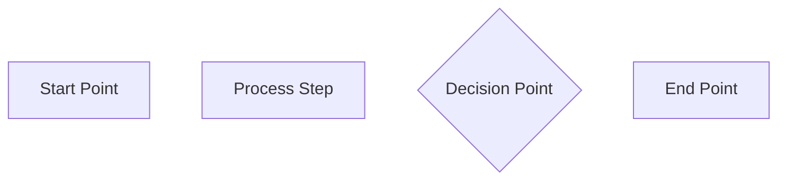

**For Sequence Diagrams**:
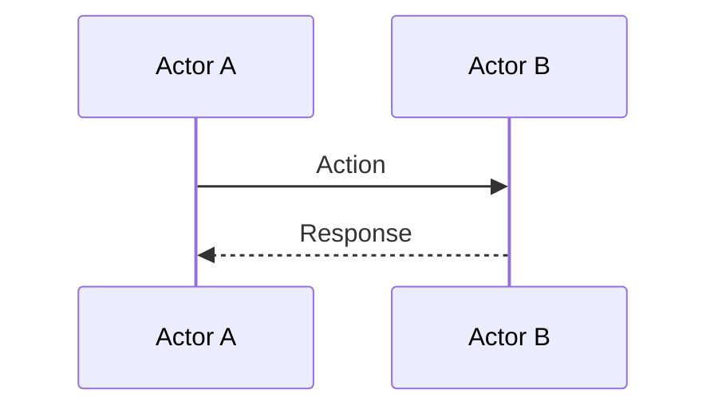

**For ERDs**:
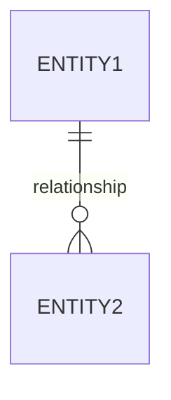

### Step 2: Choose Layout Direction

**Flowchart Directions**:
- `TB` or `TD`: Top to bottom (default, best for processes)
- `BT`: Bottom to top (rare, only for specific cases)
- `LR`: Left to right (good for timelines, horizontal flows)
- `RL`: Right to left (rare, RTL language contexts)

**Best Practice**: Use `TD` for processes, `LR` for timelines

### Step 3: Add Initial Nodes

Start with 3-5 key nodes:
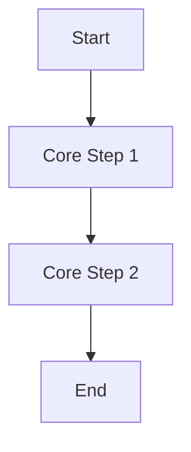

### Step 4: Test Basic Rendering

**Quick Test**:
1. Copy code to [Mermaid Live Editor](https://mermaid.live)
2. Verify syntax is valid
3. Check basic layout looks reasonable

**Early Validation**: Catch syntax errors before adding complexity

---

## Phase 4: Adding Detail & Styling

### Step 1: Expand with Complete Logic

Add all nodes and relationships:
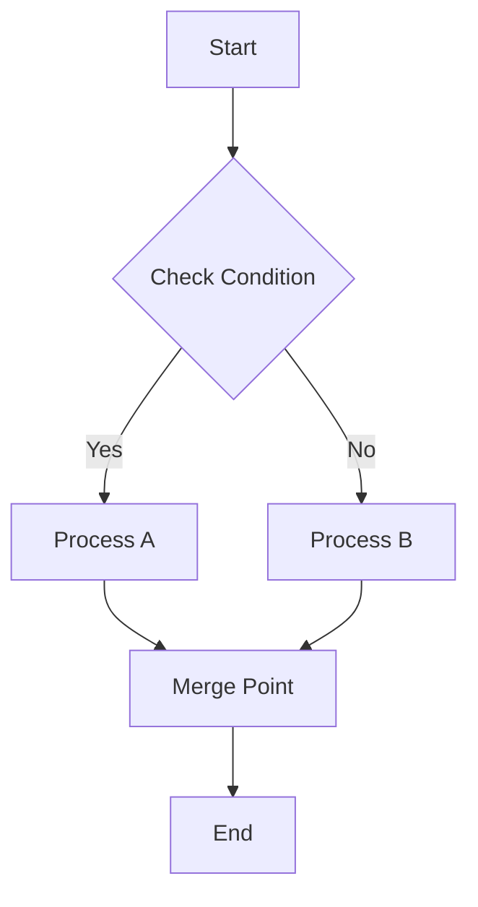

### Step 2: Use Subgraphs for Organization

**For complex diagrams** (>15 nodes):
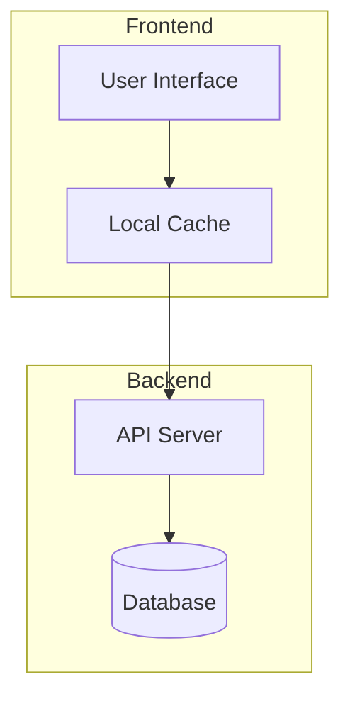

**Benefits**:
- Visual grouping of related components
- Clearer organization
- Better readability

### Step 3: Apply Meaningful Styling

**Color Conventions**:
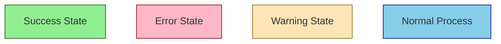

**Shape Conventions**:
- `[Rectangle]` - Process step
- `{Diamond}` - Decision point
- `([Rounded])` - Start/End point
- `[(Cylinder)]` - Database
- `[[Subroutine]]` - Subprocess

**Line Style Conventions**:
- `-->` Solid line - Primary flow
- `-.->` Dotted line - Optional/alternative flow
- `==>` Thick line - Important/critical path

### Step 4: Add Descriptive Labels

**Good Labels**:
- ✅ "Validate User Input"
- ✅ "Check Authentication"
- ✅ "Is Request Valid?"

**Poor Labels**:
- ❌ "Step 1"
- ❌ "Process"
- ❌ "Check"

**Best Practice**: Use verb phrases for processes, questions for decisions

### Step 5: Include Comments

For complex syntax:
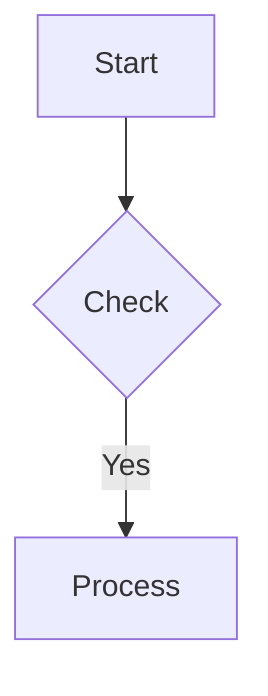

---

## Phase 5: Testing & Validation

### Step 1: Test in Mermaid Live Editor

**Process**:
1. Go to https://mermaid.live
2. Paste your diagram code
3. Verify it renders correctly
4. Check for syntax errors (highlighted in red)

**Common Rendering Issues**:
- Missing closing brackets
- Invalid characters in node IDs
- Incorrect arrow syntax

### Step 2: Verify Readability

**Checklist**:
- [ ] Can you read all text at 100% zoom?
- [ ] Are relationships clear and unambiguous?
- [ ] Is the flow direction intuitive?
- [ ] Are colors/shapes meaningful?
- [ ] Are there fewer than 20 nodes per diagram?

**If too complex**: Consider splitting into multiple diagrams or using subgraphs

### Step 3: Check Platform Compatibility

**GitHub/GitLab**:
- Test in actual markdown preview
- Some features may render differently
- Check mobile rendering

**Confluence/Documentation Sites**:
- May support additional features
- Verify custom styling works
- Test export formats

### Step 4: Optimize Performance

**Performance Guidelines**:
- **Optimal**: <15 nodes per diagram
- **Good**: 15-25 nodes
- **Acceptable**: 25-50 nodes with subgraphs
- **Too Complex**: >50 nodes (consider splitting)

**Optimization Strategies**:
1. Use subgraphs to group related nodes
2. Collapse detailed sub-processes into single nodes
3. Create separate diagrams for different abstraction levels
4. Link between diagrams in documentation

### Step 5: Validate Accessibility

**Accessibility Checklist**:
- [ ] Sufficient color contrast (don't rely on color alone)
- [ ] Clear text labels (not just icons)
- [ ] Logical flow (left-to-right or top-to-bottom)
- [ ] Alt text provided in surrounding documentation

---

## Phase 6: Refinement & Documentation

### Step 1: Add Inline Documentation

**Within the diagram**:
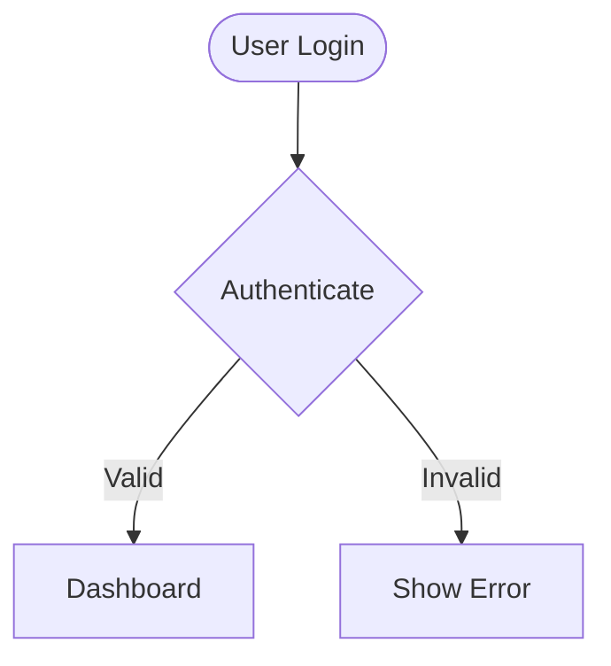

**Benefits**:
- Future maintainability
- Context for other developers
- Change history tracking

### Step 2: Ensure Style Consistency

**Check**:
- [ ] All similar nodes use same shapes
- [ ] Color scheme is consistent throughout
- [ ] Line styles follow conventions
- [ ] Spacing and indentation are uniform

**Formatting Example**:
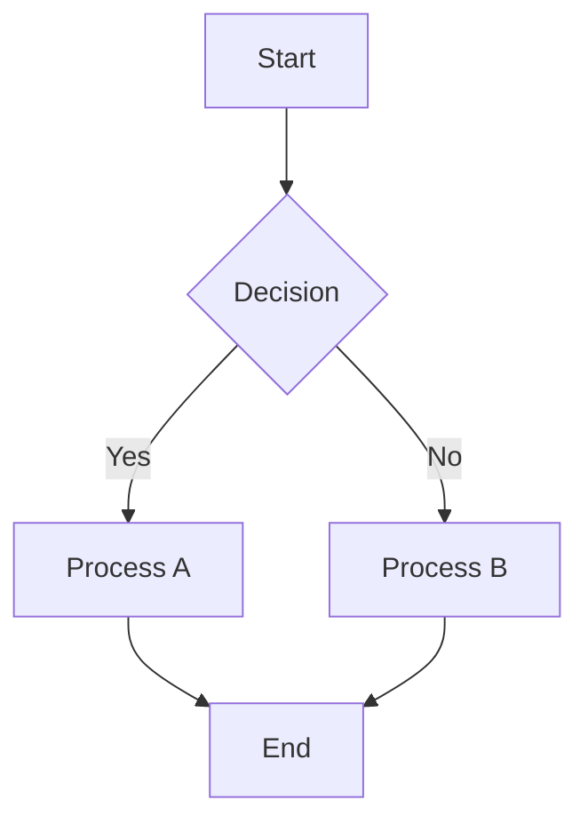

### Step 3: Export to Appropriate Format

**SVG** (Recommended):
- Scalable vector graphics
- Best for web and documentation
- Maintains quality at any zoom level
- Use Mermaid Live Editor export

**PNG**:
- Raster image format
- Good for presentations
- Fixed resolution
- Larger file size

**Inline Code**:
- Keep source in markdown
- Renders natively in GitHub/GitLab
- Easy to update

### Step 4: Provide Rendering Instructions

**In Documentation**:
```markdown
## Architecture Diagram

The following diagram shows the system architecture:

\`\`\`mermaid
graph TD
    [Your diagram here]
\`\`\`

**Viewing**: This diagram renders automatically on GitHub. To edit:
1. Copy the code block
2. Open [Mermaid Live Editor](https://mermaid.live)
3. Paste and modify
4. Copy back to update
```

### Step 5: Create Quality Checklist

**Before Publishing**:
- [ ] Diagram renders correctly in target environment
- [ ] All text is legible at normal zoom
- [ ] Flow direction is clear and intuitive
- [ ] Colors/shapes have semantic meaning
- [ ] No syntax errors or warnings
- [ ] Complexity is appropriate (<25 nodes)
- [ ] Comments explain complex sections
- [ ] Surrounding documentation provides context
- [ ] Export format is appropriate for use case

---

## Common Workflows

### Quick Diagram (5-10 minutes)

1. Identify diagram type (2 min)
2. Sketch 5-7 key nodes (3 min)
3. Add relationships (2 min)
4. Test in Mermaid Live (1 min)
5. Copy to documentation (1 min)

**Best for**: Simple flows, quick documentation

### Professional Diagram (30-60 minutes)

1. Understand requirements (5 min)
2. Choose diagram type (5 min)
3. Create basic structure (10 min)
4. Add complete detail (15 min)
5. Apply styling (10 min)
6. Test and validate (5 min)
7. Refine and document (10 min)

**Best for**: Technical documentation, important specs

### Complex Multi-Diagram System (2-4 hours)

1. Define scope and requirements (30 min)
2. Plan diagram hierarchy (30 min)
3. Create high-level overview diagram (30 min)
4. Create 3-5 detailed diagrams (60 min)
5. Add comprehensive styling (30 min)
6. Cross-reference and link diagrams (15 min)
7. Review and refine (15 min)

**Best for**: System architecture, comprehensive documentation

---

## Integration with Other Documents

**When to consult other resources**:

### SKILL.md
- Quick syntax reference
- Diagram type list
- Basic examples
- Output format information

### EXAMPLES.md
- Real-world diagram samples
- Styling inspiration
- Complex syntax patterns
- Platform-specific examples

### TROUBLESHOOTING.md
- Syntax error solutions
- Rendering issues
- Platform-specific problems
- Performance optimization tips

---

## Best Practices Summary

### DO:
- ✅ Start simple, add complexity gradually
- ✅ Use meaningful node IDs (descriptive, not generic)
- ✅ Test frequently in Mermaid Live Editor
- ✅ Keep diagrams focused (one concept per diagram)
- ✅ Use subgraphs for organization (>15 nodes)
- ✅ Apply consistent styling with semantic meaning
- ✅ Add comments for complex sections
- ✅ Verify rendering in target platform

### DON'T:
- ❌ Create diagrams with >50 nodes
- ❌ Use generic labels ("Step 1", "Process")
- ❌ Rely on color alone (ensure text clarity)
- ❌ Mix multiple concepts in one diagram
- ❌ Skip testing before publishing
- ❌ Use complex syntax without comments
- ❌ Forget to check mobile rendering

---

## Quick Reference: Diagram Type Selection

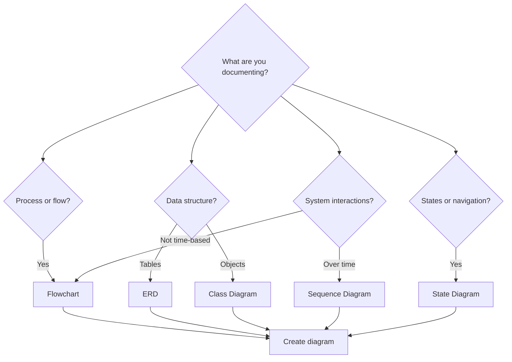

Use this decision tree as a starting point, then refine based on specific requirements.

---

## Next Steps

After completing your diagram:

1. **Validate**: Check all items in the quality checklist
2. **Document**: Add context in surrounding documentation
3. **Review**: Get feedback from team/stakeholders
4. **Iterate**: Refine based on feedback
5. **Publish**: Include in final documentation

For troubleshooting, see [TROUBLESHOOTING.md](TROUBLESHOOTING.md).
For examples, see [EXAMPLES.md](EXAMPLES.md).

---

*Last Updated: 2025-10-27*
