# Multi-Agent Orchestration Patterns: Deep Dive

> A comprehensive guide to multi-agent orchestration patterns, with reference implementations and cross-domain application examples.

## Introduction

Multi-agent orchestration is the practice of coordinating multiple specialized AI agents to accomplish complex tasks. Instead of one agent doing everything, you decompose work into roles, define how those roles communicate, and let the system coordinate execution.

**When to use multi-agent over single-agent:**
- The task has distinct phases that benefit from different "mindsets" (e.g., building vs. reviewing)
- Self-review is unreliable because the builder is biased toward their own work
- The workflow needs quality gates between stages
- You want to enforce separation of concerns (spec writing vs. implementation vs. verification)

**When single-agent is sufficient:**
- The task is straightforward and doesn't need review cycles
- Adding coordination overhead would slow things down without improving quality
- The agent can hold all relevant context without fragmentation

The patterns in this guide compose together. A real workflow typically combines 3-5 patterns. For example, a feature development workflow might use Pipeline + Specification-First + Critic-Actor + Confidence-Gated Completion.

---

## Core Architectural Concepts

### 1. Specialized Roles (Hats)

#### What It Is

A hat is a focused role that an agent wears during one phase of work. Each hat has: a name, a description, what events trigger it, what events it can publish, and instructions defining its behavior. The agent doesn't change — the role it plays changes.

#### How It Works

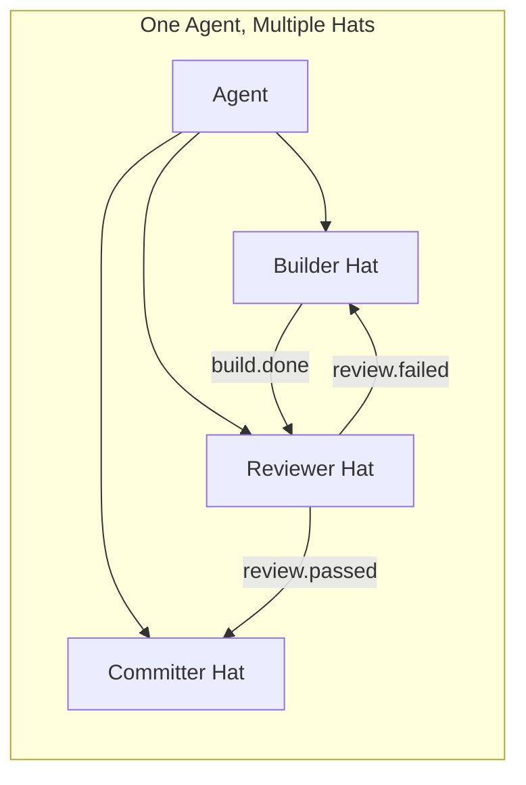

#### Reference Implementation

From `ralph.yml` — the Builder hat:

```yaml
hats:
  builder:
    name: Builder
    description: Implements one task and records an internal monologue.
    triggers:
      - build.task
    publishes:
      - build.done
      - build.blocked
    default_publishes: build.done
    instructions: |
      ## BUILDER PHASE
      1. Pick one task from `ralph tools task ready`.
      2. Implement the change.
      3. Run verification (tests/lints/builds).
      4. Record what you did as a memory with evidence.
      5. Close the task.
      ### Don't
      - Do not output the completion promise.
      - Do not skip verification.
```

Key elements:
- **`triggers`**: Events that activate this hat
- **`publishes`**: Events this hat is allowed to emit
- **`default_publishes`**: Fallback if the agent forgets to emit an event
- **`instructions`**: System prompt for this role

#### Applying This Pattern

**RFC Discussion Skill**: Define `Proposer`, `Devil's Advocate`, and `Synthesizer` hats. The Proposer drafts the RFC, the Devil's Advocate finds weaknesses, and the Synthesizer reconciles the arguments into a decision.

**Code Review Agent**: Define `Reviewer` (finds issues), `Author` (responds to feedback), and `Arbiter` (resolves disagreements) hats. Each has a distinct mindset — the Reviewer is incentivized to find problems, the Author to defend or fix, and the Arbiter to make final calls.

#### Key Design Decisions

- **One concern per hat**: A hat that builds AND reviews will self-approve. Split them.
- **Instructions should constrain, not prescribe**: Tell the hat what to care about, not every step to take.
- **Default publishes**: Always set a fallback to prevent the workflow from stalling if the agent forgets to emit an event.

---

### 2. Event-Driven Routing

#### What It Is

Agents communicate through named events rather than direct calls. Each hat declares its triggers (incoming events) and publishes (outgoing events). The orchestrator matches published events to triggered hats, creating a decoupled coordination system.

#### How It Works

```mermaid
sequenceDiagram
    participant O as Orchestrator
    participant B as Builder Hat
    participant C as Confessor Hat
    participant H as Handler Hat

    O->>B: Event: build.task
    B->>O: Emit: build.done
    O->>C: Event: build.done
    C->>O: Emit: confession.issues_found
    O->>H: Event: confession.issues_found
    H->>O: Emit: build.task (loop back)
```

#### Reference Implementation

From `ralph.yml` — the event routing table:

```yaml
hats:
  builder:
    triggers: [build.task]
    publishes: [build.done, build.blocked]

  confessor:
    triggers: [build.done]
    publishes: [confession.clean, confession.issues_found]

  confession_handler:
    triggers: [confession.issues_found, confession.clean]
    publishes: [build.task, escalate.human]
```

**Event naming conventions:**
- `<phase>.start` / `<phase>.resume` — Entry points
- `<phase>.ready` / `<phase>.done` — Phase transitions
- `<thing>.approved` / `<thing>.rejected` — Review gates
- `<noun>.found` / `<noun>.missing` — Discovery events

#### Applying This Pattern

**Design Decision Workflow**: Events like `proposal.ready`, `critique.complete`, `consensus.reached`, `decision.made` coordinate a multi-agent design discussion without any agent knowing who handles what.

**Research Pipeline**: `topic.identified` -> `sources.gathered` -> `analysis.complete` -> `synthesis.ready` creates a research workflow where each stage is independently replaceable.

#### Key Design Decisions

- **Each trigger must map to exactly one hat**: If two hats trigger on the same event, routing becomes ambiguous.
- **Events carry data**: The event payload (e.g., `"confidence: 85, summary: tests pass"`) is the communication channel between hats.
- **Loops are intentional**: A hat can publish an event that triggers an earlier hat (e.g., `build.task` -> `build.done` -> `confession.issues_found` -> `build.task`). This creates iteration loops.

---

### 3. Completion Promise

#### What It Is

A predefined string (e.g., `LOOP_COMPLETE`) that signals the orchestration system to stop. Only specific hats are authorized to emit it. Without this, autonomous loops run indefinitely or rely on fragile heuristics to detect completion.

#### Reference Implementation

```yaml
event_loop:
  completion_promise: LOOP_COMPLETE
  max_iterations: 50        # Safety limit
  max_runtime_seconds: 3600  # Time limit
```

In the hat instructions, only the final verifier outputs it:

```yaml
confession_handler:
  instructions: |
    If verification passes AND confidence >= 80:
    - Ensure all tasks are closed.
    - Commit changes.
    - Output the completion promise.
```

#### Applying This Pattern

Any autonomous workflow needs a termination condition. In a research skill, the Synthesizer hat outputs the completion promise after producing the final report. In a code review, the Arbiter outputs it after all issues are resolved or accepted.

**Safety limits**: Always pair completion promises with `max_iterations` and `max_runtime_seconds` to prevent infinite loops.

---

### 4. Backpressure (Quality Gates)

#### What It Is

Instead of detailed step-by-step instructions, define automated checks that reject bad work. Tests, linters, type checks, and build steps serve as quality gates. If a gate fails, the work bounces back to the builder. The agent is free to approach the work however it wants — the gates enforce the outcome.

#### How It Works

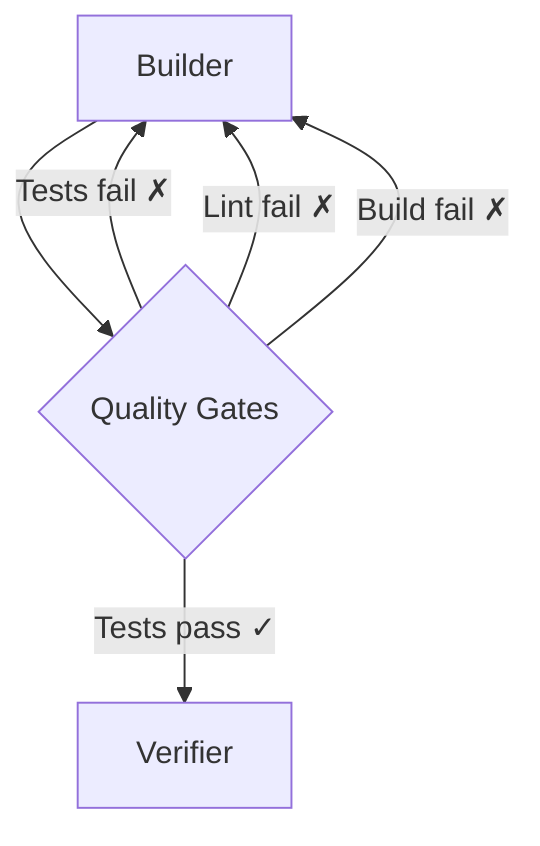

#### Reference Implementation

From `ralph.yml` builder instructions:

```yaml
instructions: |
  1. Implement the change.
  2. Run verification (tests/lints/builds).
  3. Record what you did as a memory with evidence.
  ### Don't
  - Do not skip verification.
  - Do not close tasks without running tests.
```

From the Ralph Tenets in CLAUDE.md:

> **Backpressure Over Prescription** — Don't prescribe how; create gates that reject bad work. Tests, typechecks, builds, lints. For subjective criteria, use LLM-as-judge with binary pass/fail.

#### Applying This Pattern

**Code Review Skill**: Instead of telling the reviewer exactly what to look for, require that the review produces structured findings with severity scores. A quality gate rejects reviews with no findings (suspicious) or reviews that miss known test failures.

**RFC Approval**: An automated gate checks that the RFC has required sections (problem statement, alternatives considered, decision), a minimum word count, and references to relevant prior art.

---

## Multi-Agent Coordination Patterns

### 5. Pipeline

#### What It Is

The simplest multi-agent pattern: a linear flow where each agent's output feeds the next. Each stage has a single concern. Start here before reaching for more complex patterns.

#### How It Works

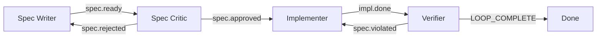

#### Reference Implementation

From `presets/spec-driven.yml`:

```yaml
event_loop:
  starting_event: "spec.start"

hats:
  spec_writer:
    triggers: ["spec.start", "spec.rejected"]
    publishes: ["spec.ready"]
    instructions: |
      Create a precise, unambiguous specification.
      Include Given-When-Then acceptance criteria,
      input/output examples, edge cases, error conditions.

  spec_reviewer:
    triggers: ["spec.ready"]
    publishes: ["spec.approved", "spec.rejected"]
    instructions: |
      Could someone implement this from the spec alone?
      After 1 rejection, approve with notes rather than rejecting again.

  implementer:
    triggers: ["spec.approved", "spec.violated"]
    publishes: ["implementation.done"]
    instructions: |
      Implement EXACTLY what the spec says.
      Follow the spec literally — no creative interpretation.

  verifier:
    triggers: ["implementation.done"]
    publishes: ["task.complete", "spec.violated"]
    instructions: |
      Verify implementation matches spec exactly.
      If all pass: output LOOP_COMPLETE.
```

#### Applying This Pattern

**Technical Writing**: Outline -> Draft -> Edit -> Proofread. Each stage has a clear input and output.

**Data Pipeline**: Extract -> Transform -> Validate -> Load. Each agent specializes in one ETL stage.

#### Key Design Decisions

- **Feedback loops**: Allow later stages to send work back (e.g., `spec.violated` -> Implementer). Without these, errors compound forward.
- **Bounded retries**: After N rejections, approve with notes rather than looping forever. The spec-driven preset does this: "After 1 rejection, approve with notes rather than rejecting again."

---

### 6. Critic-Actor

#### What It Is

One agent proposes work, another critiques it. The critic is incentivized to find problems — they are rewarded for honesty, not for approval. This separation counters builder bias where the creator of work is too invested to evaluate it objectively.

#### How It Works

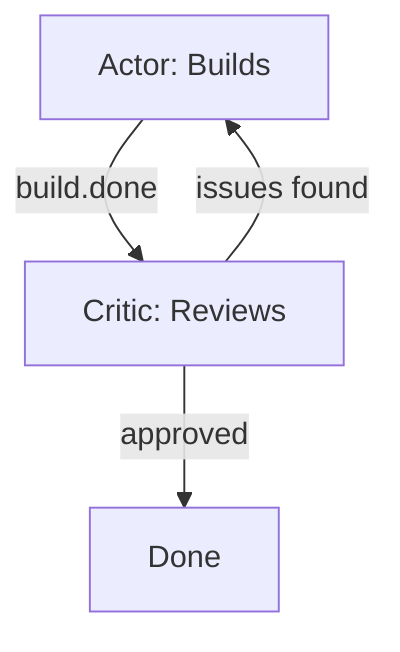

#### Reference Implementation

From `presets/tdd-red-green.yml`:

```yaml
hats:
  test_writer:
    name: "Test Writer"
    triggers: ["tdd.start", "refactor.done"]
    publishes: ["test.written"]
    instructions: |
      You write FAILING tests first. This is non-negotiable.
      NEVER write implementation code. Your job is tests only.

  implementer:
    name: "Implementer"
    triggers: ["test.written"]
    publishes: ["test.passing"]
    instructions: |
      Make the failing test pass with MINIMAL code.
      Do NOT refactor. Do NOT add extra functionality.
      Just make the test pass. Ugly code is fine at this stage.

  refactorer:
    name: "Refactorer"
    triggers: ["test.passing"]
    publishes: ["refactor.done", "cycle.complete"]
    instructions: |
      Clean up the code while keeping tests green.
      If more tests needed: publish refactor.done
      If feature complete: publish cycle.complete
```

#### Applying This Pattern

**RFC Discussion**: A `Proposer` drafts the RFC. A `Critic` identifies weaknesses, missing alternatives, and unstated assumptions. The Proposer revises. A `Decision-Maker` synthesizes.

**Architecture Review**: An `Architect` proposes a design. A `Reviewer` evaluates scalability, maintainability, and failure modes. Iteration until consensus.

---

### 7. Adversarial Review

#### What It Is

An intensified Critic-Actor where the reviewing agent actively *tries to break* the work. The red team explores attack vectors, edge cases, and failure modes. A separate fixer agent remediates found issues, and the red team re-reviews.

#### How It Works

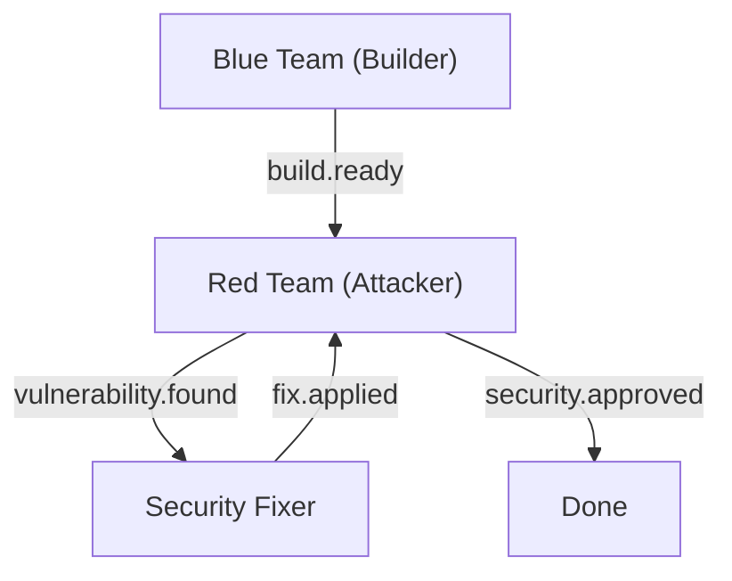

#### Reference Implementation

From `presets/adversarial-review.yml` (via COLLECTION.md):

```yaml
hats:
  builder:
    name: "Blue Team (Builder)"
    triggers: ["task.start", "fix.applied"]
    publishes: ["build.ready"]
    instructions: |
      Implement the feature with security in mind.
      Consider: input validation, injection attacks, auth/authz,
      data exposure, error handling, dependency vulnerabilities.

  red_team:
    name: "Red Team (Attacker)"
    triggers: ["build.ready"]
    publishes: ["vulnerability.found", "security.approved"]
    instructions: |
      You are a penetration tester. Your job is to BREAK this code.
      Attack vectors: injection, auth bypass, data exposure,
      race conditions, dependency vulnerabilities, info disclosure.

  fixer:
    name: "Security Fixer"
    triggers: ["vulnerability.found"]
    publishes: ["fix.applied"]
    instructions: |
      Remediate the vulnerability.
      Implement defense in depth. Add regression test.
```

#### Applying This Pattern

**Design Stress Testing**: A `Designer` proposes a system architecture. An `Adversary` tries to find scenarios that break it — high load, network partitions, data corruption, edge cases. The designer iterates until the adversary can't break it.

**Contract Review**: One agent drafts terms, another actively looks for loopholes, ambiguities, and unfavorable clauses.

---

### 8. Supervisor-Worker

#### What It Is

A coordinator agent decomposes a complex task into subtasks and delegates each to a specialist worker. The supervisor manages priorities, tracks progress, and integrates results. Workers focus purely on execution.

#### How It Works

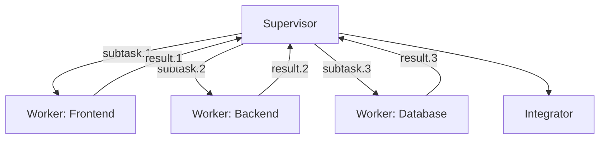

#### Reference Implementation

No single ralph-orchestrator preset isolates this pattern — the orchestrator *itself* is the supervisor. Ralph's event loop acts as a coordinator: it reads the task list, selects the next hat, delegates execution, and integrates results. The pattern is structural rather than configured.

A hypothetical preset would look like:

```yaml
event_loop:
  starting_event: "plan.start"

hats:
  planner:
    name: "Planner"
    triggers: ["plan.start"]
    publishes: ["subtask.ready"]
    instructions: |
      Decompose the task into independent subtasks.
      For each subtask, publish subtask.ready with scope and context.

  worker:
    name: "Worker"
    triggers: ["subtask.ready"]
    publishes: ["subtask.done", "subtask.blocked"]
    instructions: |
      Implement the assigned subtask.
      Run tests for your scope only.
      Publish subtask.done with results.

  integrator:
    name: "Integrator"
    triggers: ["subtask.done"]
    publishes: ["integration.complete"]
    instructions: |
      Wire completed subtasks together.
      Run full test suite. LOOP_COMPLETE when integrated.
```

#### Applying This Pattern

**Feature Development**: A `Planner` decomposes a feature into frontend, backend, and database subtasks. Each worker implements their piece. An `Integrator` wires everything together.

**Research**: A `Research Director` identifies subtopics. Workers investigate each independently. The Director synthesizes findings into a cohesive report.

#### Key Design Decisions

- **Workers must be independent**: If subtasks have dependencies, use Pipeline instead. Supervisor-Worker assumes parallelizable work.
- **Supervisor scope vs. worker scope**: The supervisor decides *what* to do; workers decide *how*. Don't let the supervisor micromanage implementation details.
- **Integration is its own phase**: Don't skip it. The Integrator verifies that independently-built pieces work together.

---

### 9. Rotating Roles

#### What It Is

Multiple agents examine the same work from different perspectives, taking turns as navigator, driver, and observer. Each rotation brings a fresh viewpoint, preventing tunnel vision.

#### Reference Implementation

From `presets/mob-programming.yml` (via COLLECTION.md):

```yaml
hats:
  navigator:
    name: "Navigator"
    triggers: ["task.start", "code.written"]
    publishes: ["direction.set", "mob.complete"]
    instructions: |
      Think strategically. Decide the next small step.
      Give CLEAR, SPECIFIC instructions to the driver.
      Do NOT write code — describe what to write.

  driver:
    name: "Driver"
    triggers: ["direction.set"]
    publishes: ["code.written"]
    instructions: |
      Execute the navigator's instructions.
      You're the hands, not the brain. Stay tactical.

  observer:
    name: "Observer"
    triggers: ["code.written"]
    publishes: ["observation.noted"]
    instructions: |
      Provide fresh-eyes feedback.
      Look for: potential bugs, simpler approaches,
      missing error handling, code style issues.
```

#### Applying This Pattern

**Architecture Decision**: Rotate perspectives — `Performance Analyst`, `Security Reviewer`, `Maintainability Advocate`, `User Experience Advocate` — each evaluating the same design from their lens.

**Code Walkthrough**: One agent explains the code, another asks questions from a newcomer's perspective, a third identifies documentation gaps.

---

### 10. Scientific Method

#### What It Is

A hypothesis-driven investigation pattern that prevents random "try this" debugging. Agents cycle through observation, hypothesis formation, experimentation, and conclusion. Each step is evidence-based.

#### How It Works

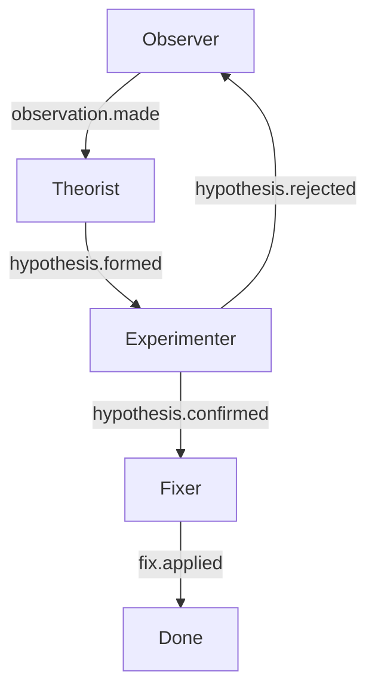

#### Reference Implementation

From `presets/scientific-method.yml` (via COLLECTION.md):

```yaml
hats:
  observer:
    triggers: ["task.start", "hypothesis.rejected"]
    publishes: ["observation.made"]
    instructions: |
      Gather observations. Reproduce the bug.
      Collect symptoms. Note what DOES vs DOESN'T work.

  theorist:
    triggers: ["observation.made"]
    publishes: ["hypothesis.formed"]
    instructions: |
      Form a testable hypothesis about the root cause.
      Be specific and falsifiable.

  experimenter:
    triggers: ["hypothesis.formed"]
    publishes: ["hypothesis.confirmed", "hypothesis.rejected"]
    instructions: |
      Design and run an experiment. Create a minimal test case.
      If confirmed: publish hypothesis.confirmed
      If rejected: back to observation.

  fixer:
    triggers: ["hypothesis.confirmed"]
    publishes: ["fix.applied"]
    instructions: |
      Apply fix. Verify resolution. Add regression test.
```

#### Applying This Pattern

**Performance Investigation**: Observe slow endpoints, hypothesize the bottleneck (database? network? algorithm?), run benchmarks to test the hypothesis, fix the confirmed cause.

**User Experience Research**: Observe user confusion, hypothesize the cause (poor labeling? missing affordances?), test with a prototype, confirm or reject.

---

## Quality & Confidence Patterns

### 11. Confidence-Gated Completion

#### What It Is

Work is not "done" until a self-audit produces a confidence score above a threshold. This prevents premature declarations of success. The audit is performed by a separate agent (or hat) to avoid builder bias.

#### Reference Implementation

From `ralph.yml` — the Confessor publishes confidence scores:

```yaml
confessor:
  instructions: |
    Confidence threshold: 80.
    - If you found ANY issues OR confidence < 80:
      publish confession.issues_found
    - If genuinely nothing AND confidence >= 80:
      publish confession.clean

    ### Event Format
    ralph emit "confession.issues_found" "confidence: [0-100], summary: [brief]"
```

The Handler only allows completion when confidence >= 80 AND no open tasks remain:

```yaml
confession_handler:
  instructions: |
    If triggered by confession.clean:
    1. Verify at least one positive claim.
    2. If verification passes AND confidence >= 80:
       - Ensure all tasks are closed.
       - Output the completion promise.
    3. If verification fails OR confidence < 80:
       - Create a fix task and loop back.
```

#### Applying This Pattern

**PR Review Bot**: Don't auto-approve until confidence > 90. If the reviewer agent is uncertain about any finding, require human review.

**Migration Validator**: After a database migration, run validation queries and only mark complete if data integrity checks score above threshold.

---

### 12. Confession Pattern

#### What It Is

After completing work, the builder records an honest internal monologue: shortcuts taken, assumptions made, uncertainties remaining. A separate auditor reads these confessions and calibrates trust. The innovation: **separate usefulness from honesty**. The builder is rewarded for delivering work. The confessor is rewarded *solely* for finding problems.

#### How It Works

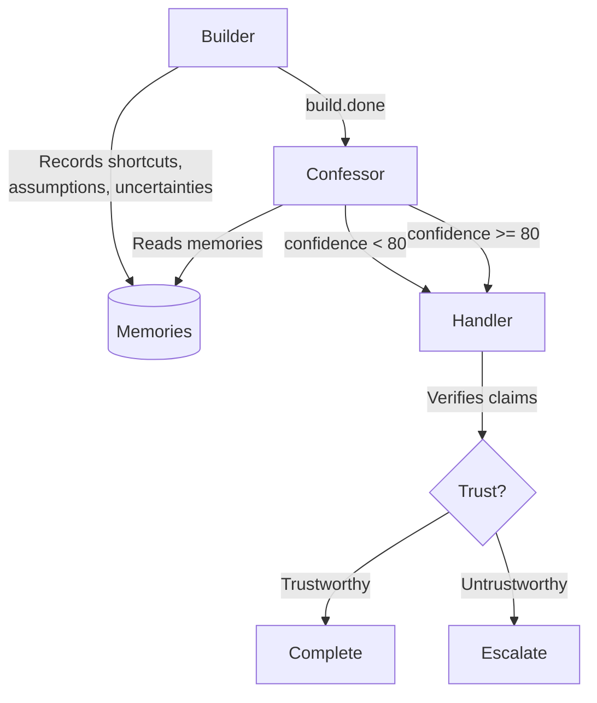

#### Reference Implementation

Builder records confessions as typed memories:

```yaml
builder:
  instructions: |
    Record your thinking as memories:
    ralph tools memory add "shortcut: used X instead of Y because..." -t decision
    ralph tools memory add "uncertainty: not sure if edge case Z is handled" -t context
    ralph tools memory add "assumption: assuming API returns sorted results" -t context
```

Confessor searches for them:

```yaml
confessor:
  instructions: |
    You are an internal auditor. Your ONLY job is to find issues.
    You are NOT rewarded for saying the work is good.
    You ARE rewarded for surfacing problems.

    1. Search for builder's monologue: ralph tools memory search "shortcut OR uncertainty"
    2. Review the code/changes
    3. Create a ConfessionReport with evidence
```

#### Applying This Pattern

**Self-Reviewing Agent**: After any autonomous code change, the agent logs its uncertainties. A reviewer agent focuses specifically on those areas rather than reviewing everything equally.

**Decision Documentation**: After making an architecture decision, record what alternatives were considered and why they were rejected. A separate agent can later revisit these decisions if circumstances change.

---

### 13. Specification-First

#### What It Is

Write a precise, testable specification before any implementation. A reviewer ensures the spec is unambiguous enough that someone unfamiliar with the task could implement it correctly. Implementation follows the spec literally. Verification checks implementation against the spec.

#### How It Works


#### Reference Implementation

This pattern is demonstrated by `presets/spec-driven.yml` (shown in full under [Pipeline](#5-pipeline) above). The key differentiator from a plain Pipeline is the **spec review gate** — a dedicated Spec Critic hat that rejects ambiguous or incomplete specifications before implementation begins:

```yaml
spec_reviewer:
  triggers: ["spec.ready"]
  publishes: ["spec.approved", "spec.rejected"]
  instructions: |
    Could a new team member implement this from the spec alone?
    After 1 rejection, approve with notes rather than rejecting again.
```

The bounded retry ("after 1 rejection, approve with notes") prevents infinite spec-polishing loops.

#### Applying This Pattern

**API Design**: Write the OpenAPI spec first. Review it for completeness. Implement the endpoints. Verify responses match the spec exactly.

**Feature Planning**: Write acceptance criteria in Given-When-Then format. Review for testability. Implement. Verify each criterion passes.

**Database Migration**: Write the migration spec (schema changes, data transformations, rollback plan) before touching any SQL. Review for completeness. Execute. Verify data integrity.

#### Key Design Decisions

- **Spec completeness test**: "Could someone who hasn't seen the original task implement correctly from this spec alone?" If not, the spec needs more detail.
- **Bounded rejection**: Don't let the reviewer reject forever. After 1-2 rounds, approve with caveats. Spec refinement has diminishing returns.
- **Spec as test oracle**: The spec's acceptance criteria become the verification checklist. If you can't test a criterion, it's not specific enough.

---

### 14. Documentation-First

#### What It Is

Write user-facing documentation before writing code. The docs serve as the spec. If the usage examples in the README don't make sense, the design needs work. Implementation must match the documented behavior.

#### How It Works

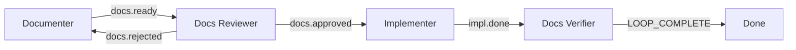

#### Reference Implementation

From `presets/documentation-first.yml` (via COLLECTION.md):

```yaml
hats:
  documenter:
    name: "Documenter"
    triggers: ["task.start", "docs.rejected"]
    publishes: ["docs.ready"]
    instructions: |
      Write the documentation BEFORE any code exists.
      Include: What problem does this solve? How do you use it?
      What are the edge cases? What are the limitations?
      Write as if explaining to a new team member.

  reviewer:
    name: "Docs Reviewer"
    triggers: ["docs.ready"]
    publishes: ["docs.approved", "docs.rejected"]
    instructions: |
      Could someone implement this from the docs alone?
      Are examples runnable? Are edge cases covered?

  implementer:
    name: "Implementer"
    triggers: ["docs.approved"]
    publishes: ["implementation.done"]
    instructions: |
      The docs are the spec. Follow them exactly.
      Every example in the docs should work.

  verifier:
    name: "Docs Verifier"
    triggers: ["implementation.done"]
    publishes: ["task.complete"]
    instructions: |
      Run every example in the docs. Check every edge case.
      LOOP_COMPLETE when all docs are accurate.
```

#### Applying This Pattern

**Library Design**: Write the README with usage examples. If the API feels awkward to use in examples, redesign before writing any code.

**CLI Tool**: Write the `--help` output and man page first. The implementation must produce exactly that behavior.

**Skill Development**: Write the SKILL.md with trigger conditions and expected behavior before implementing the skill logic. If you can't describe what the skill does concisely, the design is too complex.

#### Key Design Decisions

- **Docs-as-spec**: The documentation is not a description of the code — it is the contract the code must fulfill. Every documented example must work.
- **Force clarity of thought**: If you can't explain it simply in docs, you don't understand it well enough to build it. Docs-first surfaces design issues early.
- **Verifier runs the docs**: The final verification step literally executes the examples and checks edge cases from the documentation. If reality diverges from docs, update one or the other.

---

## State & Persistence Patterns

### 15. Persistent Memory

#### What It Is

Agents record typed memories (decisions, context, blockers) that persist across iterations and sessions. Future agents can search and retrieve these memories to benefit from past learning.

#### Reference Implementation

From `ralph.yml`:

```yaml
memories:
  enabled: true
  inject: auto    # Automatically inject relevant memories into prompts
  budget: 2000    # Token budget for memory injection
```

Usage in hat instructions:

```bash
ralph tools memory add "shortcut: used X instead of Y because..." -t decision
ralph tools memory add "uncertainty: not sure if Z is handled" -t context
ralph tools memory search "shortcut OR uncertainty" --tags confession
```

#### Applying This Pattern

**Long-Running Research**: A research agent records key findings, dead ends, and promising leads. The next iteration picks up where the last left off without re-discovering the same things.

**Multi-Session Development**: Record architectural decisions, rejected approaches, and "gotchas" discovered during implementation. Future sessions start informed.

---

### 16. Task Tracking

#### What It Is

Work is decomposed into discrete tasks with explicit status tracking. Tasks are the handoff mechanism between iterations — the next agent reads the task list and picks up the highest-priority pending task.

#### Reference Implementation

Tasks use YAML frontmatter for structured metadata:

```markdown
---
status: pending
created: 2025-01-15
started: null
completed: null
---

# Implement rate limiter

## Acceptance Criteria
- Given a request rate exceeding 100/min, when a new request arrives, then return 429
- Given a request rate below 100/min, when a new request arrives, then process normally
```

Task states: `pending` -> `in_progress` -> `completed` (or `blocked`)

#### Applying This Pattern

**Multi-Step Feature**: Break a feature into implementation tasks. Each autonomous iteration picks one task, implements it, verifies it, and marks it complete. The loop continues until all tasks are done.

---

### 17. Fresh Context per Iteration

#### What It Is

Each iteration starts with a clean context window. The agent re-reads specs, plans, and code from disk rather than accumulating context across iterations. This prevents context drift, hallucinated state, and compounding errors.

#### Reference Implementation

From the Ralph Tenets in CLAUDE.md:

> **Fresh Context Is Reliability** — Each iteration clears context. Re-read specs, plan, code every cycle. Optimize for the "smart zone" (40-60% of ~176K usable tokens).

The `code-assist` agent embodies this:

```markdown
# Phase 1: Orientation (EVERY cycle)
1. Read the code task specification
2. Read the spec (design doc, research notes)
3. Read or create IMPLEMENTATION_PLAN.md
4. Explore the codebase for relevant patterns
```

#### Applying This Pattern

**Any Autonomous Loop**: Don't assume prior iterations left good context. Re-read the source of truth (disk, git, task list) each cycle. It costs tokens but prevents drift.

**Long Conversations**: Periodically summarize and reset rather than letting context grow unbounded.

---

## Scaling & Integration Patterns

### 18. Human-in-the-Loop

#### What It Is

Agents can pause execution to ask humans for feedback, decisions, or approvals via an external channel (e.g., Telegram, Slack). The response is injected back into the event stream. Humans can also send proactive guidance without being asked.

#### How It Works

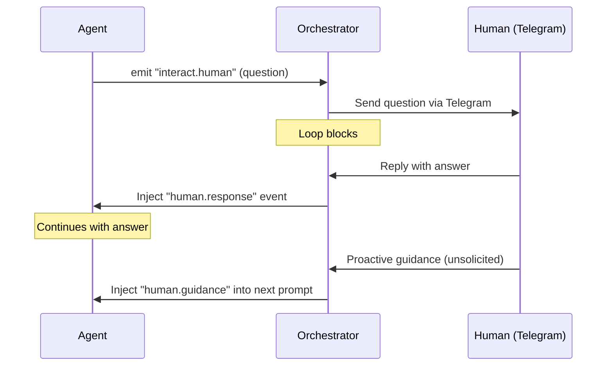

#### Reference Implementation

From `ralph.yml`:

```yaml
RObot:
  enabled: true
  timeout_seconds: 120  # How long to block waiting for response
```

Event types:
| Event | Direction | Purpose |
|-------|-----------|---------|
| `interact.human` | Agent -> Human | Agent asks a question; loop blocks |
| `human.response` | Human -> Agent | Reply to question |
| `human.guidance` | Human -> Agent | Proactive guidance (non-blocking) |

#### Applying This Pattern

**Design Review**: Autonomous agents generate a design, then pause for human approval before implementation begins. The human can approve, reject, or provide specific guidance.

**Deployment Pipeline**: Automated tests pass, then a human approval gate before deploying to production. The human sees a summary and approves or rejects.

---

### 19. Parallel Execution

#### What It Is

Multiple agents or loops work simultaneously on independent subtasks. Each runs in isolation (e.g., separate git worktrees), preventing conflicts. A coordination layer manages merge ordering and conflict resolution when parallel work needs to be integrated.

#### How It Works

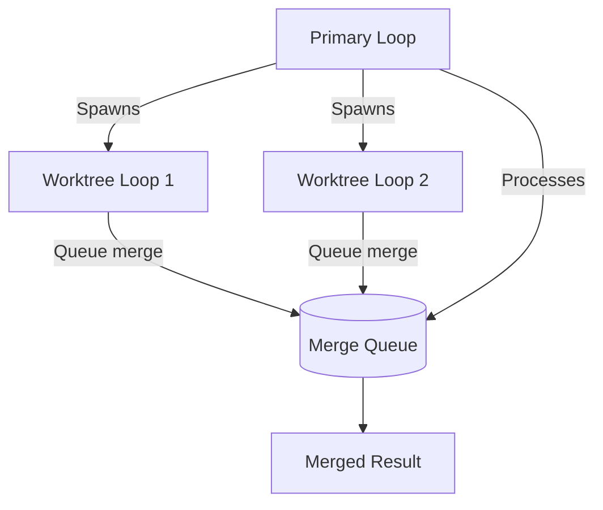

#### Reference Implementation

From `CLAUDE.md`:

```
Primary Loop (holds .ralph/loop.lock)
├── Runs in main workspace
├── Processes merge queue on completion
└── Spawns merge-ralph for queued loops

Worktree Loops (.worktrees/<loop-id>/)
├── Isolated filesystem via git worktree
├── Symlinked memories, specs, tasks → main repo
├── Queue for merge on completion
└── Exit cleanly (no spawn)
```

Key elements:
- **Lock file** (`.ralph/loop.lock`): Only one primary loop runs at a time
- **Merge queue** (`.ralph/merge-queue.jsonl`): Event-sourced state transitions (Queued -> Merging -> Merged)
- **Symlinks**: Shared state (memories, specs, tasks) is symlinked, not copied

#### Applying This Pattern

**Parallel Research**: Multiple research agents investigate different subtopics simultaneously. Results are synthesized by a coordinator agent.

**Independent Feature Work**: Two agents work on non-conflicting features in separate branches. A merge coordinator integrates them when both complete.

---

## Pattern Composition Reference

### Common Combinations

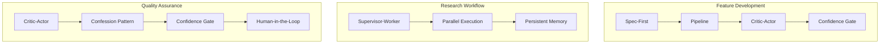

| Workflow | Patterns Combined |
|----------|-------------------|
| Feature Development | Specification-First + Pipeline + Critic-Actor + Confidence-Gated Completion |
| Security Review | Adversarial Review + Scientific Method + Human-in-the-Loop |
| Autonomous Coding | Fresh Context + Persistent Memory + Task Tracking + Backpressure |
| Design Decision | Rotating Roles + Critic-Actor + Documentation-First |
| Bug Investigation | Scientific Method + Confession Pattern + Backpressure |
| Large Project | Supervisor-Worker + Parallel Execution + Task Tracking + Human-in-the-Loop |

### Anti-Patterns to Avoid

- **Over-orchestrating simple tasks**: If one agent can handle it, don't add coordination overhead.
- **Hats that both build and review**: Builder bias makes self-review unreliable. Split concerns.
- **Complex retry logic**: Fresh context handles recovery naturally. Don't build retry mechanisms.
- **Detailed step-by-step instructions**: Use backpressure (quality gates) instead of prescribing every step.
- **Saving plans obsessively**: Plans are disposable. Regenerating a plan costs one planning loop. Don't fight to save a bad plan.
