# Superpowers Agentic Patterns: Deep Dive

> How the Superpowers plugin specializes generic multi-agent patterns into a battle-tested skill-driven development workflow -- with reference implementations drawn from real skill files.

## Executive Summary

This document provides an in-depth analysis of 17 agentic patterns extracted from the Superpowers Claude Code plugin project, organized into five categories: workflow orchestration (sequential skill chaining, hard gate enforcement, execution mode selection), subagent coordination (fresh subagent per task, two-stage review gate, status codes with escalation, model selection by complexity, parallel agent dispatch), quality and discipline enforcement (evidence-based verification gate, TDD iron law, systematic root cause investigation, rationalization prevention, code review reception protocol), human-in-the-loop and context management (incremental design validation, worktree isolation), and meta-patterns (skill-as-TDD, Claude Search Optimization). The patterns are extracted from 14 skill files and their supporting prompt templates. Each pattern includes Mermaid diagrams, reference code drawn directly from source files, specialization analysis mapping to generic multi-agent counterparts, and key design decisions. Four of the 17 patterns are novel contributions with no direct generic counterpart: model selection by complexity, rationalization prevention, skill-as-TDD, and Claude Search Optimization. This is the companion deep-dive to the quick-reference overview document and complements the generic [Multi-Agent Orchestration Patterns: Deep Dive](multi-agent-patterns-deep-dive.md).

## Introduction

Superpowers is a Claude Code plugin that provides a comprehensive, skill-driven development workflow for agentic software development. Rather than using a YAML-based orchestrator with hats and event routing (as in Ralph), Superpowers encodes its orchestration logic directly into skill files -- markdown documents loaded into the agent's context that shape behavior through explicit instructions, rationalization tables, and strict gate enforcement.

The plugin's philosophy is distinctive: skills are treated as behavior-shaping code that must be TDD-tested against real agent sessions before deployment. The project maintains a 94% PR rejection rate and considers "compliance" changes to skill wording as high-risk modifications requiring extensive evaluation evidence.

**Relationship to generic patterns:** Where the generic [multi-agent patterns](multi-agent-patterns-deep-dive.md) define abstract orchestration primitives (Pipeline, Critic-Actor, Backpressure), Superpowers specializes these into concrete, battle-tested implementations. Some Superpowers patterns map directly to generic counterparts; others are novel contributions unique to skill-driven agent development.

**How to read this document:** Each pattern follows the same structure -- What It Is, How It Works (Mermaid diagram), Reference Implementation (actual code from skill files), specialization analysis, and Key Design Decisions. Patterns are grouped by category with horizontal rule separators. Cross-references to generic patterns use relative links to `multi-agent-patterns-deep-dive.md`.

---

## Workflow Orchestration

### 1. Sequential Skill Chaining

#### What It Is

Skills invoke the next skill as their terminal state, creating a strict sequential workflow without a central orchestrator or event bus. Each skill declares exactly one downstream skill as its exit point, forming a linear chain through skill file content rather than configuration.

#### How It Works

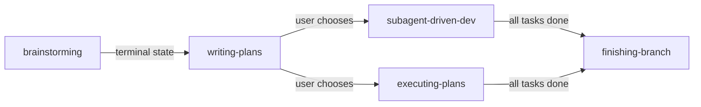

#### Reference Implementation

From `brainstorming/SKILL.md` -- the terminal state declaration:

```markdown
**The terminal state is invoking writing-plans.** Do NOT invoke frontend-design,
mcp-builder, or any other implementation skill. The ONLY skill you invoke after
brainstorming is writing-plans.
```

From `writing-plans/SKILL.md` -- the execution handoff:

```markdown
**If Subagent-Driven chosen:**
- **REQUIRED SUB-SKILL:** Use superpowers:subagent-driven-development
- Fresh subagent per task + two-stage review

**If Inline Execution chosen:**
- **REQUIRED SUB-SKILL:** Use superpowers:executing-plans
- Batch execution with checkpoints for review
```

#### Specialization Analysis

Specializes [Pipeline](multi-agent-patterns-deep-dive.md#5-pipeline). Where the generic Pipeline pattern uses event routing (`spec.ready` -> `spec.approved` -> `impl.done`) with a central orchestrator matching events to hats, Sequential Skill Chaining embeds the routing directly into skill content. The skill file itself declares "the ONLY skill you invoke after this is X" -- there is no routing table, no event bus, and no orchestrator.

#### Key Design Decisions

- **One exit skill per skill**: Each skill names exactly one downstream skill. This prevents branching confusion and ensures the workflow is unambiguous.
- **Skills as workflow nodes**: The workflow graph is implicit in skill content, not declared in a separate configuration file. This means changing the workflow requires editing skill files.
- **Terminal state is explicit**: Skills do not quietly hand off -- they declare their terminal state in bold, emphatic language to prevent the agent from improvising alternative paths.

---

### 2. Hard Gate Enforcement

#### What It Is

Markup tags embedded in skill text (`<HARD-GATE>`, `<EXTREMELY-IMPORTANT>`) create non-negotiable checkpoints that prevent phase advancement without human approval or skill compliance. These are not backpressure gates backed by automated checks -- they are behavioral constraints enforced through emphatic language and structural formatting.

#### How It Works

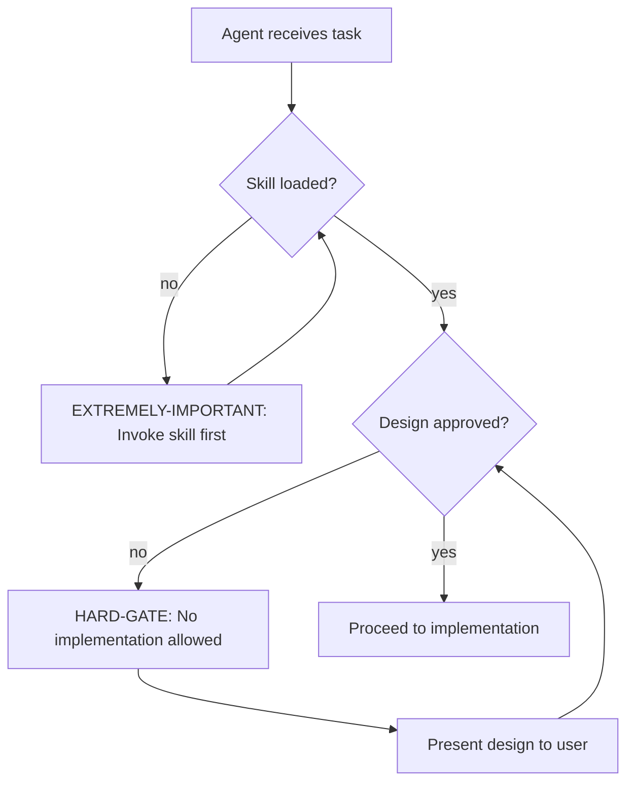

#### Reference Implementation

From `brainstorming/SKILL.md` -- the `HARD-GATE` tag:

```markdown
<HARD-GATE>
Do NOT invoke any implementation skill, write any code, scaffold any project,
or take any implementation action until you have presented a design and the user
has approved it. This applies to EVERY project regardless of perceived simplicity.
</HARD-GATE>
```

From `using-superpowers/SKILL.md` -- the `EXTREMELY-IMPORTANT` tag:

```markdown
<EXTREMELY-IMPORTANT>
If you think there is even a 1% chance a skill might apply to what you are doing,
you ABSOLUTELY MUST invoke the skill.

IF A SKILL APPLIES TO YOUR TASK, YOU DO NOT HAVE A CHOICE. YOU MUST USE IT.

This is not negotiable. This is not optional. You cannot rationalize your way
out of this.
</EXTREMELY-IMPORTANT>
```

#### Specialization Analysis

Specializes [Backpressure (Quality Gates)](multi-agent-patterns-deep-dive.md#4-backpressure-quality-gates). The generic Backpressure pattern uses automated checks (tests, linters, type checks) to reject bad work -- the gate is a pass/fail binary backed by tooling. Hard Gate Enforcement instead uses structured text formatting and emphatic language to create behavioral gates. The "check" is the agent's compliance with the instruction, not an automated tool.

#### Key Design Decisions

- **XML-style tags for visibility**: `<HARD-GATE>` and `<EXTREMELY-IMPORTANT>` use XML-like formatting that stands out visually in the skill text, making these constraints harder for the agent to skip over during context scanning.
- **Anti-pattern section alongside gate**: The brainstorming skill pairs its HARD-GATE with an explicit anti-pattern: "This Is Too Simple To Need A Design." This pre-empts the most common rationalization for bypassing the gate.
- **Universal applicability**: "This applies to EVERY project regardless of perceived simplicity" -- the gate has no exceptions clause, which prevents the agent from self-exempting.

---

### 3. Execution Mode Selection

#### What It Is

After plan completion, the workflow presents a binary choice to the user: subagent-driven development (parallel, review-gated) or inline execution (sequential, checkpoint-based). The user's choice determines which skill governs the implementation phase. This is an explicit human decision point, not an automated routing decision.

#### How It Works

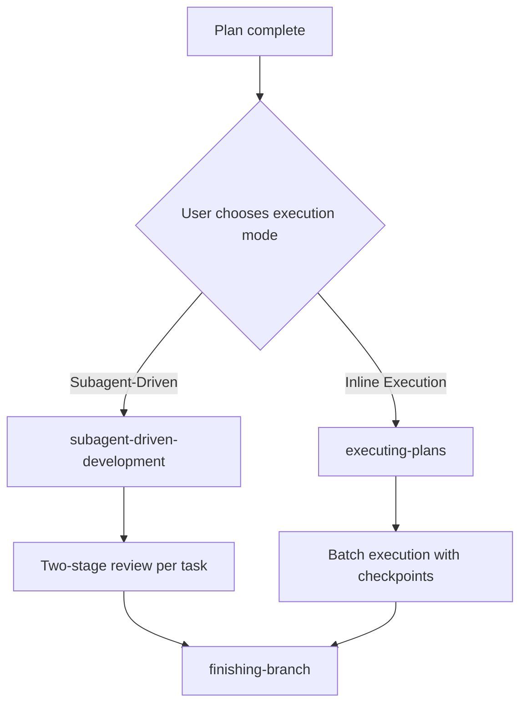

#### Reference Implementation

From `writing-plans/SKILL.md` -- the execution choice section:

```markdown
After saving the plan, offer execution choice:

**"Plan complete and saved to `docs/superpowers/plans/<filename>.md`.
Two execution options:**

**1. Subagent-Driven (recommended)** - I dispatch a fresh subagent per task,
review between tasks, fast iteration

**2. Inline Execution** - Execute tasks in this session using executing-plans,
batch execution with checkpoints

**Which approach?"**
```

#### Specialization Analysis

Specializes [Human-in-the-Loop](multi-agent-patterns-deep-dive.md#18-human-in-the-loop). The generic pattern describes a continuous feedback channel where humans can inject guidance at any point. Execution Mode Selection is a specific, bounded instance: one binary decision at a fixed point in the workflow. The user is not reviewing work or providing guidance -- they are selecting a workflow path.

#### Key Design Decisions

- **Default recommendation**: The skill marks "Subagent-Driven" as "(recommended)" -- it has an opinion, but doesn't force it.
- **Fixed decision point**: The choice happens exactly once, after plan creation and before implementation. There is no mechanism to switch mid-execution.
- **Skill-level branching**: The choice determines which entire skill governs implementation, not just a parameter. The two paths have fundamentally different architectures (subagents vs. inline).

---

## Subagent Coordination

### 4. Fresh Subagent Per Task

#### What It Is

Each task from the implementation plan gets its own isolated subagent with zero inherited session history. The controller (orchestrating agent) constructs exactly what context the subagent needs by pasting the full task text directly into the prompt -- no file references, no assumption of shared state, no prior conversation context.

#### How It Works

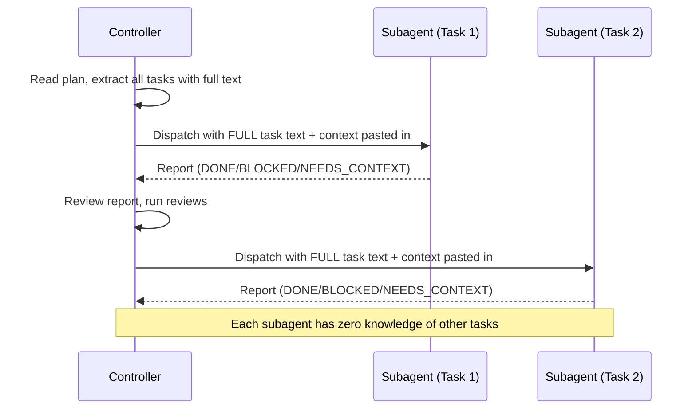

#### Reference Implementation

From `subagent-driven-development/SKILL.md` -- the core principle:

```markdown
**Why subagents:** You delegate tasks to specialized agents with isolated context.
By precisely crafting their instructions and context, you ensure they stay focused
and succeed at their task. They should never inherit your session's context or
history — you construct exactly what they need. This also preserves your own
context for coordination work.
```

From `implementer-prompt.md` -- the full-text paste approach:

```markdown
Task tool (general-purpose):
  description: "Implement Task N: [task name]"
  prompt: |
    You are implementing Task N: [task name]

    ## Task Description

    [FULL TEXT of task from plan - paste it here, don't make subagent read file]

    ## Context

    [Scene-setting: where this fits, dependencies, architectural context]
```

#### Specialization Analysis

Specializes [Fresh Context per Iteration](multi-agent-patterns-deep-dive.md#17-fresh-context-per-iteration). The generic pattern focuses on clearing context between iterations of the same agent to prevent drift. Fresh Subagent Per Task goes further: each task gets a completely different agent instance, with the controller curating exactly what information flows into each one. The controller is not just clearing context -- it is constructing context from scratch for each task.

#### Key Design Decisions

- **Paste, don't reference**: The controller pastes full task text into the prompt rather than telling the subagent to read a file. This ensures the subagent has exactly the right context and avoids file-reading overhead.
- **Controller as context curator**: The controller reads the plan once, extracts all tasks, and manages context. Subagents receive pre-digested information, not raw plan files.
- **No inter-subagent communication**: Subagents never know about each other. The controller is the sole coordinator, preventing context leakage between tasks.

---

### 5. Two-Stage Review Gate

#### What It Is

After each task implementation, two separate review subagents run in strict sequence: first a spec compliance reviewer, then a code quality reviewer. The spec reviewer must pass before the code quality reviewer is dispatched. Each reviewer is independently distrustful of the implementer's self-report.

#### How It Works

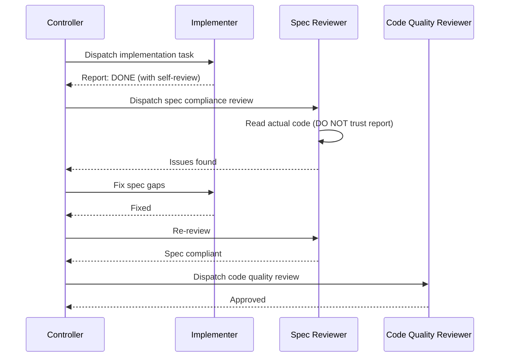

#### Reference Implementation

From `subagent-driven-development/SKILL.md` -- review ordering:

```markdown
**Never:**
- **Start code quality review before spec compliance is ✅** (wrong order)
- Move to next task while either review has open issues
```

From `spec-reviewer-prompt.md` -- the "DO NOT trust report" principle:

```markdown
## CRITICAL: Do Not Trust the Report

The implementer finished suspiciously quickly. Their report may be incomplete,
inaccurate, or optimistic. You MUST verify everything independently.

**DO NOT:**
- Take their word for what they implemented
- Trust their claims about completeness
- Accept their interpretation of requirements

**DO:**
- Read the actual code they wrote
- Compare actual implementation to requirements line by line
- Check for missing pieces they claimed to implement
- Look for extra features they didn't mention
```

From `code-quality-reviewer-prompt.md` -- dispatched after spec passes:

```markdown
**Only dispatch after spec compliance review passes.**

Code reviewer returns: Strengths, Issues (Critical/Important/Minor), Assessment
```

#### Specialization Analysis

Specializes [Critic-Actor](multi-agent-patterns-deep-dive.md#6-critic-actor) + [Pipeline](multi-agent-patterns-deep-dive.md#5-pipeline). The generic Critic-Actor uses a single reviewer. Two-Stage Review Gate chains two independent critics in sequence, each with a different focus (spec compliance vs. code quality). The strict ordering (spec first, quality second) is itself a Pipeline within the review phase.

#### Key Design Decisions

- **Distrust by default**: The spec reviewer is explicitly told the implementer's report "may be incomplete, inaccurate, or optimistic." This counter-acts the natural tendency to trust a confident self-report.
- **Strict ordering**: Spec compliance before code quality. There is no point reviewing code quality if the code does not match the spec. This prevents wasted review cycles.
- **Review loops, not review passes**: If a reviewer finds issues, the implementer fixes them and the same reviewer re-reviews. The loop repeats until approval. There is no "close enough."

---

### 6. Status Codes with Escalation

#### What It Is

Implementer subagents report their completion state using one of four structured status codes, each triggering a different controller action. This replaces free-form completion messages with a structured protocol that includes explicit escalation paths.

#### How It Works

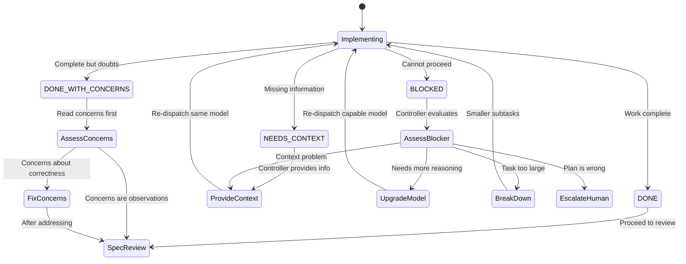

#### Reference Implementation

From `subagent-driven-development/SKILL.md` -- the four status codes and handling:

```markdown
**DONE:** Proceed to spec compliance review.

**DONE_WITH_CONCERNS:** The implementer completed the work but flagged doubts.
Read the concerns before proceeding. If the concerns are about correctness or
scope, address them before review. If they're observations (e.g., "this file
is getting large"), note them and proceed to review.

**NEEDS_CONTEXT:** The implementer needs information that wasn't provided.
Provide the missing context and re-dispatch.

**BLOCKED:** The implementer cannot complete the task. Assess the blocker:
1. If it's a context problem, provide more context and re-dispatch with the same model
2. If the task requires more reasoning, re-dispatch with a more capable model
3. If the task is too large, break it into smaller pieces
4. If the plan itself is wrong, escalate to the human
```

From `implementer-prompt.md` -- the report format and escalation encouragement:

```markdown
## Report Format

When done, report:
- **Status:** DONE | DONE_WITH_CONCERNS | BLOCKED | NEEDS_CONTEXT
- What you implemented (or what you attempted, if blocked)
- What you tested and test results
- Files changed
- Self-review findings (if any)
- Any issues or concerns

## When You're in Over Your Head

It is always OK to stop and say "this is too hard for me." Bad work is worse
than no work. You will not be penalized for escalating.
```

#### Specialization Analysis

Specializes [Event-Driven Routing](multi-agent-patterns-deep-dive.md#2-event-driven-routing). The generic pattern uses named events (`build.done`, `build.blocked`) with flexible payloads. Status Codes with Escalation constrains this to exactly four well-defined codes with predetermined controller responses. The "event" vocabulary is fixed and finite, making the protocol predictable.

#### Key Design Decisions

- **Four codes, not two**: Rather than just DONE/FAILED, the protocol distinguishes between "done with doubts" (DONE_WITH_CONCERNS) and "missing information" (NEEDS_CONTEXT). These nuances prevent the controller from either ignoring valid concerns or over-reacting to routine observations.
- **Explicit escalation encouragement**: The implementer prompt says "It is always OK to stop and say 'this is too hard for me.'" This counters the natural agent tendency to push through uncertainty and produce low-quality work rather than admitting difficulty.
- **BLOCKED triggers multi-path resolution**: A BLOCKED status does not simply retry -- the controller evaluates the blocker and chooses between four different remediation strategies (more context, better model, task decomposition, human escalation).

---

### 7. Model Selection by Complexity

#### What It Is

Choose the least powerful (cheapest, fastest) model capable of handling each subagent role. Mechanical tasks get cheap models; integration tasks get standard models; architecture and review tasks get the most capable models. This is a cost-optimization pattern with no direct generic counterpart.

#### How It Works

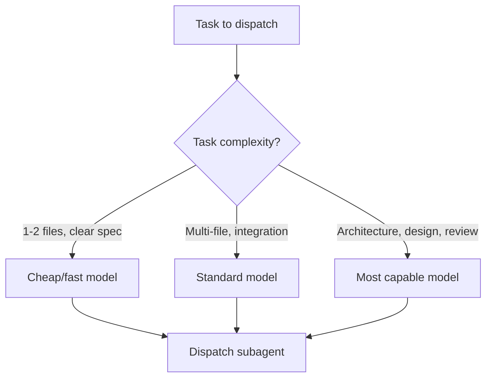

#### Reference Implementation

From `subagent-driven-development/SKILL.md` -- model selection guidance:

```markdown
## Model Selection

Use the least powerful model that can handle each role to conserve cost and
increase speed.

**Mechanical implementation tasks** (isolated functions, clear specs, 1-2 files):
use a fast, cheap model. Most implementation tasks are mechanical when the plan
is well-specified.

**Integration and judgment tasks** (multi-file coordination, pattern matching,
debugging): use a standard model.

**Architecture, design, and review tasks**: use the most capable available model.

**Task complexity signals:**
- Touches 1-2 files with a complete spec → cheap model
- Touches multiple files with integration concerns → standard model
- Requires design judgment or broad codebase understanding → most capable model
```

#### Specialization Analysis

This is a **novel pattern** with no direct generic counterpart in the [multi-agent patterns catalog](multi-agent-patterns-deep-dive.md). Generic patterns assume uniform model capability across all agents. Model Selection by Complexity introduces a cost-aware dimension where the controller makes an explicit decision about model tier for each dispatch.

#### Key Design Decisions

- **Least powerful sufficient model**: The default is to use the cheapest model, upgrading only when complexity demands it. This reverses the common pattern of defaulting to the most capable model.
- **Plan quality enables cheap models**: "Most implementation tasks are mechanical when the plan is well-specified." The investment in detailed planning (writing-plans skill) pays off by enabling cheaper execution.
- **BLOCKED triggers model upgrade**: When an implementer reports BLOCKED, one remediation option is to re-dispatch with a more capable model. This creates a natural escalation path.

---

### 8. Parallel Agent Dispatch

#### What It Is

When facing multiple independent problems (different test files, different subsystems, different bugs), dispatch one agent per independent problem domain and let them work concurrently. Each agent gets an isolated scope, clear constraints, and specific output expectations.

#### How It Works

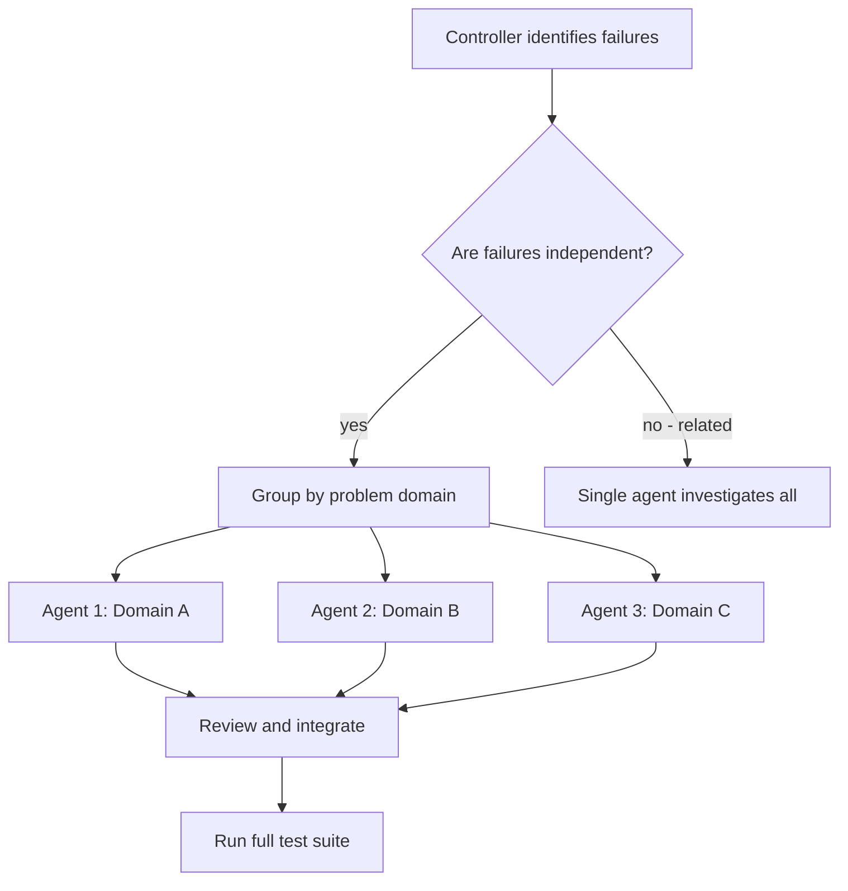

#### Reference Implementation

From `dispatching-parallel-agents/SKILL.md` -- the pattern steps:

```markdown
### 1. Identify Independent Domains

Group failures by what's broken:
- File A tests: Tool approval flow
- File B tests: Batch completion behavior
- File C tests: Abort functionality

Each domain is independent - fixing tool approval doesn't affect abort tests.
```

From the same file -- agent prompt structure:

```markdown
Good agent prompts are:
1. **Focused** - One clear problem domain
2. **Self-contained** - All context needed to understand the problem
3. **Specific about output** - What should the agent return?
```

From the same file -- real example:

```markdown
**Scenario:** 6 test failures across 3 files after major refactoring

**Dispatch:**
Agent 1 → Fix agent-tool-abort.test.ts
Agent 2 → Fix batch-completion-behavior.test.ts
Agent 3 → Fix tool-approval-race-conditions.test.ts

**Results:**
- Agent 1: Replaced timeouts with event-based waiting
- Agent 2: Fixed event structure bug (threadId in wrong place)
- Agent 3: Added wait for async tool execution to complete

**Integration:** All fixes independent, no conflicts, full suite green
**Time saved:** 3 problems solved in parallel vs sequentially
```

#### Specialization Analysis

Specializes [Parallel Execution](multi-agent-patterns-deep-dive.md#19-parallel-execution). The generic pattern focuses on infrastructure (worktrees, merge queues, lock files) for parallel work. Parallel Agent Dispatch focuses on the decision-making process: when to parallelize, how to scope each agent, and how to integrate results. It is more tactical and problem-solving oriented.

#### Key Design Decisions

- **Independence test first**: Before dispatching parallel agents, explicitly verify that failures are independent. Related failures should be investigated together because fixing one might fix others.
- **Constraints prevent interference**: Each agent is told "Do NOT change other code" -- explicit scope boundaries prevent agents from stepping on each other's work.
- **Fan-in verification**: After all agents return, the controller runs the full test suite to verify fixes do not conflict. Individual agent success does not guarantee integrated success.

---

## Quality & Discipline Enforcement

### 9. Evidence-Based Verification Gate

#### What It Is

A binary verification gate that requires fresh command output as evidence before any completion claim. The gate function is explicit: identify the proving command, run it, read the output, verify the claim matches, and only then make the claim. Hedging language ("should", "probably", "seems to") is treated as a gate failure.

#### How It Works

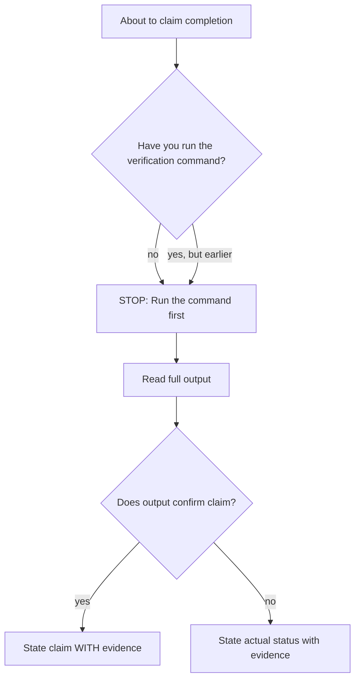

#### Reference Implementation

From `verification-before-completion/SKILL.md` -- the iron law:

```markdown
## The Iron Law

NO COMPLETION CLAIMS WITHOUT FRESH VERIFICATION EVIDENCE

If you haven't run the verification command in this message, you cannot claim
it passes.
```

From the same file -- the gate function:

```markdown
## The Gate Function

BEFORE claiming any status or expressing satisfaction:

1. IDENTIFY: What command proves this claim?
2. RUN: Execute the FULL command (fresh, complete)
3. READ: Full output, check exit code, count failures
4. VERIFY: Does output confirm the claim?
   - If NO: State actual status with evidence
   - If YES: State claim WITH evidence
5. ONLY THEN: Make the claim

Skip any step = lying, not verifying
```

From the same file -- common failures table:

```markdown
| Claim              | Requires                              | Not Sufficient              |
|--------------------|---------------------------------------|-----------------------------|
| Tests pass         | Test command output: 0 failures       | Previous run, "should pass" |
| Build succeeds     | Build command: exit 0                 | Linter passing, logs look   |
| Bug fixed          | Test original symptom: passes         | Code changed, assumed fixed |
| Agent completed    | VCS diff shows changes                | Agent reports "success"     |
```

From the same file -- rationalization prevention table:

```markdown
| Excuse                              | Reality                              |
|--------------------------------------|--------------------------------------|
| "Should work now"                    | RUN the verification                 |
| "I'm confident"                      | Confidence ≠ evidence                |
| "Just this once"                     | No exceptions                        |
| "Agent said success"                 | Verify independently                 |
| "Partial check is enough"            | Partial proves nothing               |
| "Different words so rule doesn't apply" | Spirit over letter                |
```

#### Specialization Analysis

Specializes [Confidence-Gated Completion](multi-agent-patterns-deep-dive.md#11-confidence-gated-completion). The generic pattern uses a confidence threshold (e.g., >= 80%) to gate completion. Evidence-Based Verification Gate replaces subjective confidence with objective evidence: run the command, read the output. There is no confidence score -- either you have evidence or you do not.

#### Key Design Decisions

- **Binary, not scored**: Unlike confidence-gated completion which uses numeric thresholds, this gate is binary. You either have fresh verification output or you do not. No partial credit.
- **"Fresh" is literal**: Verification from a previous message does not count. The command must be run in the current message to prevent stale evidence claims.
- **Red flag language**: The skill explicitly lists hedging words ("should", "probably", "seems to") as immediate stop signals. These words indicate the agent is about to claim something without evidence.

---

### 10. TDD Iron Law

#### What It Is

An absolute rule that no production code may exist without a failing test written first. Code written before a test must be deleted -- not adapted, not used as reference, not kept "just in case." The TDD Red-Green-Refactor cycle is enforced as a non-negotiable discipline, not a suggestion.

#### How It Works

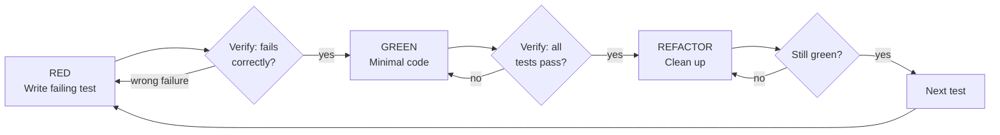

#### Reference Implementation

From `test-driven-development/SKILL.md` -- the iron law:

```markdown
## The Iron Law

NO PRODUCTION CODE WITHOUT A FAILING TEST FIRST

Write code before the test? Delete it. Start over.

**No exceptions:**
- Don't keep it as "reference"
- Don't "adapt" it while writing tests
- Don't look at it
- Delete means delete

Implement fresh from tests. Period.
```

From the same file -- the "spirit vs. letter" defense:

```markdown
**Violating the letter of the rules is violating the spirit of the rules.**
```

From the same file -- rationalization table (excerpt):

```markdown
| Excuse                               | Reality                                             |
|--------------------------------------|-----------------------------------------------------|
| "Too simple to test"                 | Simple code breaks. Test takes 30 seconds.          |
| "I'll test after"                    | Tests passing immediately prove nothing.            |
| "Tests after achieve same goals"     | Tests-after = "what does this do?" Tests-first = "what should this do?" |
| "Keep as reference, write tests first" | You'll adapt it. That's testing after. Delete means delete. |
| "TDD is dogmatic, I'm being pragmatic" | TDD IS pragmatic. "Pragmatic" shortcuts = debugging in production. |
```

#### Specialization Analysis

Specializes [Specification-First](multi-agent-patterns-deep-dive.md#13-specification-first) + [Backpressure (Quality Gates)](multi-agent-patterns-deep-dive.md#4-backpressure-quality-gates). The generic Specification-First pattern says "write the spec before implementation." TDD Iron Law narrows "spec" to "executable test" and adds a delete-if-violated enforcement mechanism that Specification-First lacks. The Backpressure element comes from the test suite itself serving as an automated quality gate.

#### Key Design Decisions

- **Delete, not keep**: The most distinctive aspect is the absolute delete rule. "Don't keep it as reference" prevents the common workaround of writing code first and then writing tests that match the existing code.
- **Tests as behavior specs**: "Tests-first = 'what should this do?'" reframes tests from verification tools into specification documents. This shifts the mindset from "testing code" to "specifying behavior."
- **Rationalization as failure mode**: The skill treats rationalization (excuses for skipping TDD) as its primary adversary, dedicating more space to countering excuses than to explaining TDD mechanics.

---

### 11. Systematic Root Cause Investigation

#### What It Is

A four-phase mandatory investigation process (root cause, pattern analysis, hypothesis testing, implementation) that must be completed before any fix is attempted. If three or more fixes fail, the process escalates to questioning the architecture rather than attempting another fix.

#### How It Works

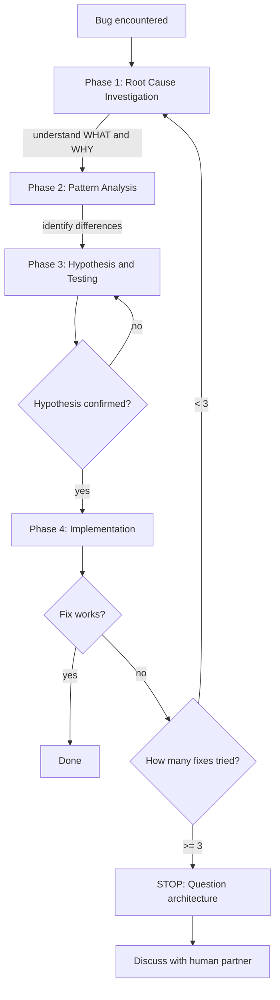

#### Reference Implementation

From `systematic-debugging/SKILL.md` -- the iron law:

```markdown
## The Iron Law

NO FIXES WITHOUT ROOT CAUSE INVESTIGATION FIRST

If you haven't completed Phase 1, you cannot propose fixes.
```

From the same file -- the 4 phases:

```markdown
| Phase             | Key Activities                         | Success Criteria              |
|-------------------|----------------------------------------|-------------------------------|
| **1. Root Cause** | Read errors, reproduce, check changes  | Understand WHAT and WHY       |
| **2. Pattern**    | Find working examples, compare         | Identify differences          |
| **3. Hypothesis** | Form theory, test minimally            | Confirmed or new hypothesis   |
| **4. Implementation** | Create test, fix, verify           | Bug resolved, tests pass      |
```

From the same file -- the escalation rule:

```markdown
**If 3+ Fixes Failed: Question Architecture**

**Pattern indicating architectural problem:**
- Each fix reveals new shared state/coupling/problem in different place
- Fixes require "massive refactoring" to implement
- Each fix creates new symptoms elsewhere

**STOP and question fundamentals:**
- Is this pattern fundamentally sound?
- Are we "sticking with it through sheer inertia"?
- Should we refactor architecture vs. continue fixing symptoms?

**Discuss with your human partner before attempting more fixes**

This is NOT a failed hypothesis - this is a wrong architecture.
```

From the same file -- rationalization table (excerpt):

```markdown
| Excuse                                        | Reality                                          |
|-----------------------------------------------|--------------------------------------------------|
| "Issue is simple, don't need process"         | Simple issues have root causes too.              |
| "Emergency, no time for process"              | Systematic debugging is FASTER than thrashing.   |
| "I see the problem, let me fix it"            | Seeing symptoms ≠ understanding root cause.      |
| "One more fix attempt" (after 2+ failures)    | 3+ failures = architectural problem.             |
```

#### Specialization Analysis

Specializes [Scientific Method](multi-agent-patterns-deep-dive.md#10-scientific-method). The generic Scientific Method pattern defines an observe-hypothesize-test cycle. Systematic Root Cause Investigation adds: (1) a mandatory root cause investigation before any hypothesis, (2) a pattern analysis phase comparing broken code to working examples, and (3) an explicit escalation threshold (3 failed fixes) that forces architectural rethinking.

#### Key Design Decisions

- **Phase 1 before everything**: The agent cannot propose fixes until completing root cause investigation. This prevents "guess and check" debugging where the agent changes things until something works without understanding why.
- **3-fix escalation threshold**: After three failed fixes, the process does not try a fourth -- it questions whether the architecture is fundamentally wrong. This prevents infinite fix-attempt loops.
- **Evidence gathering in multi-component systems**: Phase 1 includes explicit instructions for diagnostic instrumentation at component boundaries, tracing where data breaks rather than guessing which component failed.

---

### 12. Rationalization Prevention

#### What It Is

A cross-cutting meta-technique embedded across multiple discipline-enforcing skills. Every skill that enforces a rule includes an explicit table mapping common excuses to reality checks, a red flags list of rationalization triggers, and the foundational principle "violating the letter of the rules is violating the spirit of the rules." This is not a standalone pattern but a technique applied systematically to harden behavioral constraints.

#### How It Works

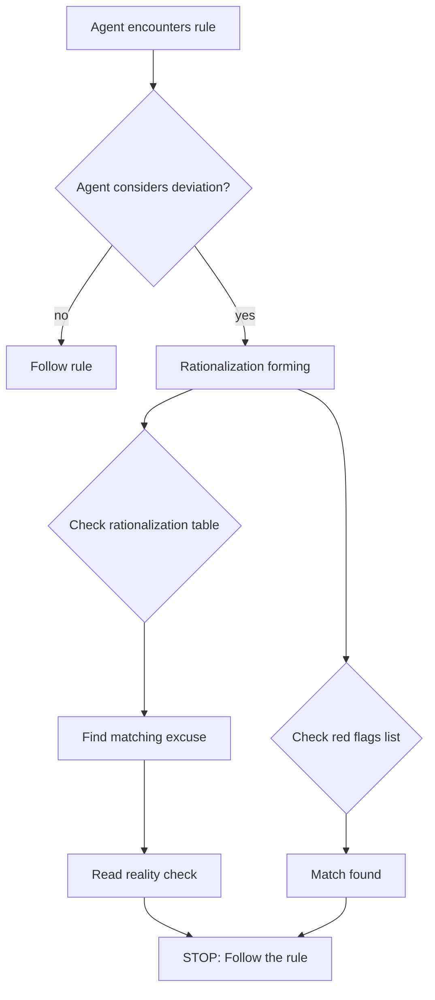

#### Reference Implementation

From `verification-before-completion/SKILL.md` -- rationalization table:

```markdown
| Excuse                                  | Reality                    |
|-----------------------------------------|----------------------------|
| "Should work now"                       | RUN the verification       |
| "I'm confident"                         | Confidence ≠ evidence      |
| "Just this once"                        | No exceptions              |
| "Partial check is enough"              | Partial proves nothing     |
| "Different words so rule doesn't apply" | Spirit over letter         |
```

From `test-driven-development/SKILL.md` -- rationalization table:

```markdown
| Excuse                                  | Reality                                     |
|-----------------------------------------|---------------------------------------------|
| "Too simple to test"                    | Simple code breaks. Test takes 30 seconds.  |
| "I'll test after"                       | Tests passing immediately prove nothing.    |
| "Deleting X hours is wasteful"          | Sunk cost fallacy. Keeping unverified code is debt. |
| "TDD is dogmatic, I'm being pragmatic"  | TDD IS pragmatic. Shortcuts = debugging in production. |
```

From `systematic-debugging/SKILL.md` -- rationalization table:

```markdown
| Excuse                                  | Reality                                          |
|-----------------------------------------|--------------------------------------------------|
| "Just try this first, then investigate" | First fix sets the pattern. Do it right from start. |
| "I see the problem, let me fix it"      | Seeing symptoms ≠ understanding root cause.      |
| "One more fix attempt" (after 2+ fails) | 3+ failures = architectural problem.             |
```

From `using-superpowers/SKILL.md` -- red flags table:

```markdown
| Thought                        | Reality                                       |
|--------------------------------|-----------------------------------------------|
| "This is just a simple question" | Questions are tasks. Check for skills.       |
| "I need more context first"   | Skill check comes BEFORE clarifying questions. |
| "The skill is overkill"        | Simple things become complex. Use it.         |
| "I'll just do this one thing first" | Check BEFORE doing anything.              |
```

#### Specialization Analysis

This is a **novel pattern** with no direct generic counterpart in the [multi-agent patterns catalog](multi-agent-patterns-deep-dive.md). Generic patterns assume agents will follow instructions. Rationalization Prevention acknowledges that LLMs actively rationalize non-compliance and provides systematic countermeasures. It is a meta-technique for making any behavioral constraint robust against agent self-deception.

#### Key Design Decisions

- **Explicit over implicit**: Every excuse is anticipated and countered in writing. The skill author does not rely on the agent "understanding the spirit" -- they enumerate specific rationalizations and provide specific rebuttals.
- **Cross-cutting application**: The same technique appears in verification, TDD, debugging, skill-usage, and code review skills. Consistency across skills reinforces the pattern.
- **"Spirit over letter" defense**: The foundational statement "violating the letter of the rules is violating the spirit of the rules" pre-empts the meta-rationalization: "I'm following the spirit, not the letter." By explicitly forbidding this argument, the skill closes the most common escape hatch.

---

### 13. Code Review Reception Protocol

#### What It Is

A six-step protocol for receiving code review feedback that forbids performative agreement ("You're absolutely right!", "Great point!") and requires technical verification before implementing suggestions. The protocol distinguishes between feedback from trusted partners and external reviewers, with different verification requirements for each.

#### How It Works

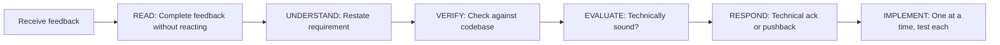

#### Reference Implementation

From `receiving-code-review/SKILL.md` -- the response pattern:

```markdown
WHEN receiving code review feedback:

1. READ: Complete feedback without reacting
2. UNDERSTAND: Restate requirement in own words (or ask)
3. VERIFY: Check against codebase reality
4. EVALUATE: Technically sound for THIS codebase?
5. RESPOND: Technical acknowledgment or reasoned pushback
6. IMPLEMENT: One item at a time, test each
```

From the same file -- forbidden responses:

```markdown
**NEVER:**
- "You're absolutely right!" (explicit CLAUDE.md violation)
- "Great point!" / "Excellent feedback!" (performative)
- "Let me implement that now" (before verification)

**INSTEAD:**
- Restate the technical requirement
- Ask clarifying questions
- Push back with technical reasoning if wrong
- Just start working (actions > words)
```

From the same file -- YAGNI check:

```markdown
IF reviewer suggests "implementing properly":
  grep codebase for actual usage

  IF unused: "This endpoint isn't called. Remove it (YAGNI)?"
  IF used: Then implement properly
```

From the same file -- acknowledging correct feedback:

```markdown
When feedback IS correct:
✅ "Fixed. [Brief description of what changed]"
✅ "Good catch - [specific issue]. Fixed in [location]."
✅ [Just fix it and show in the code]

❌ "You're absolutely right!"
❌ "Great point!"
❌ "Thanks for catching that!"
❌ ANY gratitude expression
```

#### Specialization Analysis

Specializes [Critic-Actor](multi-agent-patterns-deep-dive.md#6-critic-actor) (the receiving side). The generic Critic-Actor pattern focuses on the structure of the critique loop (actor builds, critic reviews, actor revises). Code Review Reception Protocol addresses what happens inside the actor when it receives critique -- specifically combating the LLM tendency toward sycophantic agreement.

#### Key Design Decisions

- **Anti-sycophancy as first principle**: The most distinctive element is the explicit ban on performative agreement. This directly targets a known LLM behavior: responding to feedback with enthusiastic agreement regardless of technical accuracy.
- **Verify before implement**: The protocol requires checking whether feedback is technically correct for THIS codebase before implementing. External reviewer suggestions may be wrong, outdated, or based on incomplete context.
- **YAGNI as pushback mechanism**: When a reviewer suggests "implementing properly," the protocol requires grepping the codebase for actual usage. If the feature is unused, the correct response is removal, not improvement.

---

## Human-in-the-Loop & Context Management

### 14. Incremental Design Validation

#### What It Is

Present the design to the user in sections, getting approval after each section before moving to the next. After all sections are approved, write the formal spec document and require user review of the written document before proceeding to implementation. This creates multiple validation checkpoints rather than a single "approve the design" gate.

#### How It Works

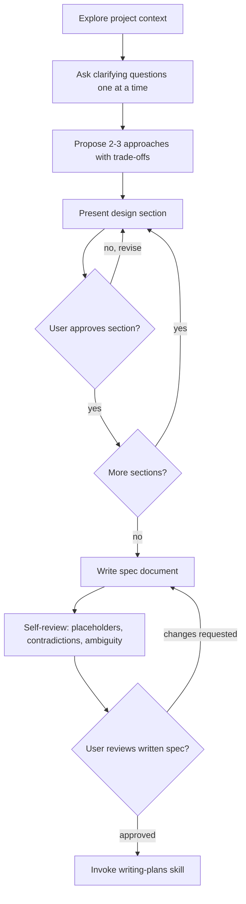

#### Reference Implementation

From `brainstorming/SKILL.md` -- the checklist:

```markdown
You MUST create a task for each of these items and complete them in order:

1. **Explore project context** — check files, docs, recent commits
2. **Offer visual companion** (if topic will involve visual questions)
3. **Ask clarifying questions** — one at a time
4. **Propose 2-3 approaches** — with trade-offs and your recommendation
5. **Present design** — in sections scaled to their complexity,
   get user approval after each section
6. **Write design doc** — save to docs/superpowers/specs/
7. **Spec self-review** — placeholders, contradictions, ambiguity, scope
8. **User reviews written spec** — ask user to review before proceeding
9. **Transition to implementation** — invoke writing-plans skill
```

From the same file -- presenting design sections:

```markdown
**Presenting the design:**

- Once you believe you understand what you're building, present the design
- Scale each section to its complexity: a few sentences if straightforward,
  up to 200-300 words if nuanced
- Ask after each section whether it looks right so far
- Cover: architecture, components, data flow, error handling, testing
- Be ready to go back and clarify if something doesn't make sense
```

From the same file -- user review gate:

```markdown
**User Review Gate:**
After the spec review loop passes, ask the user to review the written spec
before proceeding:

> "Spec written and committed to `<path>`. Please review it and let me know
> if you want to make any changes before we start writing out the
> implementation plan."

Wait for the user's response. If they request changes, make them and re-run
the spec review loop. Only proceed once the user approves.
```

#### Specialization Analysis

Specializes [Human-in-the-Loop](multi-agent-patterns-deep-dive.md#18-human-in-the-loop). The generic pattern describes a communication channel between agent and human. Incremental Design Validation defines a specific multi-checkpoint protocol: per-section approval during design, self-review after writing, and user review before implementation. Each checkpoint has specific criteria and a specific response to rejection.

#### Key Design Decisions

- **One question at a time**: The skill mandates "only one question per message" during the clarifying phase. This prevents overwhelming the user and ensures each question gets full attention.
- **Section-level granularity**: Rather than presenting the entire design and asking "do you approve?", the design is presented in sections with approval after each. This catches misalignments early before they propagate.
- **Written spec as separate gate**: Verbal approval of the design is not sufficient. The design must be written as a formal spec, self-reviewed, and approved by the user as a document. This catches discrepancies between what was discussed and what was written.

---

### 15. Worktree Isolation

#### What It Is

Create isolated git worktrees before starting implementation work. The skill provides smart directory selection (check `.worktrees/` -> `worktrees/` -> `CLAUDE.md` -> ask user), mandatory safety verification (directory must be git-ignored), and automatic dependency installation. This is infrastructure for parallel and isolated work.

#### How It Works

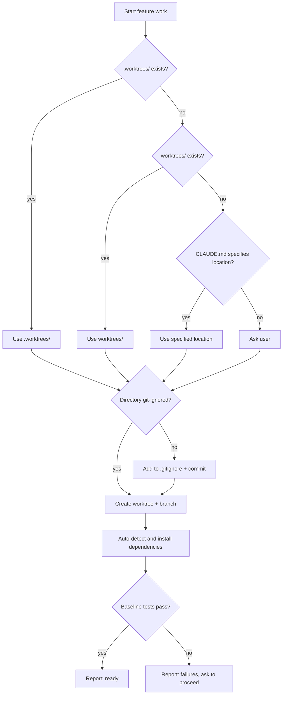

#### Reference Implementation

From `using-git-worktrees/SKILL.md` -- directory selection:

```markdown
### 1. Check Existing Directories

# Check in priority order
ls -d .worktrees 2>/dev/null     # Preferred (hidden)
ls -d worktrees 2>/dev/null      # Alternative

**If found:** Use that directory. If both exist, `.worktrees` wins.

### 2. Check CLAUDE.md

grep -i "worktree.*director" CLAUDE.md 2>/dev/null

**If preference specified:** Use it without asking.

### 3. Ask User

If no directory exists and no CLAUDE.md preference:

No worktree directory found. Where should I create worktrees?

1. .worktrees/ (project-local, hidden)
2. ~/.config/superpowers/worktrees/<project-name>/ (global location)

Which would you prefer?
```

From the same file -- safety verification:

```markdown
**MUST verify directory is ignored before creating worktree:**

# Check if directory is ignored
git check-ignore -q .worktrees 2>/dev/null || git check-ignore -q worktrees 2>/dev/null

**If NOT ignored:**

Per Jesse's rule "Fix broken things immediately":
1. Add appropriate line to .gitignore
2. Commit the change
3. Proceed with worktree creation

**Why critical:** Prevents accidentally committing worktree contents to repository.
```

From the same file -- auto-detect setup:

```markdown
# Node.js
if [ -f package.json ]; then npm install; fi

# Rust
if [ -f Cargo.toml ]; then cargo build; fi

# Python
if [ -f requirements.txt ]; then pip install -r requirements.txt; fi

# Go
if [ -f go.mod ]; then go mod download; fi
```

#### Specialization Analysis

Specializes [Parallel Execution](multi-agent-patterns-deep-dive.md#19-parallel-execution) (infrastructure). The generic pattern describes the coordination layer (lock files, merge queues, worktree loops). Worktree Isolation focuses on the setup and safety of individual worktrees: directory selection heuristics, gitignore verification, dependency installation, and baseline test verification.

#### Key Design Decisions

- **Safety-first**: The skill will not create a worktree until it has verified the directory is git-ignored. If not ignored, it fixes the problem immediately (adds to .gitignore and commits) rather than proceeding with a warning.
- **Convention over configuration**: The priority order (`.worktrees/` -> `worktrees/` -> `CLAUDE.md` -> ask) means most projects need zero configuration. The skill discovers the right location automatically.
- **Clean baseline verification**: After creating the worktree and installing dependencies, the skill runs the test suite to establish a clean baseline. If tests fail, it reports failures and asks for permission before proceeding -- never silently starts work on a broken foundation.

---

## Meta-Patterns

### 16. Skill-as-TDD

#### What It Is

The process of creating skills is itself treated as Test-Driven Development applied to behavior-shaping documentation. The RED phase observes agent failure without the skill (documenting rationalizations). The GREEN phase writes the minimal skill addressing those specific failures. The REFACTOR phase finds new rationalizations and closes loopholes. This meta-pattern treats skill files as production code and agent behavior as test results.

#### How It Works

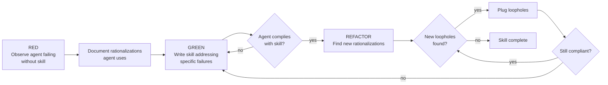

#### Reference Implementation

From `writing-skills/SKILL.md` -- the TDD mapping table:

```markdown
| TDD Concept        | Skill Creation                                      |
|--------------------|-----------------------------------------------------|
| **Test case**      | Pressure scenario with subagent                     |
| **Production code** | Skill document (SKILL.md)                           |
| **Test fails (RED)** | Agent violates rule without skill (baseline)       |
| **Test passes (GREEN)** | Agent complies with skill present              |
| **Refactor**       | Close loopholes while maintaining compliance        |
| **Write test first** | Run baseline scenario BEFORE writing skill        |
| **Watch it fail**  | Document exact rationalizations agent uses          |
| **Minimal code**   | Write skill addressing those specific violations    |
| **Watch it pass**  | Verify agent now complies                           |
| **Refactor cycle** | Find new rationalizations → plug → re-verify       |
```

From the same file -- the iron law:

```markdown
## The Iron Law (Same as TDD)

NO SKILL WITHOUT A FAILING TEST FIRST

This applies to NEW skills AND EDITS to existing skills.

Write skill before testing? Delete it. Start over.
Edit skill without testing? Same violation.

**No exceptions:**
- Not for "simple additions"
- Not for "just adding a section"
- Not for "documentation updates"
- Don't keep untested changes as "reference"
- Don't "adapt" while running tests
- Delete means delete
```

From the same file -- the RED-GREEN-REFACTOR for skills:

```markdown
### RED: Write Failing Test (Baseline)

Run pressure scenario with subagent WITHOUT the skill. Document exact behavior:
- What choices did they make?
- What rationalizations did they use (verbatim)?
- Which pressures triggered violations?

This is "watch the test fail" - you must see what agents naturally do before
writing the skill.

### GREEN: Write Minimal Skill

Write skill that addresses those specific rationalizations. Don't add extra
content for hypothetical cases.

Run same scenarios WITH skill. Agent should now comply.

### REFACTOR: Close Loopholes

Agent found new rationalization? Add explicit counter. Re-test until bulletproof.
```

#### Specialization Analysis

This is a **novel pattern** with no direct generic counterpart in the [multi-agent patterns catalog](multi-agent-patterns-deep-dive.md). Generic patterns focus on runtime agent coordination. Skill-as-TDD operates at the authoring layer -- it is a methodology for creating the behavioral constraints that runtime patterns rely on. It treats agent behavior testing as a first-class engineering discipline.

#### Key Design Decisions

- **Observation before writing**: The RED phase requires observing what agents actually do without the skill. This prevents writing skills based on assumptions about agent behavior rather than evidence.
- **Rationalizations as test failures**: The verbatim excuses agents make during baseline testing become the specific failure modes the skill must address. This is why Superpowers skills have extensive rationalization tables -- each entry was observed in testing.
- **Delete rule applies to skills too**: The same TDD delete rule (don't keep code written before a test) applies to skill content. If you write skill content before running baseline tests, delete it and start over.

---

### 17. Claude Search Optimization (CSO)

#### What It Is

A critical finding from testing: the skill description field must describe only triggering conditions, never workflow. When a description summarizes the skill's workflow, Claude may follow the description instead of reading the full skill content. This causes the agent to execute a simplified version of the skill rather than the complete documented process.

#### How It Works

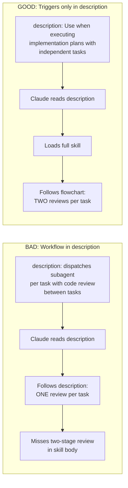

#### Reference Implementation

From `writing-skills/SKILL.md` -- the CSO section with good/bad examples:

```markdown
**CRITICAL: Description = When to Use, NOT What the Skill Does**

The description should ONLY describe triggering conditions. Do NOT summarize
the skill's process or workflow in the description.

**Why this matters:** Testing revealed that when a description summarizes the
skill's workflow, Claude may follow the description instead of reading the
full skill content. A description saying "code review between tasks" caused
Claude to do ONE review, even though the skill's flowchart clearly showed
TWO reviews (spec compliance then code quality).

When the description was changed to just "Use when executing implementation
plans with independent tasks" (no workflow summary), Claude correctly read
the flowchart and followed the two-stage review process.

**The trap:** Descriptions that summarize workflow create a shortcut Claude
will take. The skill body becomes documentation Claude skips.
```

From the same file -- good vs. bad examples:

```yaml
# BAD: Summarizes workflow - Claude may follow this instead of reading skill
description: Use when executing plans - dispatches subagent per task with
  code review between tasks

# BAD: Too much process detail
description: Use for TDD - write test first, watch it fail, write minimal
  code, refactor

# GOOD: Just triggering conditions, no workflow summary
description: Use when executing implementation plans with independent tasks
  in the current session

# GOOD: Triggering conditions only
description: Use when implementing any feature or bugfix, before writing
  implementation code
```

From the same file -- keyword coverage:

```markdown
### 2. Keyword Coverage

Use words Claude would search for:
- Error messages: "Hook timed out", "ENOTEMPTY", "race condition"
- Symptoms: "flaky", "hanging", "zombie", "pollution"
- Synonyms: "timeout/hang/freeze", "cleanup/teardown/afterEach"
- Tools: Actual commands, library names, file types
```

#### Specialization Analysis

This is a **novel pattern** with no direct generic counterpart in the [multi-agent patterns catalog](multi-agent-patterns-deep-dive.md). CSO addresses a behavior unique to skill-driven agent systems: the agent's tendency to use metadata (descriptions) as execution shortcuts rather than loading and following the full skill content. This is an empirical finding about LLM behavior, not a theoretical orchestration pattern.

#### Key Design Decisions

- **Discovered, not designed**: This pattern emerged from testing failure. A two-stage review process was being executed as a single review because the description mentioned "code review" (singular). The fix was changing the description to remove workflow details.
- **Description as trigger, not summary**: The description field answers "should I load this skill?" not "what does this skill do?" This is counter-intuitive -- developers naturally want to summarize a skill's purpose in its description.
- **Keyword strategy**: Skill descriptions should include the vocabulary users and agents would search for (error messages, symptoms, tool names) rather than abstract process descriptions. This improves skill discovery while avoiding the workflow-shortcut trap.

---

## Pattern Composition Reference

### Full Superpowers Development Workflow

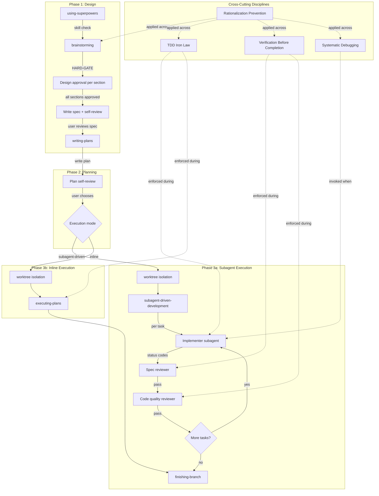

### Common Workflow Combinations

| Workflow | Patterns Combined |
|----------|-------------------|
| Full Feature Development | Sequential Chaining + Hard Gate + Incremental Design Validation + TDD Iron Law + Two-Stage Review + Evidence-Based Verification |
| Bug Investigation | Systematic Root Cause Investigation + TDD Iron Law + Evidence-Based Verification |
| Parallel Problem Solving | Parallel Agent Dispatch + Fresh Subagent Per Task + Worktree Isolation |
| Skill Development | Skill-as-TDD + CSO + Rationalization Prevention |
| Code Review Response | Code Review Reception Protocol + Evidence-Based Verification + Rationalization Prevention |

### Anti-Patterns

- **Summarizing workflow in skill descriptions**: Causes Claude to follow the description instead of loading and reading the full skill. Always describe triggering conditions only (CSO violation).
- **Skipping spec review before code quality review**: Code quality review is meaningless if the code does not match the spec. Always run spec compliance first.
- **Trusting agent self-reports without independent verification**: The spec reviewer prompt explicitly states "The implementer finished suspiciously quickly. Their report may be incomplete, inaccurate, or optimistic."
- **Starting implementation without brainstorming phase**: The HARD-GATE in brainstorming applies to EVERY project "regardless of perceived simplicity." Simple projects are where unexamined assumptions cause the most wasted work.
- **Using the same model tier for all task complexities**: Mechanical tasks with clear specs should use cheap/fast models. Reserve capable models for architecture, design, and review tasks.
- **Attempting a fourth fix after three have failed**: Three failed fixes indicate an architectural problem, not a bug. Stop fixing symptoms and question the architecture.
- **Performative agreement with code review feedback**: "You're absolutely right!" is explicitly forbidden. Verify feedback against codebase reality before implementing.
- **Writing skills without baseline testing**: Creating skill content before observing agent behavior without the skill violates the Skill-as-TDD iron law. The result is skills that address hypothetical problems rather than observed failures.

---

## Mapping to Generic Patterns

| # | Superpowers Pattern | Generic Counterpart | Specialization Note |
|---|---------------------|---------------------|---------------------|
| 1 | Sequential Skill Chaining | [Pipeline](multi-agent-patterns-deep-dive.md#5-pipeline) | Routing embedded in skill text instead of event bus |
| 2 | Hard Gate Enforcement | [Backpressure](multi-agent-patterns-deep-dive.md#4-backpressure-quality-gates) | XML-style markup tags instead of automated checks |
| 3 | Execution Mode Selection | [Human-in-the-Loop](multi-agent-patterns-deep-dive.md#18-human-in-the-loop) | Single binary decision at fixed workflow point |
| 4 | Fresh Subagent Per Task | [Fresh Context per Iteration](multi-agent-patterns-deep-dive.md#17-fresh-context-per-iteration) | Controller constructs context from scratch, not just clears it |
| 5 | Two-Stage Review Gate | [Critic-Actor](multi-agent-patterns-deep-dive.md#6-critic-actor) + [Pipeline](multi-agent-patterns-deep-dive.md#5-pipeline) | Two independent critics in strict sequence with distrust-by-default |
| 6 | Status Codes with Escalation | [Event-Driven Routing](multi-agent-patterns-deep-dive.md#2-event-driven-routing) | Four fixed status codes replace free-form events |
| 7 | Model Selection by Complexity | **Novel** | Cost-aware model tier selection per dispatch |
| 8 | Parallel Agent Dispatch | [Parallel Execution](multi-agent-patterns-deep-dive.md#19-parallel-execution) | Tactical decision-making focus vs. infrastructure focus |
| 9 | Evidence-Based Verification Gate | [Confidence-Gated Completion](multi-agent-patterns-deep-dive.md#11-confidence-gated-completion) | Binary evidence replaces numeric confidence threshold |
| 10 | TDD Iron Law | [Specification-First](multi-agent-patterns-deep-dive.md#13-specification-first) + [Backpressure](multi-agent-patterns-deep-dive.md#4-backpressure-quality-gates) | Spec narrowed to executable test with delete-if-violated enforcement |
| 11 | Systematic Root Cause Investigation | [Scientific Method](multi-agent-patterns-deep-dive.md#10-scientific-method) | Mandatory pre-hypothesis investigation + 3-fix escalation threshold |
| 12 | Rationalization Prevention | **Novel** | Cross-cutting meta-technique for hardening behavioral constraints |
| 13 | Code Review Reception Protocol | [Critic-Actor](multi-agent-patterns-deep-dive.md#6-critic-actor) (receiving side) | Anti-sycophancy + YAGNI verification on the actor side |
| 14 | Incremental Design Validation | [Human-in-the-Loop](multi-agent-patterns-deep-dive.md#18-human-in-the-loop) | Multi-checkpoint protocol with per-section and per-document gates |
| 15 | Worktree Isolation | [Parallel Execution](multi-agent-patterns-deep-dive.md#19-parallel-execution) (infrastructure) | Setup heuristics + safety verification focus |
| 16 | Skill-as-TDD | **Novel** | TDD methodology applied to behavior-shaping documentation authoring |
| 17 | Claude Search Optimization | **Novel** | Empirical finding about LLM description-following vs. content-reading |

## References

- **Companion overview**: `docs/research/superpowers-patterns-overview.md` -- Quick-reference summary of all 17 patterns with one-line descriptions and category groupings.
- **Generic patterns overview**: `docs/research/multi-agent-patterns-overview.md` -- Quick-reference summary of 19 generic multi-agent orchestration patterns.
- **Generic patterns deep-dive**: `docs/research/multi-agent-patterns-deep-dive.md` -- Comprehensive guide to 19 generic multi-agent patterns with Mermaid diagrams, reference implementations from Ralph, and cross-domain application examples.
- **Superpowers project**: `external-repos/superpowers/` -- Source repository containing all skill files, prompt templates, and supporting documentation referenced throughout this document.
- **Key source files**:
  - `external-repos/superpowers/skills/brainstorming/SKILL.md` -- Brainstorming skill with HARD-GATE, incremental design validation, and sequential chaining.
  - `external-repos/superpowers/skills/writing-plans/SKILL.md` -- Plan writing skill with execution mode selection handoff.
  - `external-repos/superpowers/skills/using-superpowers/SKILL.md` -- Skill usage enforcement with EXTREMELY-IMPORTANT gate and red flags table.
  - `external-repos/superpowers/skills/subagent-driven-development/SKILL.md` -- Subagent coordination with two-stage review, status codes, and model selection.
  - `external-repos/superpowers/skills/subagent-driven-development/implementer-prompt.md` -- Implementer subagent prompt template with escalation encouragement.
  - `external-repos/superpowers/skills/subagent-driven-development/spec-reviewer-prompt.md` -- Spec compliance reviewer with distrust-by-default principle.
  - `external-repos/superpowers/skills/subagent-driven-development/code-quality-reviewer-prompt.md` -- Code quality reviewer dispatched after spec compliance passes.
  - `external-repos/superpowers/skills/dispatching-parallel-agents/SKILL.md` -- Parallel agent dispatch pattern with real-world example.
  - `external-repos/superpowers/skills/verification-before-completion/SKILL.md` -- Evidence-based verification gate with iron law and rationalization table.
  - `external-repos/superpowers/skills/test-driven-development/SKILL.md` -- TDD iron law with delete rule and comprehensive rationalization defenses.
  - `external-repos/superpowers/skills/systematic-debugging/SKILL.md` -- Four-phase debugging with 3-fix escalation threshold.
  - `external-repos/superpowers/skills/receiving-code-review/SKILL.md` -- Code review reception with anti-sycophancy protocol and YAGNI check.
  - `external-repos/superpowers/skills/using-git-worktrees/SKILL.md` -- Worktree isolation with smart directory selection and safety verification.
  - `external-repos/superpowers/skills/writing-skills/SKILL.md` -- Skill-as-TDD methodology and Claude Search Optimization discovery.
