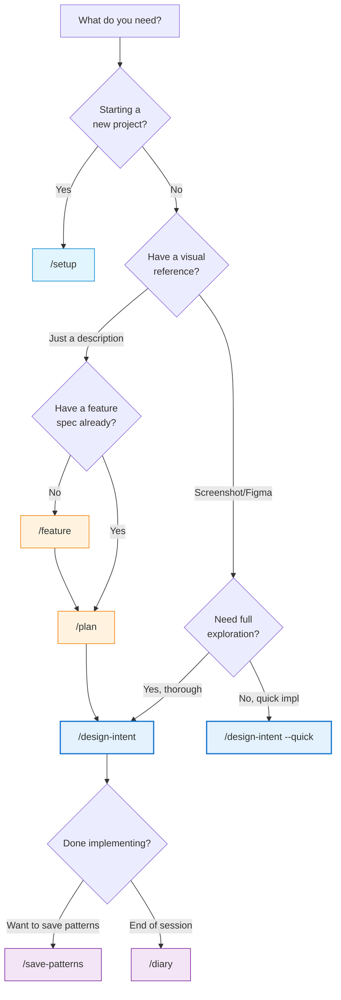
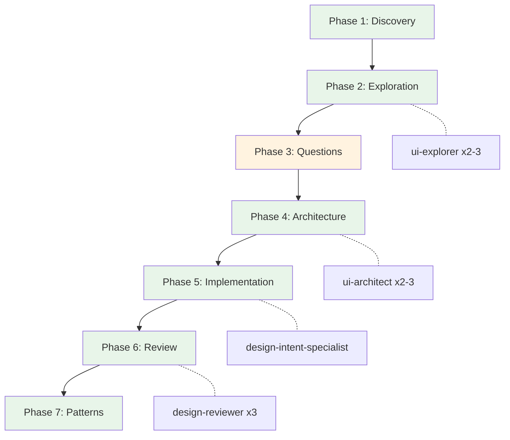
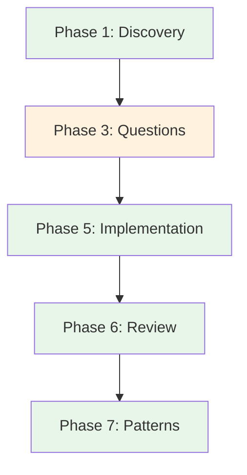
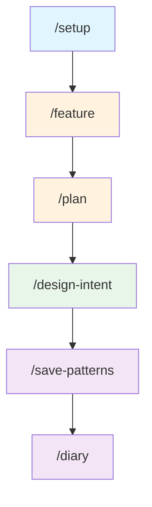

# Design Intent Plugin

UI/UX Design Plugin - Visual fidelity from Figma/mockups, design system enforcement, and React UI prototyping with pattern memory. Focused exclusively on frontend visual implementation.

## Overview

This plugin provides a complete workflow for building frontend prototypes with AI assistance while maintaining design consistency. It combines:

- **7-Phase Structured Workflow** - Discovery, exploration, questions, architecture, implementation, review, patterns
- **Specialized UI Agents** - Explorer, architect, and reviewer for thorough UI development
- **Design Intent Documentation** - Capture your team's design dialect for consistency
- **Parallel Agent Execution** - Multiple agents working simultaneously for efficiency

## Scope Boundaries

**IN SCOPE:**
- React/frontend component implementation
- Design token and pattern enforcement
- Visual reference analysis (Figma, screenshots, descriptions)
- Responsive behavior and breakpoints
- Accessibility compliance (ARIA, keyboard navigation)
- Design system integration (Fluent UI, Material UI, etc.)

**OUT OF SCOPE:**
- Backend API implementation
- Database schemas or migrations
- Server-side logic or business rules
- Unit/integration testing frameworks
- DevOps, CI/CD, or deployment

For backend implementation, use the core plugin (`/develop`) or standard Claude Code.

## Background & Credits

This plugin is based on [design-intent-for-sdd](https://github.com/HugoPalomares/design-intent-for-sdd) by Hugo Palomares, which builds upon the Spec-Driven Development (SDD) methodology created by [John Lam](https://github.com/jflam) at GitHub.

**Related Resources:**

- [github/spec-kit](https://github.com/github/spec-kit) - The original SDD framework for feature specifications and implementation plans
- [design-intent-for-sdd](https://github.com/HugoPalomares/design-intent-for-sdd) - The standalone project this plugin was adapted from

## What is Design Intent?

> *"If design systems are your language, design intent is your dialect"*

**Design systems** provide the universal language - components, tokens, patterns that work everywhere.

**Design intent** captures your dialect - how your team specifically applies that language for your unique context.

### Language vs Dialect Examples

**Language (Design System)**: Data display components (tables, cards, carousels)

**Your Dialect**:

- **Enterprise**: "We default to tables for displaying data because users need to compare many items and export functionality"
- **Consumer**: "We use card grids and carousels because users browse smaller sets and prioritize visual appeal over density"

**Language (Design System)**: Standard spacing scale (8px, 16px, 24px...)

**Your Dialect**:

- **Enterprise**: "We use 32px between sections for clear information hierarchy in dense dashboards"
- **Consumer**: "We use 48px between sections to create breathing room and reduce cognitive load"

## Installation

```bash
# Add marketplace (if not already added)
/plugin marketplace add ./arkhe-claude-plugins

# Install plugin
/plugin install design-intent@arkhe-claude-plugins
```

## Quick Start

### 1. Initialize Your Project

```bash
/setup
```

This creates the complete design intent structure in your project with all templates.

### 2. Full Structured Workflow (Recommended)

Use the main orchestrating command for comprehensive UI development:

```bash
/design-intent Add a user profile card with avatar and stats
```

This launches the **7-phase workflow**:

1. **Discovery** - Understand requirements
2. **Exploration** - Analyze existing UI patterns (2-3 agents in parallel)
3. **Questions** - Clarify visual preferences, responsive needs
4. **Architecture** - Design approaches with trade-offs (2-3 agents in parallel)
5. **Implementation** - Build with design-intent-specialist skill
6. **Review** - Quality check (3 agents in parallel)
7. **Patterns** - Document reusable patterns

**Quick Mode** for small changes:

```bash
/design-intent --quick Fix button spacing in header
```

Skips exploration and architecture phases.

### 3. Standalone Commands

For specific tasks, use individual commands:

```bash
/feature user authentication flow   # Create UI feature spec
/plan                               # Generate UI implementation plan
/save-patterns                      # Capture successful patterns
/diary                              # Create session diary
```

## Which Command Should I Use?



## Workflow Diagrams

### Full 7-Phase Workflow (`/design-intent`)



### Quick Mode (`/design-intent --quick`)



### Standalone Commands Flow



## Commands

| Command | Description | When to Use |
| ------- | ----------- | ----------- |
| `/design-intent [ref]` | 7-phase structured UI workflow | Complex UI work needing exploration and architecture |
| `/design-intent --quick [ref]` | Streamlined 5-phase workflow | Simple changes, known patterns |
| `/setup` | Initialize design intent structure | Starting a new project |
| `/feature [desc]` | Create UI feature specification | Defining new UI features |
| `/plan` | Generate UI implementation plan | After feature spec approved |
| `/save-patterns` | Extract and document UI patterns | After successful implementation |
| `/diary` | Create session handoff doc | End of work session |

## Agents

### ui-explorer (Cyan)

Analyzes existing UI codebase by tracing component hierarchies, mapping design tokens, understanding styling patterns, and documenting established design system usage.

**Used in**: Phase 2 (Exploration) - 2-3 agents in parallel

**Focus areas**:

- Component discovery (hierarchies, props, variants)
- Design token analysis (colors, spacing, typography)
- Styling pattern analysis (CSS approach, responsive patterns)
- Design intent review (existing patterns)

**Output**: Component inventory, design token map, styling conventions, 5-10 essential files.

### ui-architect (Green)

Designs UI component architectures by analyzing existing patterns, proposing component structures, and creating implementation blueprints with clear trade-offs.

**Used in**: Phase 4 (Architecture) - 2-3 agents with different approaches

**Design approaches**:

- **Minimal/Conservative**: Maximum reuse, smallest changes
- **Clean/Ideal**: Optimal architecture, proper abstractions
- **Pragmatic/Balanced**: Speed + quality balance

**Output**: Component structure, props/interfaces, styling strategy, file map, build sequence.

### design-reviewer (Magenta)

Reviews UI implementations for visual consistency, accessibility compliance, responsive behavior, and design pattern adherence using confidence-based filtering.

**Used in**: Phase 6 (Review) - 3 agents with different focuses

**Review focuses**:

- Visual consistency (tokens, spacing, typography)
- Accessibility/Responsiveness (ARIA, keyboard, breakpoints)
- Pattern adherence (design intent compliance)

**Confidence scoring**: Only reports issues with confidence >= 80.

## Skill

### Design Intent Specialist

Auto-invoked skill for creating accurate frontend implementations from visual references while maintaining design consistency.

**Used in**: Phase 5 (Implementation)

**Capabilities:**

- Mandatory design intent pattern check before implementation
- Visual reference analysis (screenshots, Figma, descriptions)
- Section-by-section implementation for complex designs
- Conflict resolution between references and existing patterns
- Support for iterative "vibe coding" refinement

**Auto-triggers on:**

- Figma URLs
- Screenshots/design images
- UI implementation requests
- Phase 5 of `/design-intent` workflow

**Documentation:**

- `skills/design-intent-specialist/SKILL.md` - Quick start
- `skills/design-intent-specialist/WORKFLOW.md` - Detailed process
- `skills/design-intent-specialist/EXAMPLES.md` - Usage examples
- `skills/design-intent-specialist/TROUBLESHOOTING.md` - Common issues

## Project Structure After Setup

```text
your-project/
├── design-intent/
│   ├── memory/
│   │   ├── constitution.md      # Core development principles (7 Articles)
│   │   ├── team-roles.md        # AI/User collaboration expectations
│   │   └── project-vision.md    # Your project overview
│   ├── specs/
│   │   └── 000-template/        # Feature spec and plan templates
│   ├── patterns/
│   │   └── design-intent-template.md  # Pattern documentation template
│   └── diary/
│       └── session-template.md  # Session diary template
```

## The Constitution

The constitution (7 Articles) governs prototype development:

- **Article I**: Simplicity Imperative - Start simple, evolve gradually
- **Article II**: Anti-Abstraction Principle - Framework-first development
- **Article III**: Responsive Design Mandate - Mobile-first approach
- **Article IV**: Prototype Principles - Mock data, happy paths
- **Article V**: Feature-First Development - Features over visual fidelity
- **Article VI**: UI Quality Standards - Microinteractions, visual hierarchy
- **Article VII**: Design Intent Documentation - Document proven patterns

## Optional: MCP Server Setup

For enhanced capabilities, configure these optional MCP servers:

### Figma Dev Mode MCP Server

Enables reading Figma designs, extracting code, and retrieving design tokens.

**Installation:**

```bash
npm install -g @anthropic/mcp-server-figma-dev-mode
```

**Configuration (`.mcp.json`):**

```json
{
  "mcpServers": {
    "figma-dev-mode-mcp-server": {
      "command": "npx",
      "args": ["-y", "@anthropic/mcp-server-figma-dev-mode"],
      "env": {
        "FIGMA_ACCESS_TOKEN": "your-figma-token"
      }
    }
  }
}
```

**Get Figma Token:**

1. Go to Figma → Account Settings → Personal Access Tokens
2. Generate a new token with read access

### Fluent UI Pilot MCP Server

Provides Fluent UI v9 component information and guidance.

**Installation:**

```bash
npm install -g @anthropic/mcp-server-fluent-pilot
```

**Configuration (`.mcp.json`):**

```json
{
  "mcpServers": {
    "fluent-pilot": {
      "command": "npx",
      "args": ["-y", "@anthropic/mcp-server-fluent-pilot"]
    }
  }
}
```

### Combined Configuration

```json
{
  "mcpServers": {
    "figma-dev-mode-mcp-server": {
      "command": "npx",
      "args": ["-y", "@anthropic/mcp-server-figma-dev-mode"],
      "env": {
        "FIGMA_ACCESS_TOKEN": "your-figma-token"
      }
    },
    "fluent-pilot": {
      "command": "npx",
      "args": ["-y", "@anthropic/mcp-server-fluent-pilot"]
    }
  }
}
```

## Workflow

### Recommended: Full 7-Phase Workflow

```text
/design-intent [visual reference or description]

Phase 1: Discovery      → Understand requirements, confirm with user
Phase 2: Exploration    → 2-3 ui-explorer agents analyze codebase
Phase 3: Questions      → Clarify all ambiguities (checkpoint)
Phase 4: Architecture   → 2-3 ui-architect agents propose approaches
Phase 5: Implementation → design-intent-specialist builds the UI
Phase 6: Review         → 3 design-reviewer agents check quality
Phase 7: Patterns       → Extract and document reusable patterns
```

### Quick Mode for Small Changes

```text
/design-intent --quick [change description]

Phase 1: Discovery      → Understand requirements
Phase 3: Questions      → Clarify ambiguities
Phase 5: Implementation → Build the UI
Phase 6: Review         → Quality check
Phase 7: Patterns       → Document patterns
```

### Standalone Commands Cycle

```text
1. /setup              → Initialize project structure
2. /feature            → Create UI feature specification
3. /plan               → Generate UI implementation plan
4. /design-intent      → Build the UI feature
5. /save-patterns      → Capture successful patterns
6. /diary              → Document session for handoff
```

### Design Intent Pattern

The workflow captures your team's "design dialect" - custom decisions that won't come from the design system:

- **Custom Layout Patterns** - App-specific compositions
- **Contextual Spacing** - Spacing decisions that deviate from tokens
- **Content Hierarchies** - Information architecture patterns
- **Custom Compositions** - Unique component combinations

**NOT documented:** Standard design system artifacts (colors, typography, default behaviors)

## Examples of Design Intent

### L2 Layout Pattern

**Element:** Header of L2 main section

**Pattern file:** `design-intent/patterns/l2-layout.md`

```markdown
## Decision
Use a consistent header structure with back navigation on the left, action buttons
on the right using large variant, and responsive overflow menu behavior when space
is constrained.

## When to Use
All L2 detail pages that require back navigation and action buttons (person details,
agent details, etc.).

## Components
- Button (large variant)
- OverflowButton
- Existing responsive overflow menu pattern

## Why
Provides consistent navigation experience, maintains action accessibility across
screen sizes, and ensures all actions remain discoverable regardless of screen width.

## Dependencies
- OverflowButton component with responsive menu behavior
- Large button variant from Fluent UI
- Page layout system
```

### Data Table Pattern

**Element:** Data tables across the application

**Pattern file:** `design-intent/components/data-table.md`

```markdown
## Decision
Fluent Table-based implementation with integrated skeleton loading, intelligent
state management, and flexible column sizing.

## When to Use
- **Structured data display**: Lists, directories, catalogs requiring tabular presentation
- **Interactive data**: Content that users scan, sort, filter, or select
- **Performance requirements**: Large datasets needing loading states and pagination
- **Consistent behavior**: Standardized table interactions across application

## Components
- `DataTable` - Main reusable table component
- `Skeleton` loading states for initial and infinite scroll loading
- Fluent Table components for base functionality

## Why
Migrated from DataGrid to Table for better column sizing control; skeleton loading
prevents jarring content shifts; intelligent state management optimizes perceived
performance; flexible column sizing adapts to content naturally.

## Dependencies
Fluent UI Table components, Skeleton components, infinite scroll utilities,
responsive breakpoint system.
```

## When to Use This Plugin

- Starting a new React prototype project
- Building AI-assisted frontend implementations
- Maintaining design consistency across features
- Documenting design decisions for team alignment
- Creating session handoff documentation

## Requirements

- Git repository
- React project (for implementations)
- Claude Code CLI

## License

MIT
