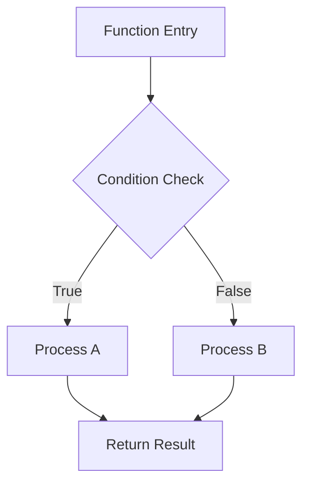
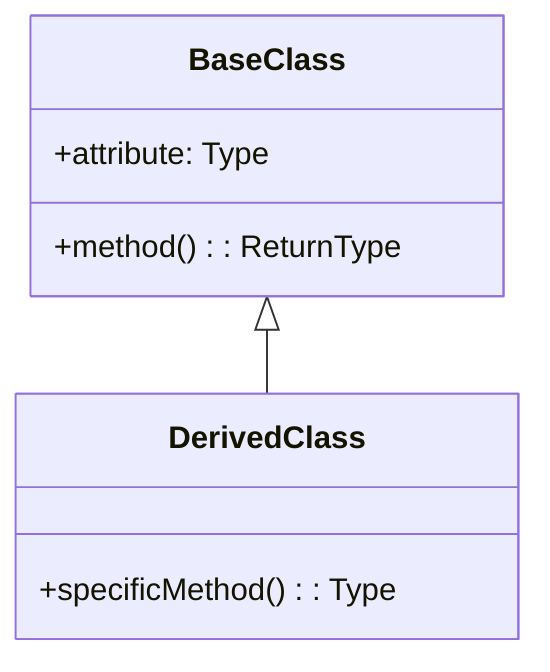
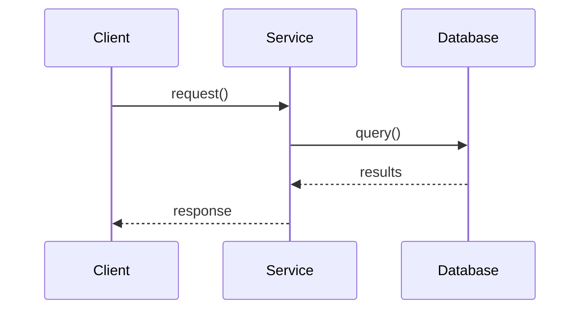

# Code Explanation: Detailed Workflow

Step-by-step methodology for creating clear, comprehensive code explanations.

## Phase 1: Code Analysis

### 1.1 Complexity Assessment

Analyze the code to determine explanation depth needed:

```python
# Mental model for complexity assessment
complexity_factors = {
    'lines_of_code': len(code.splitlines()),
    'cyclomatic_complexity': count_decision_points(code),
    'nesting_depth': max_indentation_level(code),
    'function_count': count_functions(code),
    'class_count': count_classes(code)
}

# Difficulty thresholds
if complexity_factors['cyclomatic_complexity'] > 10:
    difficulty = 'advanced'
elif complexity_factors['cyclomatic_complexity'] > 5:
    difficulty = 'intermediate'
else:
    difficulty = 'beginner'
```

### 1.2 Concept Identification

Identify programming concepts used:

| Concept | Indicators | Explanation Priority |
|---------|------------|---------------------|
| Async/Await | `async`, `await`, `asyncio` | High - often misunderstood |
| Decorators | `@decorator` syntax | High - abstraction layer |
| Generators | `yield` keyword | Medium - lazy evaluation |
| Context Managers | `with` statement | Medium - resource handling |
| Comprehensions | `[x for x in ...]` | Low - common pattern |
| Lambda | `lambda x: ...` | Low - inline functions |
| Exception Handling | `try/except` blocks | Medium - error flows |

### 1.3 Pattern Detection

Look for common design patterns:

- **Singleton** - Single instance enforcement
- **Factory** - Object creation abstraction
- **Observer** - Event-driven communication
- **Strategy** - Interchangeable algorithms
- **Decorator** - Dynamic behavior extension
- **Repository** - Data access abstraction

## Phase 2: Visual Diagram Generation

### 2.1 Flow Diagram (for control flow)



**When to use**: Functions with multiple decision points, loops, or conditional logic.

### 2.2 Class Diagram (for OOP structures)



**When to use**: Class hierarchies, inheritance, composition relationships.

### 2.3 Sequence Diagram (for interactions)



**When to use**: Multi-component interactions, API flows, method call chains.

## Phase 3: Step-by-Step Breakdown

### 3.1 Function Decomposition

For each function, explain:

1. **Purpose** (1 sentence)
2. **Inputs** (parameters with types)
3. **Processing** (step-by-step logic)
4. **Output** (return value)
5. **Side effects** (if any)

### 3.2 Logic Flow Template

```markdown
### Step 1: [Action]
**Line X-Y**: [What happens]
**Why**: [Rationale for this approach]

### Step 2: [Action]
**Line X-Y**: [What happens]
**Why**: [Rationale for this approach]
```

### 3.3 Annotated Code Blocks

```python
def process_data(items: List[Item]) -> Dict[str, int]:
    """
    Process items and return count by category.

    Step 1: Initialize empty result dictionary
    """
    result = {}  # ← Accumulator for category counts

    """
    Step 2: Iterate through each item
    """
    for item in items:  # ← O(n) iteration
        category = item.category  # ← Extract category

        """
        Step 3: Increment count (defaulting to 0)
        """
        result[category] = result.get(category, 0) + 1

    return result  # ← Final aggregated counts
```

## Phase 4: Concept Deep Dives

### 4.1 Decorator Explanation Template

```markdown
## Understanding Decorators

**Analogy**: Gift wrapping - adds something around the original without changing it.

**How it works**:
```python
@timer
def slow_function():
    pass

# Is equivalent to:
slow_function = timer(slow_function)
```

**In this code**: The decorator is used to [specific purpose].

**Benefits**:
- Separation of concerns
- Reusable cross-cutting logic
- Clean, readable code
```

### 4.2 Async/Await Explanation Template

```markdown
## Understanding Async/Await

**Analogy**: Restaurant kitchen - cook can start multiple dishes, checking each when ready.

**Key concepts**:
- `async def` - Declares a coroutine
- `await` - Pauses until result ready (non-blocking)
- Event loop - Coordinates all coroutines

**In this code**: Async is used to [specific purpose].
```

### 4.3 Generator Explanation Template

```markdown
## Understanding Generators

**Analogy**: Ticket dispenser - produces one value at a time, on demand.

**How it works**:
- `yield` produces a value and pauses
- Next call resumes from where it paused
- Memory efficient for large sequences

**In this code**: Generator is used to [specific purpose].
```

## Phase 5: Algorithm Visualization

### 5.1 Sorting Algorithm Example

```markdown
## Bubble Sort Visualization

**Initial**: [5, 2, 8, 1, 9]

### Pass 1:
- Compare [5] and [2]: Swap → [2, 5, 8, 1, 9]
- Compare [5] and [8]: No swap
- Compare [8] and [1]: Swap → [2, 5, 1, 8, 9]
- Compare [8] and [9]: No swap

### Pass 2:
[Continue pattern...]

**Complexity**: O(n²) time, O(1) space
```

### 5.2 Recursion Visualization

```markdown
## Recursive Call Stack

```
factorial(4)
│
├─> 4 * factorial(3)
│   │
│   ├─> 3 * factorial(2)
│   │   │
│   │   ├─> 2 * factorial(1)
│   │   │   │
│   │   │   └─> return 1 (base case)
│   │   │
│   │   └─> return 2 * 1 = 2
│   │
│   └─> return 3 * 2 = 6
│
└─> return 4 * 6 = 24
```
```

## Phase 6: Common Pitfalls

### 6.1 Pitfall Detection Patterns

| Pattern | Issue | Severity |
|---------|-------|----------|
| Bare `except:` | Catches all exceptions | High |
| `global` keyword | Shared mutable state | Medium |
| Mutable default args | Shared across calls | High |
| No type hints | Unclear contracts | Low |

### 6.2 Pitfall Explanation Template

```markdown
## ⚠️ [Pitfall Name]

**Problem**: [What's wrong]

**Why it's bad**:
- [Reason 1]
- [Reason 2]

**Better approach**:
```python
# Instead of this:
[bad_code]

# Do this:
[good_code]
```
```

## Phase 7: Learning Resources

### 7.1 Resource Recommendation Template

```markdown
## Further Learning

### For [Concept]:
- **Tutorial**: [Title and link]
- **Documentation**: [Official docs link]
- **Practice**: [Exercise suggestion]

### Suggested Learning Path:
1. [Foundation topic]
2. [Intermediate topic]
3. [Advanced topic]
```

## Quality Checklist

Before delivering an explanation:

- [ ] Purpose clearly stated in first sentence
- [ ] Complexity level matches audience
- [ ] Visual diagram included (if complexity > 5)
- [ ] Step-by-step breakdown provided
- [ ] Code references use `file_path:line_number` format
- [ ] Gotchas and edge cases mentioned
- [ ] Related concepts linked
- [ ] No jargon without explanation
