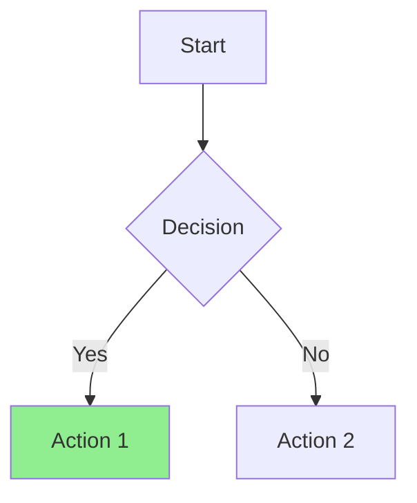
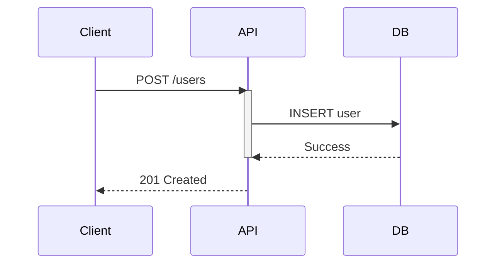

# Diagram Generator

Creates clear, professional diagrams in Mermaid (default) or ASCII format.

## Workflow

1. **Determine format** — Mermaid (default) or ASCII (only if user explicitly requests)
2. **Select diagram type** — Match the use case to the right visualization (see selection guide below)
3. **Draft structure** — Start with 5-7 core nodes; choose layout direction (`TD` for processes, `LR` for timelines)
4. **Add detail and styling** — Expand logic, apply semantic colors/shapes, use subgraphs for >15 nodes
5. **Validate** — Confirm syntax renders correctly; verify readability at normal zoom with <20 nodes per diagram

See [WORKFLOW.md](WORKFLOW.md) for the full 7-phase creation methodology.

## Diagram Type Selection

| Use Case | Type | Example Trigger |
|----------|------|-----------------|
| Process/decision flow | `graph TD` | "flowchart", "decision tree" |
| API/service interactions | `sequenceDiagram` | "sequence", "API flow" |
| Database schema | `erDiagram` | "ERD", "data model" |
| System architecture | `C4Context`, `C4Container`, `block-beta` | "architecture", "C4" |
| State transitions | `stateDiagram-v2` | "state machine", "lifecycle" |
| Brainstorming/ideas | `mindmap` | "mindmap", "brainstorm" |
| Project timeline | `gantt` | "timeline", "schedule" |
| Feature prioritization | `quadrantChart` | "priority matrix" |

## Inline Examples

### Flowchart

````markdown

````

### Sequence Diagram

````markdown

````

### ER Diagram

````markdown
```mermaid
erDiagram
    CUSTOMER ||--o{ ORDER : places
    ORDER ||--|{ LINE_ITEM : contains
    LINE_ITEM }o--|| PRODUCT : references
    CUSTOMER { string name; string email }
    ORDER { int id; decimal total }
```
````

### ASCII (When Explicitly Requested)

```
+-------+     +----------+
| Start | --> | Decision |
+-------+     +----+-----+
                   |
         +---------+---------+
         v                   v
    +----------+       +----------+
    | Action 1 |       | Action 2 |
    +----------+       +----------+
```

ASCII conventions: `+---+` for boxes, `|` for vertical lines, `-->` for connections. Use consistent spacing and alignment.

## Common Issues

- **Invalid node IDs** — Use alphanumeric IDs with `[Display Text]` for spaces
- **Arrows not rendering** — Use `-->` (solid), `-.->` (dotted), `==>` (thick)
- **Subgraph not closing** — Every `subgraph` needs a matching `end`

See [TROUBLESHOOTING.md](TROUBLESHOOTING.md) for the full error catalog and debugging workflow.

## Resources

- [WORKFLOW.md](WORKFLOW.md) — Detailed 7-phase creation methodology
- [EXAMPLES.md](EXAMPLES.md) — All diagram types with real-world examples
- [TROUBLESHOOTING.md](TROUBLESHOOTING.md) — Common errors, rendering fixes, and export tips

## Integration

- **Auto-invokes** on trigger keywords (diagram, mermaid, ASCII, visualize, etc.)
- **Manual**: `/diagram` command
- **With docs**: Works alongside `doc-coauthoring` skill for documentation diagrams
