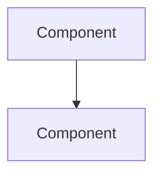

# RFC: [Title]

**Author**: [name]
**Status**: Draft | Review | Approved | Rejected | Superseded
**Date**: [YYYY-MM-DD]
**Reviewers**: [names]

## Summary

[1-2 paragraph overview of what this RFC proposes]

## Motivation

[Why is this change needed? What problem does it solve? Include data or user feedback if available.]

## Goals

- [Goal 1]
- [Goal 2]

## Non-Goals

- [Explicitly out of scope item 1]
- [Explicitly out of scope item 2]

## Architecture Overview

[High-level description of the proposed architecture]

## Diagram



## Data Model

[Schema changes, new entities, migrations]

```sql
-- Example migration
```

## APIs

[New or modified API endpoints]

| Method | Path | Description |
|--------|------|-------------|
| POST   | /api/... | ... |

## Infrastructure

[New services, configuration changes, deployment requirements]

## Security Considerations

- Authentication: [impact]
- Authorization: [impact]
- Data privacy: [impact]
- Input validation: [approach]

## Scalability

- Expected load: [metrics]
- Bottlenecks: [identified risks]
- Scaling strategy: [approach]

## Observability

- Metrics: [what to track]
- Logging: [what to log]
- Alerting: [thresholds]

## Risks and Mitigations

| Risk | Likelihood | Impact | Mitigation |
|------|-----------|--------|------------|
| ...  | H/M/L     | H/M/L  | ...        |

## Alternatives Considered

### Alternative 1: [Name]
[Description and why it was rejected]

## Migration Plan

1. [Step 1]
2. [Step 2]

**Rollback strategy**: [how to revert if needed]

## Open Questions

- [ ] [Question 1]
- [ ] [Question 2]
