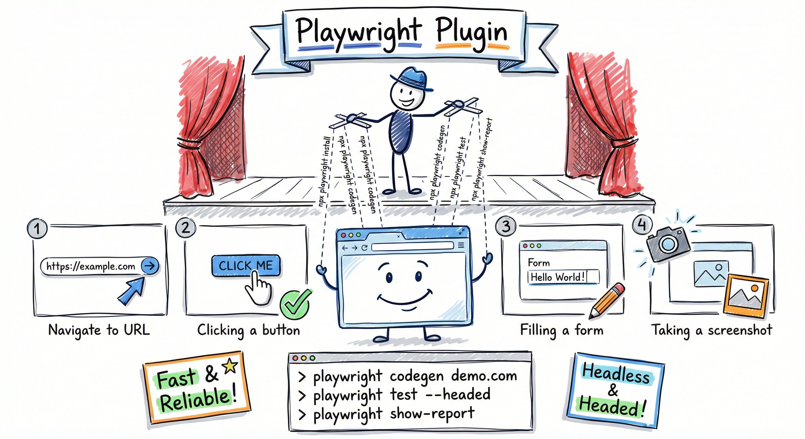

# Playwright Plugin

<div align="center">
  
</div>

Browser automation via Playwright CLI for testing, screenshots, and interaction workflows.

## Overview

The Playwright plugin provides a skill for browser automation using Playwright CLI. It teaches Claude how to navigate pages, interact with elements, capture screenshots, and test web applications through shell commands — without requiring MCP server configuration.

The CLI approach is token-efficient (no tool schemas loaded into context) and works with any agent that has Bash access.

## Prerequisites

- **Node.js 18+**
- **Playwright CLI**: `npm install -g @playwright/cli@latest`
- Verify: `playwright-cli --help`

## Available Commands

### `/playwright-setup`

Verify Playwright CLI installation and create a `.playwright/cli.config.json` configuration file. Guides you through browser engine selection, headless mode, output directory, and optional advanced settings (timeouts, video recording, allowed origins).

## Available Skills

### Playwright CLI (`playwright-cli`)

Auto-invoked when user mentions browser automation, screenshots, browser testing, Playwright, e2e testing, or page interaction.

**Capabilities:**
- Navigate to URLs, go back/forward, reload pages
- Discover page elements via accessibility snapshots
- Click, fill forms, check boxes, select dropdowns, hover, drag
- Capture screenshots and PDFs
- Manage sessions for persistent browser state
- Work with multiple tabs and named sessions
- Configure timeouts, browser engine, headed/headless mode

**Trigger keywords:** `playwright`, `browser automation`, `screenshot`, `browser testing`, `web testing`, `page interaction`, `e2e test`, `playwright-cli`

## Installation

```bash
# Add the marketplace (if not already added)
/plugin marketplace add joaquimscosta/arkhe-claude-plugins

# Install the plugin
/plugin install playwright@arkhe-claude-plugins
```

<!-- BEGIN cross-platform-install -->
<!-- Generated by scripts/update-plugin-readmes.py — do not edit by hand. -->

## Install on Gemini CLI

Install the Gemini extension shim (regenerated from the canonical Claude plugin):

```bash
# From the repo root
gemini extensions install ./.gemini-extensions/playwright
```

On first session, the `using-arkhe-skills` bootstrap skill loads automatically and maps Claude-only primitives (`AskUserQuestion`, `TaskCreate`, `EnterPlanMode`, the `Skill` tool, the `Agent` tool with `subagent_type`) to Gemini equivalents. Install the `core` extension first if you have not already — its bootstrap is referenced by every other plugin's `GEMINI.md`.

## Install on Codex CLI

Codex consumes per-plugin `AGENTS.md` files plus a symlinked skills tree:

```bash
# Enable experimental skill support (Codex CLI ≥ Dec 2025)
codex --enable skills

# From the repo root, wire this plugin into Codex
mkdir -p ~/.codex/plugins/playwright
cp .codex-marketplace/playwright/AGENTS.md ~/.codex/plugins/playwright/AGENTS.md
ln -s "$(pwd)/plugins/playwright/skills" ~/.codex/plugins/playwright/skills
```

Codex surfaces commands as trigger phrases inside `AGENTS.md` (it has no native slash-command support). The `using-arkhe-skills` bootstrap pointer at the top of `AGENTS.md` is loaded on first turn.
<!-- END cross-platform-install -->

## Usage

The skill auto-invokes when Claude detects browser automation context. Example prompts:

- "Take a screenshot of https://example.com"
- "Test the login flow on my local app"
- "Use playwright to check if the form submission works"
- "Automate the checkout flow and capture screenshots at each step"

## Skill Structure

```
plugins/playwright/
├── .claude-plugin/
│   └── plugin.json
├── commands/
│   └── playwright-setup.md
├── skills/
│   └── playwright-cli/
│       ├── SKILL.md              # Core instructions (~140 lines)
│       ├── EXAMPLES.md           # 5 workflow examples
│       ├── TROUBLESHOOTING.md    # 6 problem/solution guides
│       └── references/           # 7 deep-dive reference docs
│           ├── request-mocking.md
│           ├── running-code.md
│           ├── session-management.md
│           ├── storage-state.md
│           ├── test-generation.md
│           ├── tracing.md
│           └── video-recording.md
└── README.md
```

## Troubleshooting

| Problem | Quick Fix |
|---------|-----------|
| Invalid element ref | Run `playwright-cli snapshot` before interacting |
| Session stuck | Run `playwright-cli kill-all` |
| Timeout error | Increase timeouts in `.playwright/cli.config.json` |
| CLI not found | Run `npm install -g @playwright/cli@latest` |

See [TROUBLESHOOTING.md](skills/playwright-cli/TROUBLESHOOTING.md) for detailed solutions.

## Version

1.0.0
