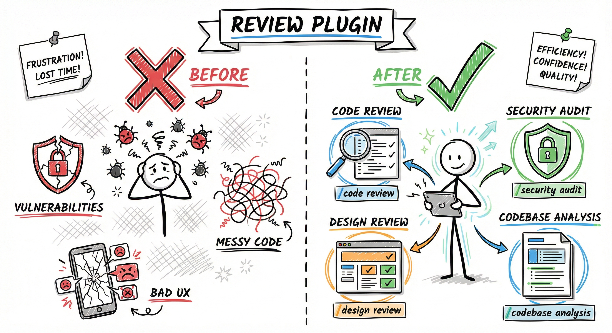

# Review Plugin

<div align="center">
  
</div>

> Code quality review tools for development teams

## Overview

The Review plugin provides comprehensive code quality tools including code review, security assessment, and design review. All skills support customizable output paths for flexible integration into any project workflow.

## Components

### Agents (3)

#### 1. pragmatic-code-review
Single-pass code reviewer for delegation by other workflows. Implements the "Pragmatic Quality" framework — balancing rigorous engineering standards with development velocity.

**Capabilities**:
- Architectural design evaluation
- Functionality and correctness analysis
- Security vulnerability assessment
- Maintainability and readability review
- Testing strategy evaluation
- Performance and scalability analysis

**Use via**: `/agents` interface or spawned by other workflows as a subtask

**Note**: For full multi-agent orchestrated reviews, use `/review:code-review` instead.

#### 2. design-review
Elite design review specialist conducting comprehensive UI/UX reviews using Playwright CLI for automated browser testing.

**Capabilities**:
- Live environment interaction testing
- Responsive design validation (desktop/tablet/mobile)
- Accessibility compliance testing (WCAG 2.1 AA)
- Interactive state verification (hover, active, disabled)
- Visual consistency and polish analysis
- Browser console error detection

**Preloaded Skills**: `design-review`, `playwright:playwright-cli`

**Use via**: `/agents` interface

#### 3. false-positive-verifier
Skeptical verification specialist that independently re-examines code and security review findings to eliminate false positives through deep codebase tracing, framework-aware analysis, and web research.

**Capabilities**:
- Independent re-examination of each finding from scratch
- Data flow tracing from source to sink
- Framework protection detection (React, Spring, Django, etc.)
- CWE/CVE web research for false positive patterns
- Verdict assignment: CONFIRMED, DISMISSED, DOWNGRADED

**Use via**: `/agents` interface or auto-invoked after code/security reviews

### Skills (4)

Skills 1-2 and 4 are command-invoke only (`disable-model-invocation: true`). Skill 3 (verify-findings) is auto-invoked after code and security reviews via `context: fork`.

#### 1. code-review

Multi-agent code review orchestrating parallel specialized reviewers with independent confidence scoring.

**Features**:
- Multi-agent pipeline: 4-5 parallel Sonnet reviewers (CLAUDE.md compliance, bug scanner, git history, security, code comments)
- Independent confidence scoring (0-100) via Haiku agents — threshold 80 filters false positives
- Context gathering: auto-discovers CLAUDE.md files and summarizes changes
- Optional GitHub PR posting via `--post-to-pr` flag
- Automatic false-positive verification via `verify-findings`
- Graceful degradation: partial results if agents fail, single-agent fallback if all fail

**Usage**:
```bash
/review:code-review                           # Local report to ./reviews/code/
/review:code-review custom/reviews            # Custom output path
/review:code-review --post-to-pr              # Local report + post to GitHub PR
/review:code-review custom/reviews --post-to-pr  # Both
```

**Output**: `{path}/{YYYY-MM-DD}_{HH-MM-SS}_code-review.md`

**Files**: [SKILL.md](skills/code-review/SKILL.md) | [WORKFLOW.md](skills/code-review/WORKFLOW.md) | [EXAMPLES.md](skills/code-review/EXAMPLES.md)

---

#### 2. security-review

Security-focused code review identifying high-confidence exploitable vulnerabilities.

**Features**:
- Focuses on HIGH and MEDIUM severity issues
- Per-finding Haiku verification agents (KEEP/DISMISS/DOWNGRADE verdicts)
- Minimizes false positives (two-axis scoring + Haiku verification + verify-findings)
- Comprehensive vulnerability categories (OWASP 2025 + API + LLM Top 10)
- Automated scanning integration (Trivy + Gitleaks)
- Optional GitHub PR posting via `--post-to-pr` flag
- Exploit scenario documentation
- Fix recommendations

**Vulnerability Categories**:
- Input validation (SQL injection, XSS, command injection)
- Authentication & authorization bypasses
- Cryptographic vulnerabilities
- Data exposure and PII handling
- Injection and code execution

**Usage**:
```bash
/review:security-review                       # Saves to ./reviews/security/
/review:security-review audits/sec            # Saves to custom path
/review:security-review --post-to-pr          # Local report + post to GitHub PR
/review:security-review audits/sec --post-to-pr  # Both
```

**Output**: `{path}/{YYYY-MM-DD}_{HH-MM-SS}_security-review.md`

**Files**: [SKILL.md](skills/security-review/SKILL.md) | [WORKFLOW.md](skills/security-review/WORKFLOW.md) | [EXAMPLES.md](skills/security-review/EXAMPLES.md)

---

#### 3. verify-findings

Independent false-positive verification for code and security review reports.

**Features**:
- Auto-invoked after code-review and security-review complete
- Runs in isolated forked context (independent from original review)
- Deep codebase tracing and framework-aware analysis
- Web research for CWE/CVE false positive patterns
- Produces a `.verified.md` report alongside the original

**Verdicts**:
- **CONFIRMED** — evidence supports the finding
- **DISMISSED** — finding is a false positive with documented reason
- **DOWNGRADED** — valid but lower severity/confidence

**Usage**:
```bash
/review:verify-findings path/to/review-report.md    # Manual verification
```

**Output**: `{original-stem}.verified.md`

**Files**: [SKILL.md](skills/verify-findings/SKILL.md) | [WORKFLOW.md](skills/verify-findings/WORKFLOW.md) | [EXAMPLES.md](skills/verify-findings/EXAMPLES.md)

---

#### 4. design-review

Frontend design review with Playwright CLI for interactive testing.

**Features**:
- Live environment testing (requires preview URL)
- Responsive design validation (desktop/tablet/mobile)
- Accessibility compliance testing (WCAG 2.1 AA)
- Interactive state verification (hover, active, disabled)
- Visual consistency analysis
- Browser console error checking

**Review Phases**:
1. Interaction and user flow testing
2. Responsiveness across viewports
3. Visual polish and consistency
4. Accessibility (keyboard navigation, focus states, contrast)
5. Robustness testing (edge cases, error states)
6. Code health review

**Requirements**: Playwright CLI (see [Browser Automation](#browser-automation))

**Usage**:
```bash
/review:design-review                  # Saves to ./reviews/design/
/review:design-review custom/path      # Saves to custom path
```

**Output**: `{path}/{YYYY-MM-DD}_{HH-MM-SS}_design-review.md`

**Files**: [SKILL.md](skills/design-review/SKILL.md) | [WORKFLOW.md](skills/design-review/WORKFLOW.md) | [EXAMPLES.md](skills/design-review/EXAMPLES.md)

---

### Scripts (1)

#### security-scan.sh

Automated security scanning using Trivy (vulnerability scanning) and Gitleaks (secret detection). Auto-detects project structure — works with any repository layout.

**Usage**:
```bash
./scripts/security-scan.sh                    # Full scan
./scripts/security-scan.sh --quick            # Skip git history
./scripts/security-scan.sh --output-dir DIR   # Custom report directory
```

**Prerequisites**: `brew install trivy gitleaks jq`

---

## Installation

### Add the Marketplace

```bash
/plugin marketplace add /path/to/arkhe-claude-plugins
```

### Install the Plugin

```bash
/plugin install review@arkhe-claude-plugins
```

After installation, run `/reload-plugins` to load the plugin.

<!-- BEGIN cross-platform-install -->
<!-- Generated by scripts/update-plugin-readmes.py — do not edit by hand. -->

## Install on Gemini CLI

Install the Gemini extension shim (regenerated from the canonical Claude plugin):

```bash
# From the repo root
gemini extensions install ./.gemini-extensions/review
```

On first session, the `using-arkhe-skills` bootstrap skill loads automatically and maps Claude-only primitives (`AskUserQuestion`, `TaskCreate`, `EnterPlanMode`, the `Skill` tool, the `Agent` tool with `subagent_type`) to Gemini equivalents. Install the `core` extension first if you have not already — its bootstrap is referenced by every other plugin's `GEMINI.md`.

## Install on Codex CLI

Codex consumes per-plugin `AGENTS.md` files plus a symlinked skills tree:

```bash
# Enable experimental skill support (Codex CLI ≥ Dec 2025)
codex --enable skills

# From the repo root, wire this plugin into Codex
mkdir -p ~/.codex/plugins/review
cp .codex-marketplace/review/AGENTS.md ~/.codex/plugins/review/AGENTS.md
ln -s "$(pwd)/plugins/review/skills" ~/.codex/plugins/review/skills
```

Codex surfaces commands as trigger phrases inside `AGENTS.md` (it has no native slash-command support). The `using-arkhe-skills` bootstrap pointer at the top of `AGENTS.md` is loaded on first turn.
<!-- END cross-platform-install -->

## Usage

### Invoking Skills

```bash
/review:code-review                        # Multi-agent code review
/review:code-review --post-to-pr           # Review + post to GitHub PR
/review:security-review
/review:verify-findings <report-path>
/review:design-review
```

### Custom Output Paths

Skills support optional custom output paths:

```bash
# Code review
/review:code-review                    # Default: ./reviews/code/
/review:code-review reviews/custom     # Custom: reviews/custom/

# Security review
/review:security-review                # Default: ./reviews/security/
/review:security-review audits/sec     # Custom: audits/sec/

# Design review
/review:design-review                  # Default: ./reviews/design/
/review:design-review custom/path      # Custom: custom/path/
```

### Accessing Agents

Browse and select agents through the `/agents` interface:

```bash
/agents
```

This will show:
- **pragmatic-code-review** — Principal Engineer code reviewer
- **design-review** — Elite design review specialist
- **false-positive-verifier** — Skeptical verification specialist

## Browser Automation

### Playwright CLI (design-review skill)

The design review uses Playwright CLI for automated browser testing via Bash.

**Setup**:
1. Install Playwright CLI: `npm install -g @playwright/cli@latest`
2. Verify: `playwright-cli --help`

For detailed Playwright CLI usage, see [Playwright CLI Guide](../../docs/PLAYWRIGHT_CLI.md).

## Configuration

### Default Paths

| Skill | Default Path | Customizable |
|-------|-------------|--------------|
| code-review | `./reviews/code/` | Yes (via `$ARGUMENTS`) |
| security-review | `./reviews/security/` | Yes (via `$ARGUMENTS`) |
| verify-findings | Alongside original report | Yes (via report path argument) |
| design-review | `./reviews/design/` | Yes (via `$ARGUMENTS`) |

### Project Integration

The plugin automatically creates output directories if they don't exist:

```bash
reviews/
├── code/         # Code review reports
├── security/     # Security review reports
└── design/       # Design review reports
```

## Examples

### Code Review Workflow

```bash
# 1. Review current changes (multi-agent, auto-verification runs after)
/review:code-review

# 1b. Or review + post to GitHub PR
/review:code-review --post-to-pr

# 2. Address critical issues from the verified report
# ... make fixes ...

# 3. Run security review (auto-verification runs after)
/review:security-review

# 4. Re-verify an existing report manually
/review:verify-findings reviews/code/2026-03-01_14-30-00_code-review.md

# 5. Review UI changes (if applicable)
/review:design-review
```

## Troubleshooting

### Skills Not Found

If skills aren't recognized after installation:
1. Restart Claude Code
2. Verify plugin is enabled: `/plugin`
3. Check marketplace is added: `/plugin marketplace list`

### Playwright CLI Issues

If design review fails with browser automation:
1. Verify Playwright CLI is installed: `playwright-cli --help`
2. Ensure preview environment is accessible

### Output Path Issues

If reports aren't saving:
1. Check directory permissions
2. Verify path is valid (absolute or relative)
3. Ensure parent directories exist (plugin creates them automatically)

## Contributing

Issues and pull requests welcome at the arkhe-claude-plugins repository.

## License

MIT License

## Version

2.0.0
