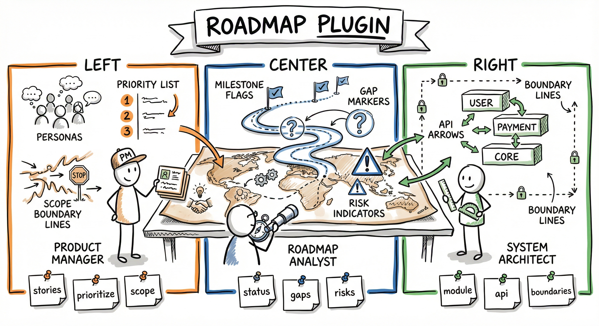

# Roadmap Plugin

<div align="center">
  
</div>

Product management, roadmap analysis, and solution architecture for any project.

## Overview

The Roadmap plugin provides three complementary capabilities for project planning and analysis:

- **PM** — User stories, scope assessments, prioritization, and needs analysis
- **Roadmap** — Project status, gap tracking, blocker analysis, and risk mapping
- **Architect** — Module structure, API design, data models, and pattern conformance

Each capability is available as both a **skill** (quick analysis in chat) and an **agent** (produces persistent artifacts). All three skills support a `--deep` flag that runs a multi-agent pipeline with quality gates, confidence scoring, and cross-perspective validation.

## Installation

```bash
/plugin marketplace add ./arkhe-claude-plugins
/plugin install roadmap@arkhe-claude-plugins
```

## Migration from 2.x → 3.0

Version 3.0 collapses 9 modes into 4 and renames the default plan artifact. This is a **hard break** — old mode names no longer work.

### Mode renames

| Old (2.x) | New (3.0) |
|-----------|-----------|
| `/roadmap gaps` | `/roadmap status --focus=gaps` |
| `/roadmap blockers` | `/roadmap status --focus=blockers` |
| `/roadmap risks` | `/roadmap status --focus=risks` |
| `/roadmap specs` | `/roadmap status --focus=specs` |
| `/roadmap delta` | `/roadmap update --dry-run` |
| `/roadmap status` | `/roadmap status` (unchanged; now renders all focus sections inline) |
| `/roadmap update` | `/roadmap update` (unchanged) |
| `/roadmap next` | `/roadmap next` (unchanged) |
| `/roadmap plan ...` | `/roadmap plan ...` (unchanged subcommands) |

### Artifact rename

The default `plan_file` is now `docs/PROJECT-ROADMAP.md` (was `docs/PROJECT-PLAN.md`).

- **No `.arkhe.yaml`**: If `docs/PROJECT-PLAN.md` exists and `docs/PROJECT-ROADMAP.md` does not, the `plan` mode auto-detects the legacy file, uses it, and emits a one-time rename notice. No action required, but renaming is recommended.
- **Pinned `plan_file: docs/PROJECT-PLAN.md` in `.arkhe.yaml`**: keeps working silently.
- **Fresh project**: `/roadmap plan scaffold` writes to `docs/PROJECT-ROADMAP.md`.

To migrate explicitly:

```bash
mv docs/PROJECT-PLAN.md docs/PROJECT-ROADMAP.md
git add docs/PROJECT-ROADMAP.md && git rm docs/PROJECT-PLAN.md
```

## Components

### Skills (Read-Only Analysis)

| Skill | Modes | Description |
|-------|-------|-------------|
| `pm` | `stories`, `prioritize`, `scope`, `validate`, `needs`, `compare`, `next` | Feature analysis from user perspective. `stories` auto-runs scope assessment as preamble |
| `roadmap` | `status` (`--focus=<gaps\|blockers\|risks\|specs>`), `update` (`--dry-run`, `--incremental`), `next` (`--force`), `plan` (`scaffold\|show\|sync`) | Project health and progress tracking. 4 modes; focus flags drill into individual sections |
| `architect` | `module`, `api`, `data-model`, `boundaries`, `patterns`, `decisions`, `frontend` | System architecture analysis with optional file persistence |
| `refresh` | `init`, `check`, `all`, `project`, `architecture`, `documents` | Context directory scaffolding and drift detection |

### Agents (Write Artifacts)

| Agent | Output Directory | Description |
|-------|-----------------|-------------|
| `product-manager` | `{output_dir}/requirements/` | User stories, scope docs, prioritization artifacts |
| `system-architect` | `{output_dir}/architecture/` | Design documents, ADRs, boundary analysis |
| `roadmap-critic` | N/A (read-only) | Quality reviewer for `--deep` pipelines. Scores artifacts using Confession Pattern |

### `--deep` Mode (Multi-Agent Pipelines)

Each skill supports `--deep` for a full multi-agent orchestration pipeline:

| Skill | `--deep` Pipeline | Patterns Used |
|-------|-------------------|---------------|
| `pm --deep` | Context Gatherer (Haiku) -> PM Analyst + Confession (Sonnet) -> Architect Feasibility (Haiku) -> Confidence Scoring (Haiku) | Pipeline, Confession, Critic-Actor, Specification-First |
| `architect --deep` | Context Gatherer (Haiku) -> Architecture Analyst + Confession (Sonnet) -> **Red Team Adversary** (Sonnet) -> Confidence Scoring (Haiku) | Pipeline, Confession, Adversarial Review |
| `roadmap --deep` | 2 Parallel Context Agents (Haiku) -> Compression (Haiku) -> **3 Parallel Perspectives**: PM + Architect + Roadmap (Sonnet) -> Cross-Reference Synthesis (Sonnet) -> Independent Confidence Scoring (Haiku) | Pipeline, Supervisor-Worker, Parallel Execution, Confession |

All `--deep` pipelines filter findings below confidence threshold (70) and tag uncertain findings with `[NEEDS VALIDATION]`.

### Lane Discipline

Each component stays in its lane:

- **PM**: user stories, scope, prioritization. NOT code, ADRs, or architecture docs.
- **Architect**: design notes, ADRs, boundary analysis. NOT source code, tests, or config files.
- **Roadmap**: status tracking, gap analysis, risk mapping. NOT requirements or architecture docs.

## Configuration (Optional)

The plugin works out of the box with dynamic context discovery. For projects that want explicit configuration, create these optional files:

### `.arkhe.yaml` — Settings

```yaml
roadmap:
  output_dir: arkhe/roadmap              # Where artifacts are written (default: arkhe/roadmap)
  context_dir: .arkhe/roadmap            # Where context files live (default: .arkhe/roadmap)
  status_file: docs/PROJECT-STATUS.md    # Status doc path (default: docs/PROJECT-STATUS.md)
  plan_file: docs/PROJECT-ROADMAP.md     # Roadmap doc path (default: docs/PROJECT-ROADMAP.md)
```

> **Legacy `PROJECT-PLAN.md`?** If `plan_file` is unset and `docs/PROJECT-PLAN.md` exists while `docs/PROJECT-ROADMAP.md` does not, the `plan` mode treats the legacy file as `plan_file` for backward compatibility and emits a one-time migration notice. Rename the file (`mv docs/PROJECT-PLAN.md docs/PROJECT-ROADMAP.md`) or pin `plan_file` in `.arkhe.yaml` to keep the old name without the notice.

### `.arkhe/roadmap/` — Rich Context Files

```
.arkhe/roadmap/
├── project.md         # Project overview, personas, domain, constraints, phases
├── architecture.md    # Tech stack, modules, patterns, boundaries
└── documents.md       # Document map (key docs and their roles)
```

## Dynamic Context Discovery

When no configuration is present, skills automatically discover project context through (in priority order):

1. `.arkhe.yaml` — Read `roadmap:` section for settings
2. `.arkhe/roadmap/*.md` — Rich context files
3. `CLAUDE.md` + `README.md` — Project identity and scope
4. Build files — Auto-detect tech stack (Gradle, package.json, Cargo.toml, go.mod, pyproject.toml)
5. Directory structure — Detect module boundaries (`apps/*`, `src/*`, `packages/*`)
6. Documentation — Glob for docs, plans, ADRs, specs, gap analyses
7. Codebase scan — Tech-stack-aware patterns (last resort, mode-dependent)

## Module Maturity Scale

All components use a shared vocabulary for assessing module maturity:

| Level | Description |
|-------|-------------|
| Stub | Directory/package exists, maybe a placeholder |
| Domain Started | Entities/models/types defined |
| Service Layer | Business logic implemented |
| API Ready | Endpoints/routes exposed |
| Tested | Tests covering key paths |
| Production Ready | Fully tested, documented, monitoring-ready |

## Usage Examples

```bash
# PM skill (light)
/roadmap:pm stories authentication
/roadmap:pm prioritize
/roadmap:pm scope dark-mode

# PM skill (deep -- multi-agent pipeline with quality gates)
/roadmap:pm --deep stories authentication
/roadmap:pm --deep scope dark-mode

# Roadmap skill (light)
/roadmap:roadmap                              # Default: full status dashboard
/roadmap:roadmap status                       # Same as above (explicit)
/roadmap:roadmap status --focus=gaps          # Drill into gap analysis only
/roadmap:roadmap status --focus=blockers      # Drill into blockers only
/roadmap:roadmap status --focus=risks         # Drill into risk register only
/roadmap:roadmap status --focus=specs         # Drill into spec pipeline only

# Roadmap skill (deep -- 3 parallel perspectives + cross-reference synthesis)
/roadmap:roadmap --deep status
/roadmap:roadmap --deep status --focus=risks

# Status doc updates
/roadmap:roadmap update --dry-run             # Preview what update would change (no write)
/roadmap:roadmap update                       # Apply full update (Phase A + Phase B)
/roadmap:roadmap update --incremental         # Fast post-sprint sync (targeted edits)

# Next actions (cached, merge-aware)
/roadmap:roadmap next                         # Returns cached or recalculates
/roadmap:roadmap next --force                 # Force recalculation (still merges)

# Roadmap lifecycle (PROJECT-ROADMAP.md)
/roadmap:roadmap plan scaffold                # Create initial roadmap from existing docs
/roadmap:roadmap plan                         # Show consolidated roadmap view
/roadmap:roadmap plan sync                    # Update roadmap from git history

# Architect skill (light — now includes quality assessment + optional save)
/roadmap:architect module payments
/roadmap:architect boundaries

# Architect skill (deep -- adversarial review by red team agent)
/roadmap:architect --deep module payments
/roadmap:architect --deep boundaries
```

## Context Directory Refresh

Scaffold and maintain the `.arkhe/roadmap/` context directory:

```bash
# Check if context files are stale
/roadmap:refresh check

# Scaffold context directory for first time
/roadmap:refresh init

# Regenerate all context files from current codebase
/roadmap:refresh all

# Regenerate a single file
/roadmap:refresh architecture
```

Context files use a **hybrid format**: condensed summary (<300 tokens) for fast context injection + references to authoritative docs for deep analysis.

## Doc Freshness

> **Moved to the Doc plugin.** Use `/doc:health` instead of `/roadmap:doc-freshness`.

## Cross-Project Compatibility

The plugin adapts to any tech stack through dynamic discovery:

- **Java/Kotlin**: Detects Gradle/Maven, scans for Spring modules, entities, controllers
- **JavaScript/TypeScript**: Detects package.json, scans for components, routes, hooks
- **Python**: Detects pyproject.toml/setup.py, scans for packages, models, views
- **Go**: Detects go.mod, scans for packages, handlers, models
- **Rust**: Detects Cargo.toml, scans for crates, modules, traits
