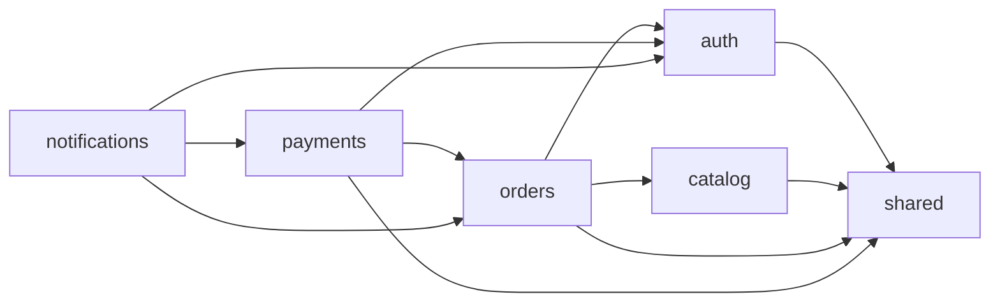

# Architect Skill — Examples

Usage examples for the System Architect skill.

## Example 1: Module Analysis

**Input:** `/roadmap:architect module payments`

**Output:**

```
## Module: payments

### Structure
payments/
├── models/
│   ├── Payment.ts
│   ├── PaymentMethod.ts
│   └── Transaction.ts
├── services/
│   ├── PaymentService.ts
│   └── StripeAdapter.ts
├── routes/
│   └── payments.ts
└── __tests__/
    ├── PaymentService.test.ts
    └── payments.routes.test.ts

### Domain Model
| Type | Name | Fields | Notes |
|------|------|--------|-------|
| Entity | Payment | id, amount, currency, status, method, createdAt | Aggregate root |
| Entity | Transaction | id, paymentId, type, amount, stripeId | Child of Payment |
| Value Object | PaymentMethod | type, last4, brand | Embedded in Payment |

### API Surface
| Method | Path | Auth | Notes |
|--------|------|------|-------|
| POST | /api/v1/payments | Required | Create payment intent |
| GET | /api/v1/payments/:id | Required | Get payment status |
| POST | /api/v1/payments/:id/confirm | Required | Confirm payment |
| GET | /api/v1/payments | Required | List user payments (paginated) |

### Dependencies
- Depends on: auth (user context), orders (order reference)
- Depended by: notifications (payment events)

### Maturity: Service Layer
Payment processing logic exists but controllers have TODOs for
webhook handling and refund flows.

### Recommendations
1. **Add webhook handler** — Stripe requires webhooks for payment confirmation
2. **Add refund flow** — No refund endpoint exists
3. **Add idempotency keys** — Payment creation should be idempotent
4. **Increase test coverage** — No tests for error scenarios
```

## Example 2: API Design

**Input:** `/roadmap:architect api user-notifications`

**Output:**

```
## API Design: User Notifications

Based on existing patterns (RESTful, /api/v1/ prefix, JWT auth, paginated lists):

### Endpoints

| Method | Path | Auth | Request | Response |
|--------|------|------|---------|----------|
| GET | /api/v1/notifications | Required | `?page=1&size=20&unread=true` | `PagedResponse<Notification>` |
| GET | /api/v1/notifications/:id | Required | — | `Notification` |
| PATCH | /api/v1/notifications/:id/read | Required | — | `Notification` |
| POST | /api/v1/notifications/read-all | Required | — | `{ count: number }` |
| GET | /api/v1/notifications/unread-count | Required | — | `{ count: number }` |

### Response Shape (follows existing DTO pattern)

```json
{
  "id": "uuid",
  "type": "order_shipped",
  "title": "Order Shipped",
  "message": "Your order #123 has been shipped",
  "read": false,
  "createdAt": "2026-02-17T10:00:00Z",
  "metadata": { "orderId": "uuid" }
}
```

### Consistency Notes
- Pagination follows existing `PagedResponse` pattern from catalog endpoints
- Auth uses same JWT middleware as other protected endpoints
- Error responses follow existing `{ error: string, code: string }` format
- `unread-count` endpoint supports badge display without loading full list
```

## Example 3: Boundary Analysis

**Input:** `/roadmap:architect boundaries`

**Output:**

```
## Module Boundary Analysis

### Dependency Graph



### Violations

| Source | Target | Type | File | Recommendation |
|--------|--------|------|------|----------------|
| orders | catalog/models/Product.ts | Direct import | orders/services/OrderService.ts:12 | Use product ID, not entity |
| payments | orders/models/Order.ts | Direct import | payments/services/PaymentService.ts:8 | Use order ID, not entity |
| notifications | payments/services/PaymentService.ts | Service import | notifications/handlers/PaymentHandler.ts:3 | Use events instead |

### Module Coupling

| Module A | Module B | Coupling | Strength |
|----------|----------|----------|----------|
| orders | catalog | Direct entity import | Strong (violation) |
| payments | orders | Direct entity import | Strong (violation) |
| notifications | payments | Direct service import | Strong (violation) |
| orders | auth | ID reference only | Weak (correct) |

### Recommendations
1. **Replace entity imports with ID references** — Orders should reference
   product IDs, not Product entities. Query catalog API when needed.
2. **Introduce domain events** — Notifications should listen to
   `PaymentCompleted` events, not import PaymentService.
3. **Add module boundary tests** — Verify imports stay within boundaries.
```

## Example 4: Pattern Conformance

**Input:** `/roadmap:architect patterns`

**Output:**

```
## Established Patterns

### 1. Layering: Route → Service → Repository

**Example:** `catalog/routes/products.ts` → `catalog/services/ProductService.ts` → `catalog/repositories/ProductRepository.ts`

✅ All modules follow this pattern consistently.

### 2. DTO Mapping

**Example:** `catalog/mappers/ProductMapper.ts`
- Entities never exposed directly in API responses
- Mapper functions in dedicated files

⚠️ `orders` module returns entities directly in 2 endpoints.

### 3. Error Handling

**Example:** `shared/middleware/errorHandler.ts`
- Global error handler catches all exceptions
- Custom error classes: `NotFoundError`, `ValidationError`, `AuthError`

✅ Consistent across all modules.

### 4. Validation

**Example:** `catalog/validators/createProduct.ts`
- Zod schemas for request validation
- Validated in route middleware

⚠️ `payments` module uses manual validation instead of Zod.

### 5. Testing

**Example:** `catalog/__tests__/ProductService.test.ts`
- Unit tests for services (mocked repositories)
- Integration tests for routes (supertest)

⚠️ `payments` module has no integration tests.
```

## Example 5: Frontend Architecture

**Input:** `/roadmap:architect frontend search`

**Output:**

```
## Frontend Architecture: Search

### Existing Patterns
- **Framework:** Next.js 14 (App Router)
- **Components:** Feature-based organization (`components/catalog/`, `components/auth/`)
- **Data Fetching:** Server Components for initial data, client hooks for interactivity
- **State:** React Context for global state, local state for forms
- **Styling:** Tailwind CSS with design tokens in `tailwind.config.ts`

### Recommended Component Hierarchy

```
app/search/page.tsx (Server Component — initial results)
├── components/search/SearchBar.tsx (Client — user input)
│   └── hooks/useDebounce.ts
├── components/search/SearchResults.tsx (Client — live results)
│   ├── components/search/SearchResultCard.tsx
│   └── components/search/SearchSkeleton.tsx
└── components/search/SearchFilters.tsx (Client — faceted filters)
```

### Data Flow
1. Server Component loads initial results via API (SSR)
2. SearchBar captures input, debounces at 300ms
3. Client-side fetch to `/api/v1/search?q=...` for live results
4. SearchFilters modify query parameters
5. URL state for shareable searches (`/search?q=term&category=x`)

### Integration Points
- Reuse `ProductCard` from catalog for result display
- Extend existing `useApi` hook for search requests
- Use existing loading skeleton pattern from catalog
```
