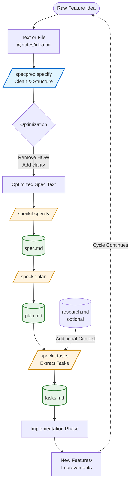

# SpecPrep Plugin

**SpecPrep** is an AI meta-prompt framework that optimizes feature text and files for use with the [Spec Kit](https://github.com/github/spec-kit) workflow.
It preprocesses inputs to ensure clarity, compliance, and structure, then **automatically invokes** `/speckit.specify` to create spec artifacts—eliminating manual copy/paste steps.

---

## 🧭 Overview

SpecPrep provides the `/specprep:specify` command that **automatically prepares and executes** the specification stage of Spec-Driven Development (SDD):

| Command | Purpose | Modes | Auto-Invokes |
|----------|----------|--------|----------------|
| `/specprep:specify` | Cleans and structures raw feature ideas, then creates spec.md artifact (or draft with `draft` flag) | `quick`, `strict`, `draft`, *(default)* | `/speckit.specify` (optional with draft) |

The command acts as a **meta-prompt optimizer and executor**, providing:

- **Automatic workflow chaining**: Optimization → SpecKit invocation (no manual copy/paste)
- Clear "WHAT and WHY" separation from "HOW"
- Proper abstraction levels
- `[NEEDS CLARIFICATION]` tagging for ambiguity
- Direct artifact creation (spec.md)

---

## 🗺️ SDD Workflow

The following diagram shows how SpecPrep integrates with the Spec Kit workflow:



### Key Integration Points

- **SpecPrep** (blue) optimizes raw feature text before it reaches SpecKit
- **SpecKit commands** (orange) generate the official artifacts used throughout development
- **Artifacts** (green) serve as both outputs and inputs for subsequent phases
- Good specs lead to natural plans — no preprocessing needed for the plan phase

---

## ⚙️ Usage Examples

```bash
# Optimize and create spec.md artifact
/specprep:specify @notes/feature-idea.txt quick

# Create draft for review before SpecKit
/specprep:specify @notes/feature-idea.txt draft strict

# After spec is created, continue with SpecKit directly
/speckit.plan @specs/002-feature/spec.md
/speckit.tasks @specs/002-feature/plan.md
```

**How it works:**
1. Optimize your input based on the selected mode (quick, strict, or default)
2. Show you the optimized output for review
3. **Automatically invoke** `/speckit.specify` (or save as draft with `draft` flag)
4. SpecKit creates the spec.md artifact

**No manual copy/paste required** for specification preparation!

---

## 🧠 Mode Behavior

The `/specprep:specify` command supports optional modes to control optimization depth:

| Mode | Description | When to Use |
|------|--------------|-------------|
| **quick** | Performs fast, lightweight cleanup and formatting — minimal validation. | Quick iterations, early drafts, or when you just need basic formatting. |
| **strict** | Enforces all SDD rules, marking ambiguities with `[NEEDS CLARIFICATION]`. Offers interactive correction after processing. | Final reviews, compliance validation, or when you want to catch every ambiguity. |
| *(default)* | Balanced optimization combining structure, clarity, and moderate validation. Implicit when no mode is specified. | Most common use case — comprehensive cleanup with reasonable validation. |

### Usage Examples

```bash
# Default mode (balanced) - just omit the mode
/specprep:specify @notes/feature-idea.txt

# Quick mode - fast cleanup
/specprep:specify @notes/feature-idea.txt quick

# Strict mode - full validation with interactive correction
/specprep:specify @notes/feature-idea.txt strict
```

### Mode Keywords

- **Valid modes**: `quick`, `strict`
- **Default mode**: Omit the mode argument (no keyword needed)
- **No abbreviations**: Full words only — `q` or `s` are not recognized
- **Position**: Mode is always the last positional argument

### Interactive Correction (Strict Mode)

When using **strict mode**, after generating output with `[NEEDS CLARIFICATION]` markers, you'll be prompted:

```
Found 3 clarifications needed. Resolve interactively? [y/N]
```

- **Yes (y)**: Answer questions to resolve each ambiguity, then regenerate clean output
- **No (N)**: Receive the output with `[NEEDS CLARIFICATION]` markers intact for manual review

---

## 📝 Draft Mode

Use `draft` mode when you want to review and edit the optimized specification before creating the official spec.md artifact:

```bash
/specprep:specify @notes/idea.txt draft [quick|strict]
```

### How Draft Mode Works

1. **Feature name determination**:
   - If on `main`/`master`: Prompts user to provide a feature name interactively
   - Otherwise: Converts current branch name to feature name (replaces slashes with hyphens)
   - Example: Branch `feature/user-auth` → Feature name `feature-user-auth`

2. **Performs optimization**:
   - Runs the same optimization logic as normal mode (respects `quick`/`strict`/default)
   - Generates optimized specification text

3. **Saves draft file**:
   - Creates directory: `plan/specs/{feature}/` (relative to git repository root)
   - Saves as `spec-draft.md` (or `spec-draft-v2.md`, `v3.md`, etc. if file exists)
   - Uses automatic versioning to avoid overwriting existing drafts
   - Presents optimized output to user

4. **Offers to continue**:
   - Prompts: "Draft saved. Proceed with /speckit.specify?"
   - **Yes**: Automatically invokes `/speckit.specify` to create spec.md
   - **No**: Stops for manual review/editing
   - Includes branch mismatch warning if applicable

### When to Use Draft Mode

- **Early exploration**: Not ready to commit to the official spec.md artifact
- **Team collaboration**: Share draft with team for feedback before finalizing
- **Iterative refinement**: Multiple passes of optimization with manual edits between versions
- **Complex specifications**: Want to review SDD compliance before creating the artifact

### Example Workflow

```bash
# Scenario: On branch 'feature/user-auth'

# 1. Create initial draft
/specprep:specify @notes/user-auth-idea.txt draft strict
# → Detects branch: feature/user-auth
# → Feature name: feature-user-auth
# → Creates plan/specs/feature-user-auth/spec-draft.md
# → Shows optimized output
# → Prompts to continue → User says "no" to review manually

# 2. Edit the draft file manually, then create v2
/specprep:specify @plan/specs/feature-user-auth/spec-draft.md draft
# → Creates plan/specs/feature-user-auth/spec-draft-v2.md (versioned)
# → User says "yes" to continue
# → Automatically creates spec.md artifact
```

**On main branch:**
```bash
/specprep:specify @notes/idea.txt draft
# → Prompts: "You're on main branch. Please provide a feature name for the draft:"
# → User enters: "new-analytics-dashboard"
# → Creates plan/specs/new-analytics-dashboard/spec-draft.md
```

### Draft vs Normal Mode

| Aspect | Normal Mode | Draft Mode |
|--------|-------------|------------|
| **Invocation** | `/specprep:specify @input.txt` | `/specprep:specify @input.txt draft` |
| **Branch check** | No | Yes (prompts for name if on main) |
| **Saves file** | No | Yes (plan/specs/{feature}/spec-draft.md) |
| **Auto-invoke SpecKit** | Always | Optional (user choice) |
| **Use case** | Ready to create artifact | Want to review/edit first |

---

## ⚙️ Input/Output Summary for SpecPrep Commands

### 🧩 `/specprep:specify`

**Purpose:**
Transform *raw feature text* or a *file reference* into a **clean, structured specification** ready for `/speckit.specify`.

**Input:**

- `@file` or freeform text (e.g., `@notes/idea.txt`)
- Optional mode argument: `quick` | `strict`

**Input Examples:**

```bash
/specprep:specify @notes/feature-idea.txt
/specprep:specify @notes/feature-idea.txt strict
/specprep:specify "Build a lightweight task tracker app" quick
```

**Processing Logic:**

- `quick` → Light text cleanup (remove noise, format sections)
- `strict` → Full compliance enforcement (removes implementation details, adds `[NEEDS CLARIFICATION]` markers, validates completeness)
- *(default)* → Balanced optimization

**Output:**
Automatically creates spec.md artifact by:
1. Presenting the optimized specification text to the user
2. Auto-invoking `/speckit.specify` with the optimized content

**Output Example:**

```markdown
Build a lightweight task tracker app  
---

### Overview
The user can create, assign, and track simple tasks.

### User Stories
- As a user, I can add new tasks with a title and due date.
- As a user, I can mark tasks complete.

### Constraints
- No authentication required.
- Local data only.

### Notes
[NEEDS CLARIFICATION: maximum number of tasks?]
```

---

## 💡 Workflow Integration

**Streamlined Spec-Driven Development pipeline:**

```bash
# Step 1: Clean raw feature idea and create spec.md (automatic chaining!)
/specprep:specify @drafts/feature.txt
# ✅ Optimizes → ✅ Auto-invokes /speckit.specify → ✅ Creates spec.md

# Step 2: Create plan from spec (use SpecKit directly)
/speckit.plan @specs/002-feature/spec.md
# ✅ Creates plan.md

# Step 3: Extract tasks (use SpecKit directly)
/speckit.tasks @specs/002-feature/plan.md
# ✅ Creates tasks.md
```

**Key benefit:** Good specs lead to natural plans — SpecPrep handles the specification preparation, then SpecKit completes the workflow.

### Mode Selection Strategy

- **Early iterations**: Use `quick` mode for rapid cleanup without deep validation
- **Mid-stage work**: Use default mode (omit mode argument) for balanced optimization
- **Pre-commit reviews**: Use `strict` mode to catch all ambiguities before finalizing

### What Changed from Manual Workflow

**Before (manual):**
1. Run `/specprep:specify` to optimize
2. Read and copy the output
3. Run `/speckit.specify` and paste the optimized text
4. Wait for artifact creation

**After (automatic):**
1. Run `/specprep:specify` with your input
2. Review optimized output (optional)
3. Artifact automatically created

This ensures that specification preparation executes seamlessly with automatic chaining, while planning and task extraction flow naturally through SpecKit.

---

## 📚 Reference Documentation

For detailed information about Spec-Driven Development and the Spec Kit workflow:

- **[Quick Start Guide](docs/quickstart.md)** — 4-step SDD workflow with complete examples  
- **[Spec-Driven Development](docs/spec-driven.md)** — Methodology, philosophy, and constitutional framework  
- **[Documentation Index](docs/README.md)** — Overview of all reference materials  

These documents from [GitHub's Spec Kit](https://github.com/github/spec-kit) provide the context and principles that SpecPrep enforces through its meta-prompt optimization.

---

## 📦 Installation

```bash
# Add the Arkhe marketplace (if not already added)
/plugin marketplace add ./arkhe-claude-plugins

# Install the SpecPrep plugin
/plugin install specprep@arkhe-claude-plugins

# Verify installation
/help  # Commands will appear as /specprep:*
```

---

## 🧩 Notes

- These commands are plugin-scoped and will appear as `/specprep:*` in `/help`.
- They are designed for **text optimization**, not code generation.
- Outputs are formatted for **direct use** with Spec Kit commands.
- **Dependency:** Designed to work with the Spec Kit plugin. While SpecPrep can be used standalone for text optimization, its primary value is in preparing inputs for Spec Kit commands.
