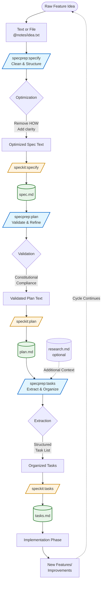

# SpecPrep Plugin

**SpecPrep** is an AI meta-prompt framework that optimizes text and files for use with the [Spec Kit](https://github.com/github/spec-kit) workflow.  
It preprocesses inputs to ensure clarity, compliance, and structure before they are passed into the main `/speckit` commands.

---

## 🧭 Overview

SpecPrep provides a set of namespaced slash commands that prepare your content for Spec Kit’s three key stages of Spec-Driven Development (SDD):

| Command | Purpose | Modes | Target Command |
|----------|----------|--------|----------------|
| `/specprep:specify` | Cleans and structures raw feature ideas into well-formed specifications | `quick`, `strict`, *(default)* | `/speckit:specify` |
| `/specprep:plan` | Validates and refines implementation plans for architectural compliance | `quick`, `strict`, *(default)* | `/speckit:plan` |
| `/specprep:tasks` | Extracts and organizes executable tasks from plans and research | `quick`, `strict`, *(default)* | `/speckit:tasks` |

Each command acts as a **meta-prompt optimizer**, enforcing SDD best practices such as:

- Clear "WHAT and WHY" separation from "HOW"
- Proper abstraction levels
- `[NEEDS CLARIFICATION]` tagging for ambiguity
- Compliance with the project constitution (Articles VII–IX)

---

## 🗺️ Complete SDD Cycle

The following diagram shows the complete Spec-Driven Development workflow and how SpecPrep integrates with Spec Kit:



### Key Integration Points

- **SpecPrep commands** (blue) optimize and validate inputs before they reach Spec Kit
- **Spec Kit commands** (orange) generate the official artifacts used throughout development
- **Artifacts** (green) serve as both outputs and inputs for subsequent phases
- **Cycle**: Implementation generates new ideas, continuing the SDD cycle

---

## ⚙️ Usage Examples

```bash
/specprep:specify @notes/feature-idea.txt quick
/specprep:plan @specs/002-feature/plan.md strict
/specprep:tasks @specs/002-feature/plan.md @specs/002-feature/research.md
```

Each command outputs optimized text ready for immediate use:

```bash
/speckit:specify [optimized text]
/speckit:plan [optimized text]
/speckit:tasks [optimized text]
```

---

## 🧠 Mode Behavior

All `/specprep:*` commands support optional modes to control optimization depth:

| Mode | Description | When to Use |
|------|--------------|-------------|
| **quick** | Performs fast, lightweight cleanup and formatting — minimal validation. | Quick iterations, early drafts, or when you just need basic formatting. |
| **strict** | Enforces all SDD and constitutional rules, marking ambiguities with `[NEEDS CLARIFICATION]`. Offers interactive correction after processing. | Final reviews, compliance validation, or when you want to catch every ambiguity. |
| *(default)* | Balanced optimization combining structure, clarity, and moderate validation. Implicit when no mode is specified. | Most common use case — comprehensive cleanup with reasonable validation. |

### Usage Examples

```bash
# Default mode (balanced) - just omit the mode
/specprep:plan @specs/002-feature/plan.md

# Quick mode - fast cleanup
/specprep:plan @specs/002-feature/plan.md quick

# Strict mode - full validation with interactive correction
/specprep:plan @specs/002-feature/plan.md strict
```

### Mode Keywords

- **Valid modes**: `quick`, `strict`
- **Default mode**: Omit the mode argument (no keyword needed)
- **No abbreviations**: Full words only — `q` or `s` are not recognized
- **Position**: Mode is always the last positional argument

### Interactive Correction (Strict Mode)

When using **strict mode**, after generating output with `[NEEDS CLARIFICATION]` markers, you'll be prompted:

```
Found 3 clarifications needed. Resolve interactively? [y/N]
```

- **Yes (y)**: Answer questions to resolve each ambiguity, then regenerate clean output
- **No (N)**: Receive the output with `[NEEDS CLARIFICATION]` markers intact for manual review

---

## ⚙️ Input/Output Summary for SpecPrep Commands

### 🧩 `/specprep:specify`

**Purpose:**  
Transform *raw feature text* or a *file reference* into a **clean, structured specification** ready for `/speckit:specify`.

**Input:**

- `@file` or freeform text (e.g., `@notes/idea.txt`)
- Optional mode argument: `quick` | `strict`

**Input Examples:**

```bash
/specprep:specify @notes/feature-idea.txt
/specprep:specify @notes/feature-idea.txt strict
/specprep:specify "Build a lightweight task tracker app" quick
```

**Processing Logic:**

- `quick` → Light text cleanup (remove noise, format sections)
- `strict` → Full compliance enforcement (removes implementation details, adds `[NEEDS CLARIFICATION]` markers, validates completeness)
- *(default)* → Balanced optimization

**Output:**
A clean, ready-to-use feature specification formatted for:

```bash
/speckit:specify [optimized spec text]
```

**Output Example:**

```markdown
Build a lightweight task tracker app  
---

### Overview
The user can create, assign, and track simple tasks.

### User Stories
- As a user, I can add new tasks with a title and due date.
- As a user, I can mark tasks complete.

### Constraints
- No authentication required.
- Local data only.

### Notes
[NEEDS CLARIFICATION: maximum number of tasks?]
```

---

### 🧩 `/specprep:plan`

**Purpose:**  
Convert a specification or draft plan into a **constitutionally compliant implementation plan** for `/speckit:plan`.

**Input:**

- `@file` or text containing an implementation plan draft
- Optional mode: `quick` | `strict`

**Input Examples:**

```bash
/specprep:plan @specs/002-feature/plan-draft.md
/specprep:plan @specs/002-feature/plan-draft.md quick
/specprep:plan @specs/002-feature/plan-draft.md strict
```

**Processing Logic:**

- `quick` → Structural cleanup; minimal gate enforcement
- `strict` → Full application of Articles VII–IX (simplicity, anti-abstraction, integration-first)
- *(default)* → Balanced plan optimization

**Output:**
Validated, structured implementation plan for:

```bash
/speckit:plan [optimized plan text]
```

**Output Example:**

```markdown
## Architecture Overview
Single web app using Vite and SQLite (<=3 projects).

## Implementation Phases
1. Setup local database schema
2. Build frontend pages
3. Connect actions to storage

## Technical Decisions
- Framework: Vite + Vanilla JS (per Article VIII)
- Database: SQLite (simplicity gate satisfied)
```

---

### 🧩 `/specprep:tasks`

**Purpose:**  
Extract and organize executable tasks from a plan and optional research files for `/speckit:tasks`.

**Input:**

- `@plan-file` (required)
- Optional `@research-file`
- Optional mode: `quick` | `strict`

**Input Examples:**

```bash
/specprep:tasks @specs/002-feature/plan.md
/specprep:tasks @specs/002-feature/plan.md @specs/002-feature/research.md quick
/specprep:tasks @specs/002-feature/plan.md strict
```

**Processing Logic:**

- `quick` → Basic task extraction; no coverage validation
- `strict` → Full coverage check; validates all plan sections yield tasks, flags missing ones with `[NEEDS CLARIFICATION]`
- *(default)* → Balanced extraction

**Output:**
A markdown task list ready for:

```bash
/speckit:tasks [optimized task text]
```

**Output Example:**

```markdown
## Backend
- [ ] Create SQLite schema for tasks
- [ ] Implement CRUD operations [P]

## Frontend
- [ ] Build task list UI
- [ ] Implement drag-and-drop reordering [P]

## Tests
- [ ] Integration test: add and retrieve tasks
- [ ] E2E: move task between lists

[NEEDS CLARIFICATION: Should tasks persist on page reload?]
```

---

### 🧠 Quick Reference Table

| Command | Input | Modes | Output |
|----------|--------|--------|---------|
| `/specprep:specify` | Text or file (`@notes/*.txt`) | `quick`, `strict`, *(default)* | Clean spec text → `/speckit:specify` |
| `/specprep:plan` | Plan draft (`@specs/*/plan.md`) | `quick`, `strict`, *(default)* | Validated plan text → `/speckit:plan` |
| `/specprep:tasks` | Plan + research (`@specs/*/plan.md`, `@specs/*/research.md`) | `quick`, `strict`, *(default)* | Structured tasks → `/speckit:tasks` |

---

## 💡 Workflow Integration

Typical Spec Kit + SpecPrep pipeline with mode selection:

```bash
# Phase 1: Clean raw feature idea (default mode)
/specprep:specify @drafts/feature.txt
→ /speckit:specify

# Phase 2: Validate implementation plan (strict mode for compliance)
/specprep:plan @specs/002-feature/spec.md strict
→ /speckit:plan
→ [Interactive clarification session]
→ /speckit:plan [with resolved clarifications]

# Phase 3: Extract tasks (quick mode for fast iteration)
/specprep:tasks @specs/002-feature/plan.md quick
→ /speckit:tasks
```

### Mode Selection Strategy

- **Early iterations**: Use `quick` mode for rapid cleanup without deep validation
- **Mid-stage work**: Use default mode (omit mode argument) for balanced optimization
- **Pre-commit reviews**: Use `strict` mode to catch all ambiguities and violations before finalizing

This architecture ensures that every phase of Spec-Driven Development begins with clean, validated input — turning raw ideas into executable specifications with maximum quality and minimal noise.

---

## 📚 Reference Documentation

For detailed information about Spec-Driven Development and the Spec Kit workflow:

- **[Quick Start Guide](docs/quickstart.md)** — 4-step SDD workflow with complete examples  
- **[Spec-Driven Development](docs/spec-driven.md)** — Methodology, philosophy, and constitutional framework  
- **[Documentation Index](docs/README.md)** — Overview of all reference materials  

These documents from [GitHub's Spec Kit](https://github.com/github/spec-kit) provide the context and principles that SpecPrep enforces through its meta-prompt optimization.

---

## 📦 Installation

```bash
# Add the Arkhe marketplace (if not already added)
/plugin marketplace add ./arkhe-claude-plugins

# Install the SpecPrep plugin
/plugin install specprep@arkhe-claude-plugins

# Verify installation
/help  # Commands will appear as /specprep:*
```

---

## 🧩 Notes

- These commands are plugin-scoped and will appear as `/specprep:*` in `/help`.
- They are designed for **text optimization**, not code generation.
- Outputs are formatted for **direct use** with Spec Kit commands.
- **Dependency:** Designed to work with the Spec Kit plugin. While SpecPrep can be used standalone for text optimization, its primary value is in preparing inputs for Spec Kit commands.
