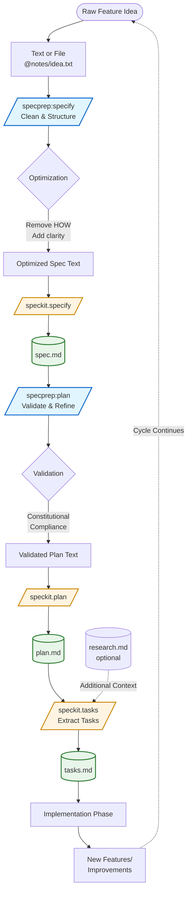

# SpecPrep Plugin

**SpecPrep** is an AI meta-prompt framework that optimizes text and files for use with the [Spec Kit](https://github.com/github/spec-kit) workflow.
It preprocesses inputs to ensure clarity, compliance, and structure, then **automatically invokes** the corresponding `/speckit` commands to create artifacts—eliminating manual copy/paste steps.

---

## 🧭 Overview

SpecPrep provides two specialized slash commands that **automatically prepare and execute** the critical preparation stages of Spec-Driven Development (SDD):

| Command | Purpose | Modes | Auto-Invokes |
|----------|----------|--------|----------------|
| `/specprep:specify` | Cleans and structures raw feature ideas, then creates spec.md artifact | `quick`, `strict`, *(default)* | `/speckit.specify` |
| `/specprep:plan` | Validates and refines implementation plans, then creates plan.md artifact | `quick`, `strict`, *(default)* | `/speckit.plan` |

Each command acts as a **meta-prompt optimizer and executor**, providing:

- **Automatic workflow chaining**: Optimization → SpecKit invocation (no manual copy/paste)
- Clear "WHAT and WHY" separation from "HOW"
- Proper abstraction levels
- `[NEEDS CLARIFICATION]` tagging for ambiguity
- Compliance with the project constitution (Articles VII–IX)
- Direct artifact creation (spec.md, plan.md, tasks.md)

---

## 🗺️ Complete SDD Cycle

The following diagram shows the complete Spec-Driven Development workflow and how SpecPrep integrates with Spec Kit:



### Key Integration Points

- **SpecPrep commands** (blue) optimize and validate requirements and architecture before they reach SpecKit
- **SpecKit commands** (orange) generate the official artifacts used throughout development
- **Artifacts** (green) serve as both outputs and inputs for subsequent phases
- **Task extraction** goes directly to SpecKit (no preprocessing needed)
- **Cycle**: Implementation generates new ideas, continuing the SDD cycle

---

## ⚙️ Usage Examples

```bash
# Phase 1: Optimize and create spec.md artifact
/specprep:specify @notes/feature-idea.txt quick

# Phase 2: Validate plan and create plan.md artifact
/specprep:plan @specs/002-feature/plan.md strict

# Phase 3: Extract tasks directly with SpecKit
/speckit.tasks @specs/002-feature/plan.md @specs/002-feature/research.md
```

**How SpecPrep commands work:**
1. Optimize your input based on the selected mode (quick, strict, or default)
2. Show you the optimized output for review
3. **Automatically invoke** the corresponding `/speckit` command
4. The SpecKit command creates the artifact file (spec.md or plan.md)

**No manual copy/paste required** for requirements and architecture preparation!

---

## 🧠 Mode Behavior

All `/specprep:*` commands support optional modes to control optimization depth:

| Mode | Description | When to Use |
|------|--------------|-------------|
| **quick** | Performs fast, lightweight cleanup and formatting — minimal validation. | Quick iterations, early drafts, or when you just need basic formatting. |
| **strict** | Enforces all SDD and constitutional rules, marking ambiguities with `[NEEDS CLARIFICATION]`. Offers interactive correction after processing. | Final reviews, compliance validation, or when you want to catch every ambiguity. |
| *(default)* | Balanced optimization combining structure, clarity, and moderate validation. Implicit when no mode is specified. | Most common use case — comprehensive cleanup with reasonable validation. |

### Usage Examples

```bash
# Default mode (balanced) - just omit the mode
/specprep:plan @specs/002-feature/plan.md

# Quick mode - fast cleanup
/specprep:plan @specs/002-feature/plan.md quick

# Strict mode - full validation with interactive correction
/specprep:plan @specs/002-feature/plan.md strict
```

### Mode Keywords

- **Valid modes**: `quick`, `strict`
- **Default mode**: Omit the mode argument (no keyword needed)
- **No abbreviations**: Full words only — `q` or `s` are not recognized
- **Position**: Mode is always the last positional argument

### Interactive Correction (Strict Mode)

When using **strict mode**, after generating output with `[NEEDS CLARIFICATION]` markers, you'll be prompted:

```
Found 3 clarifications needed. Resolve interactively? [y/N]
```

- **Yes (y)**: Answer questions to resolve each ambiguity, then regenerate clean output
- **No (N)**: Receive the output with `[NEEDS CLARIFICATION]` markers intact for manual review

---

## ⚙️ Input/Output Summary for SpecPrep Commands

### 🧩 `/specprep:specify`

**Purpose:**
Transform *raw feature text* or a *file reference* into a **clean, structured specification** ready for `/speckit.specify`.

**Input:**

- `@file` or freeform text (e.g., `@notes/idea.txt`)
- Optional mode argument: `quick` | `strict`

**Input Examples:**

```bash
/specprep:specify @notes/feature-idea.txt
/specprep:specify @notes/feature-idea.txt strict
/specprep:specify "Build a lightweight task tracker app" quick
```

**Processing Logic:**

- `quick` → Light text cleanup (remove noise, format sections)
- `strict` → Full compliance enforcement (removes implementation details, adds `[NEEDS CLARIFICATION]` markers, validates completeness)
- *(default)* → Balanced optimization

**Output:**
Automatically creates spec.md artifact by:
1. Presenting the optimized specification text to the user
2. Auto-invoking `/speckit.specify` with the optimized content

**Output Example:**

```markdown
Build a lightweight task tracker app  
---

### Overview
The user can create, assign, and track simple tasks.

### User Stories
- As a user, I can add new tasks with a title and due date.
- As a user, I can mark tasks complete.

### Constraints
- No authentication required.
- Local data only.

### Notes
[NEEDS CLARIFICATION: maximum number of tasks?]
```

---

### 🧩 `/specprep:plan`

**Purpose:**
Convert a specification or draft plan into a **constitutionally compliant implementation plan** ready for `/speckit.plan`.

**Input:**

- `@file` or text containing an implementation plan draft
- Optional mode: `quick` | `strict`

**Input Examples:**

```bash
/specprep:plan @specs/002-feature/plan-draft.md
/specprep:plan @specs/002-feature/plan-draft.md quick
/specprep:plan @specs/002-feature/plan-draft.md strict
```

**Processing Logic:**

- `quick` → Structural cleanup; minimal gate enforcement
- `strict` → Full application of Articles VII–IX (simplicity, anti-abstraction, integration-first)
- *(default)* → Balanced plan optimization

**Output:**
Automatically creates plan.md artifact by:
1. Presenting the optimized implementation plan to the user
2. Auto-invoking `/speckit.plan` with the optimized content

**Output Example:**

```markdown
## Architecture Overview
Single web app using Vite and SQLite (<=3 projects).

## Implementation Phases
1. Setup local database schema
2. Build frontend pages
3. Connect actions to storage

## Technical Decisions
- Framework: Vite + Vanilla JS (per Article VIII)
- Database: SQLite (simplicity gate satisfied)
```

---

### 🧠 Quick Reference Table

| Command | Input | Modes | Result |
|----------|--------|--------|---------|
| `/specprep:specify` | Text or file (`@notes/*.txt`) | `quick`, `strict`, *(default)* | Optimized spec → **auto-creates spec.md** |
| `/specprep:plan` | Plan draft (`@specs/*/plan.md`) | `quick`, `strict`, *(default)* | Validated plan → **auto-creates plan.md** |

**Note:** For task extraction, use `/speckit.tasks @plan.md` directly—no preprocessing needed.

---

## 💡 Workflow Integration

**Streamlined Spec-Driven Development pipeline** with automatic execution:

```bash
# Phase 1: Clean raw feature idea and create spec.md (automatic chaining!)
/specprep:specify @drafts/feature.txt
# ✅ Optimizes → ✅ Auto-invokes /speckit.specify → ✅ Creates spec.md

# Phase 2: Validate plan and create plan.md (strict mode for compliance)
/specprep:plan @specs/002-feature/spec.md strict
# ✅ Validates → ✅ Shows clarifications → ✅ Auto-invokes /speckit.plan → ✅ Creates plan.md

# Phase 3: Extract tasks and create tasks.md (use SpecKit directly)
/speckit.tasks @specs/002-feature/plan.md @specs/002-feature/research.md
# ✅ Extracts tasks → ✅ Creates tasks.md
```

**Key benefit:** SpecPrep handles the preparation phases (requirements & architecture), then SpecKit completes the workflow.

### Mode Selection Strategy

- **Early iterations**: Use `quick` mode for rapid cleanup without deep validation
- **Mid-stage work**: Use default mode (omit mode argument) for balanced optimization
- **Pre-commit reviews**: Use `strict` mode to catch all ambiguities and violations before finalizing

### What Changed from Manual Workflow

**Before (manual):**
1. Run `/specprep:X` to optimize
2. Read and copy the output
3. Run `/speckit.X` and paste the optimized text
4. Wait for artifact creation

**After (automatic):**
1. Run `/specprep:X` with your input
2. Review optimized output (optional)
3. ✨ **Artifact automatically created** ✨

This architecture ensures that the critical preparation phases (requirements and architecture) execute seamlessly with automatic chaining, while task extraction flows naturally through SpecKit—turning raw ideas into executable specifications with maximum quality and minimal friction.

---

## 📚 Reference Documentation

For detailed information about Spec-Driven Development and the Spec Kit workflow:

- **[Quick Start Guide](docs/quickstart.md)** — 4-step SDD workflow with complete examples  
- **[Spec-Driven Development](docs/spec-driven.md)** — Methodology, philosophy, and constitutional framework  
- **[Documentation Index](docs/README.md)** — Overview of all reference materials  

These documents from [GitHub's Spec Kit](https://github.com/github/spec-kit) provide the context and principles that SpecPrep enforces through its meta-prompt optimization.

---

## 📦 Installation

```bash
# Add the Arkhe marketplace (if not already added)
/plugin marketplace add ./arkhe-claude-plugins

# Install the SpecPrep plugin
/plugin install specprep@arkhe-claude-plugins

# Verify installation
/help  # Commands will appear as /specprep:*
```

---

## 🧩 Notes

- These commands are plugin-scoped and will appear as `/specprep:*` in `/help`.
- They are designed for **text optimization**, not code generation.
- Outputs are formatted for **direct use** with Spec Kit commands.
- **Dependency:** Designed to work with the Spec Kit plugin. While SpecPrep can be used standalone for text optimization, its primary value is in preparing inputs for Spec Kit commands.
